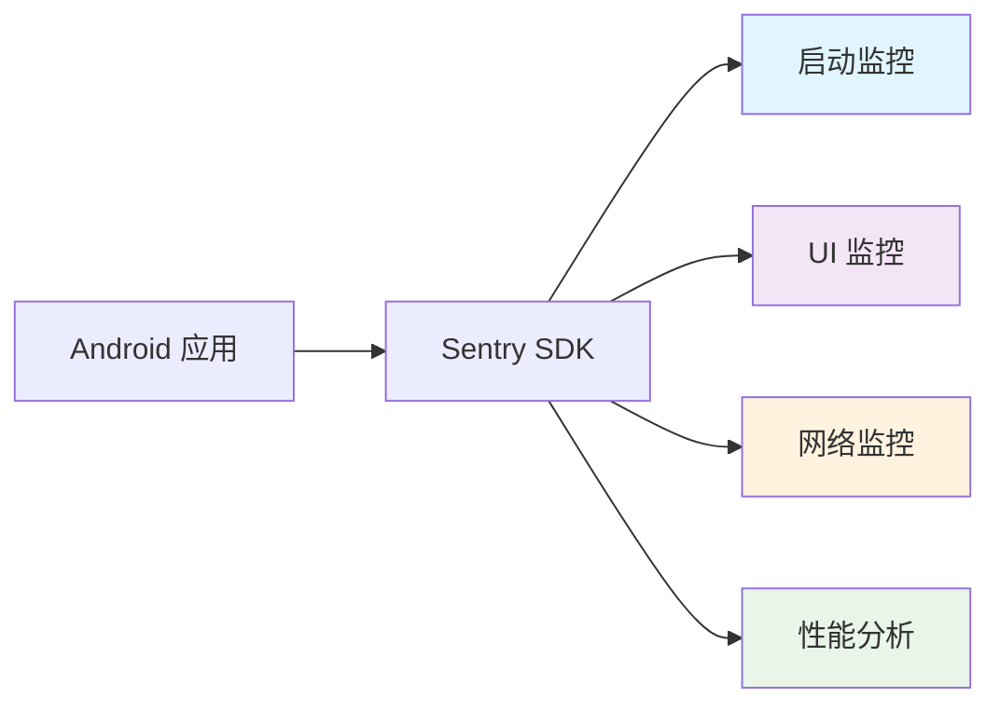
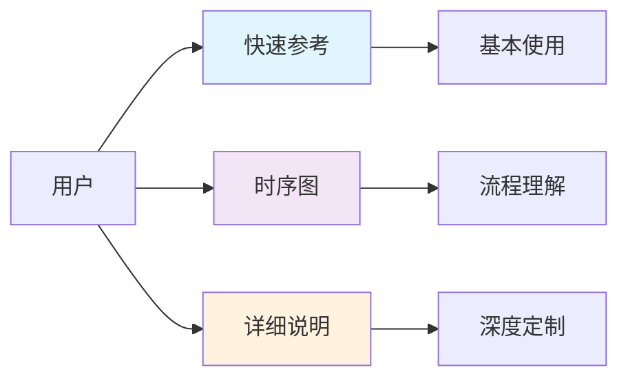

# Sentry Java SDK 分析文档

本文件夹包含了对 Sentry Java SDK 的深入分析和可视化文档，重点关注 Android 平台的性能监控机制。

## 📁 文档结构

### 🚀 [Android 性能监控完整指南](./sentry-android-performance-monitoring.md) ⭐
- **适用对象**: Android 开发者、性能工程师
- **内容**: Sentry Android SDK 性能监控的完整解决方案
- **包含**:
  - 启动性能监控 (冷启动/热启动)
  - UI 性能监控 (帧率/卡顿检测)
  - 网络性能监控 (HTTP 请求分析)
  - 性能分析 (Profiling)
  - 最佳实践和故障排查

### 📊 [Trace 操作字段监控机制详解](./sentry-trace-operations-guide.md) ⭐
- **适用对象**: 所有开发者、运维人员
- **内容**: Sentry 管理后台中各种 Trace 数据字段的详细说明
- **包含**:
  - ui.load.initial_display (TTID) 监控机制
  - ui.load.full_display (TTFD) 监控机制
  - app.start.cold/warm 启动监控
  - http.client/http.server 网络请求监控
  - db.query/db.sql.query 数据库操作监控
  - file.read/file.write 文件IO监控
  - graphql.operation/graphql.fetcher GraphQL监控
  - bean Spring框架集成监控
  - 自定义 Span 创建和管理
  - 监控时机和触发条件详解
  - 性能指标 (Measurements) 完整说明

### 🎯 [快速参考](./sentry-init-quick-reference.md)
- **适用对象**: 开发者快速查阅
- **内容**: 核心初始化步骤、关键组件、最佳实践
- **特点**: 简洁明了，包含常见问题解答

### 📊 [初始化流程详解](./sentry-initialization-flow.md)
- **适用对象**: 架构师、高级开发者
- **内容**: 完整的初始化流程可视化和详细说明
- **包含**: 时序图、流程分析、架构设计

## 🎯 Android 性能监控核心功能

### 🚀 启动性能监控
- **冷启动监控**: 进程创建到首帧绘制的完整流程
- **热启动监控**: Activity 重启的性能分析
- **关键指标**: TTID、TTFD、启动时间
- **自动检测**: 启动类型自动识别和分类

### 🎨 UI 性能监控
- **帧率监控**: 实时帧率检测和分析
- **卡顿检测**: 慢帧和冻结帧自动识别
- **双重策略**: Performance V1 (Activity级) + V2 (Span级)
- **多设备支持**: 60fps/90fps/120fps 设备适配

### 🌐 网络性能监控
- **HTTP 监控**: OkHttp 拦截器自动集成
- **性能指标**: DNS、连接、SSL、传输时间
- **错误捕获**: 4xx/5xx 状态码自动捕获
- **分布式追踪**: 跨服务请求链路追踪

### 📊 性能分析 (Profiling)
- **方法跟踪**: Android Debug API 方法调用分析
- **资源监控**: CPU、内存使用情况
- **瓶颈识别**: 性能热点自动识别
- **智能采样**: 可配置的采样策略

## 🔧 快速开始

### 基础配置
```kotlin
SentryAndroid.init(this) { options ->
    options.dsn = "YOUR_DSN"
    
    // 启用 Android 性能监控
    options.isEnableAppStartTracking = true      // 启动监控
    options.isEnableFramesTracking = true        // UI 监控
    options.isEnablePerformanceV2 = true         // 精确监控
    options.captureFailedRequests = true         // 网络监控
    
    // 设置采样率
    options.tracesSampleRate = 0.1               // 生产环境 10%
    options.profilesSampleRate = 0.1             // 生产环境 10%
}
```

### 网络监控集成
```kotlin
val client = OkHttpClient.Builder()
    .addInterceptor(SentryOkHttpInterceptor())
    .build()
```

## 📈 性能指标概览

| 监控类型 | 关键指标 | 建议阈值 |
|----------|----------|----------|
| **启动性能** | TTID | < 1.5s |
| **启动性能** | 冷启动时间 | < 2s |
| **UI 性能** | 慢帧率 | < 5% |
| **UI 性能** | 冻结帧率 | < 1% |
| **网络性能** | 请求成功率 | > 95% |
| **网络性能** | 平均响应时间 | < 2s |

## 🎨 架构图说明

文档中使用了 Mermaid 图表来可视化复杂的监控流程：



## 🔧 使用建议

### 对于 Android 开发者 (推荐路径)
1. **首先阅读** [Android 性能监控完整指南](./sentry-android-performance-monitoring.md)
2. **深入了解** [Trace 操作字段监控机制详解](./sentry-trace-operations-guide.md) - 理解管理后台中的各种数据字段
3. 了解启动性能优化策略
4. 掌握 UI 卡顿检测和优化
5. 学习网络性能监控配置
6. 配置合适的性能监控参数

### 对于性能工程师
1. 重点关注 [Android 性能监控完整指南](./sentry-android-performance-monitoring.md) 中的性能分析部分
2. **必读** [Trace 操作字段监控机制详解](./sentry-trace-operations-guide.md) - 掌握各种性能指标的含义
3. 学习各种性能指标的含义和优化策略
4. 配置智能采样和监控策略
5. 建立性能监控告警体系

### 对于应用开发者
1. 先阅读 [快速参考](./sentry-init-quick-reference.md) 了解基础配置
2. 参考 [Android 性能监控完整指南](./sentry-android-performance-monitoring.md) 进行性能优化
3. 查看 [Trace 操作字段监控机制详解](./sentry-trace-operations-guide.md) 理解监控数据
4. 遇到问题时查看故障排查部分

### 对于架构师
1. 了解 [初始化流程详解](./sentry-initialization-flow.md) 掌握整体架构
2. 参考 [Android 性能监控完整指南](./sentry-android-performance-monitoring.md) 设计监控策略
3. 学习 [Trace 操作字段监控机制详解](./sentry-trace-operations-guide.md) 制定监控标准
4. 制定团队的性能监控标准和流程

## 📚 详细文档索引

### 核心监控机制
- [💥 崩溃监控机制](./sentry-crash-monitoring.md) - 异常捕获和处理
- [🚀 启动监控机制](./sentry-startup-monitoring.md) - 启动性能详细分析
- [🎨 UI 卡顿监控机制](./sentry-ui-jank-monitoring.md) - 帧率和卡顿检测
- [🌐 网络监控机制](./sentry-network-monitoring.md) - HTTP 请求监控
- [📊 Profiling 性能分析](./sentry-profiling-analysis.md) - 方法调用跟踪

### 功能分析
- [📱 会话管理机制](./sentry-session-management.md) - 用户会话追踪
- [🎬 Replay 功能分析](./sentry-replay-analysis.md) - 屏幕录制回放

### 技术细节
- [🔍 初始化详细说明](./sentry-initialization-details.md) - 深度技术实现

## 🎯 重点推荐

对于 Android 开发者，我们强烈推荐从 **[Android 性能监控完整指南](./sentry-android-performance-monitoring.md)** 开始，这是一个整合了所有 Android 性能监控功能的完整解决方案，包含了实用的配置示例和最佳实践。

## 🎨 时序图说明

文档中使用了 Mermaid 时序图来可视化复杂的初始化流程：



## 🔧 使用建议

### 对于应用开发者
1. 先阅读 [快速参考](./sentry-init-quick-reference.md)
2. 了解 [崩溃监控机制](./sentry-crash-monitoring.md) 确保正确配置
3. 学习 [启动监控机制](./sentry-startup-monitoring.md) 优化启动性能
4. 掌握 [会话管理机制](./sentry-session-management.md) 理解用户行为追踪
5. 遇到问题时查看常见问题部分
6. 需要深入理解时参考时序图

### 对于Android开发者
1. 重点关注 [启动监控机制](./sentry-startup-monitoring.md)
2. 学习 [UI 卡顿监控机制](./sentry-ui-jank-monitoring.md) 优化界面流畅度
3. 了解 [Replay 功能分析](./sentry-replay-analysis.md) 实现用户操作回放
4. 掌握 [Profiling 性能分析](./sentry-profiling-analysis.md) 进行深度性能优化
5. 理解冷启动和热启动的区别和优化策略
6. 掌握TTID/TTFD性能指标和帧率指标的含义
7. 配置合适的性能监控参数

### 对于UI/UX工程师
1. 重点阅读 [UI 卡顿监控机制](./sentry-ui-jank-monitoring.md)
2. 理解慢帧和冻结帧对用户体验的影响
3. 学习如何通过指标数据优化界面性能
4. 掌握不同刷新率设备的性能标准

### 对于运维和测试人员
1. 重点阅读 [崩溃监控机制](./sentry-crash-monitoring.md)
2. 了解 [启动监控机制](./sentry-startup-monitoring.md) 中的性能指标
3. 关注故障排查和最佳实践部分
4. 了解不同类型崩溃的检测原理

### 对于框架集成开发者
1. 重点关注 [集成注册流程](./sentry-initialization-flow.md#集成注册流程)
2. 参考 [集成系统设计](./sentry-initialization-details.md#5-集成系统设计)
3. 查看现有集成的实现模式
4. 了解崩溃监控的扩展点

### 对于性能工程师
1. 重点阅读 [Profiling 性能分析](./sentry-profiling-analysis.md)
2. 学习 [启动监控机制](./sentry-startup-monitoring.md) 和 [UI 卡顿监控机制](./sentry-ui-jank-monitoring.md)
3. 了解 [网络监控机制](./sentry-network-monitoring.md) 分析网络性能
4. 掌握各种性能指标的含义和优化策略
5. 配置合适的采样率和监控参数

### 对于网络工程师
1. 重点阅读 [网络监控机制](./sentry-network-monitoring.md)
2. 了解分布式追踪和HTTP错误捕获
3. 学习网络性能指标的收集和分析
4. 掌握OkHttp集成和Apollo GraphQL支持
5. 配置合适的网络监控策略

### 对于QA工程师
1. 重点阅读 [Replay 功能分析](./sentry-replay-analysis.md)
2. 了解 [崩溃监控机制](./sentry-crash-monitoring.md) 和 [会话管理机制](./sentry-session-management.md)
3. 学习如何利用屏幕录制功能复现问题
4. 掌握各种监控数据的解读和分析
5. 配置合适的录制策略和采样率

### 对于 SDK 贡献者
1. 完整阅读所有文档
2. 重点理解线程安全和错误处理机制
3. 关注性能优化和内存管理策略
4. 深入研究各种监控机制的实现细节
5. 了解扩展点和集成接口设计

## 📋 关键发现

通过对 Sentry Java SDK 的深入分析，我们发现了以下关键设计特点：

### 🛡️ 健壮性设计
- **多层锁机制**: 确保并发安全
- **优雅降级**: 初始化失败不影响应用
- **异常隔离**: 单个组件异常不影响整体
- **多重崩溃检测**: Java异常、ANR、Native崩溃全覆盖

### ⚡ 性能优化
- **懒加载**: 非关键组件延迟初始化
- **异步处理**: 避免阻塞主线程
- **资源管理**: 完善的清理机制
- **智能去重**: 避免重复的多线程崩溃报告

### 🔌 扩展性
- **插件化集成**: 统一的集成接口
- **条件加载**: 根据环境动态加载功能
- **自定义支持**: 丰富的扩展点
- **平台特定优化**: Android、JVM、Native 分层处理

### 🎯 易用性
- **合理默认值**: 开箱即用
- **配置层次**: 灵活的配置优先级
- **平台适配**: 自动检测和适配
- **离线缓存**: 网络异常时的数据保护

### 💾 数据可靠性
- **阻塞刷新**: 崩溃时确保数据写入磁盘
- **标记文件**: 通过文件标记检测崩溃状态
- **重试机制**: 网络失败时的自动重试
- **启动崩溃特殊处理**: 阻塞发送确保关键数据不丢失

### 📱 启动性能监控
- **智能类型检测**: 自动区分冷启动和热启动
- **精确时间测量**: 使用系统级API获取准确启动时间
- **细粒度分析**: 分解启动过程的各个阶段
- **TTID/TTFD指标**: 关键用户体验指标监控
- **性能分析集成**: CPU和内存分析支持

### 🎨 UI性能监控
- **双重监控策略**: Performance V1和V2满足不同监控需求
- **实时帧分析**: 基于Choreographer的精确帧时间测量
- **智能帧分类**: 自动区分正常帧、慢帧和冻结帧
- **刷新率适配**: 支持不同刷新率设备的准确监控
- **内存优化**: 只存储异常帧数据，减少内存占用
- **Span级别监控**: 精确到具体操作的帧性能分析

### 📱 会话管理
- **生命周期跟踪**: 完整的会话状态管理（Ok、Crashed、Abnormal、Exited）
- **前后台感知**: 基于LifecycleWatcher的智能状态切换
- **持久化机制**: 会话数据的可靠存储和恢复
- **异常状态更新**: 实时更新会话状态反映应用健康度
- **性能优化**: 高效的会话数据管理和内存控制

### 🎬 Replay功能
- **双重录制策略**: 全会话录制 vs 错误缓冲录制
- **智能采样**: 基于错误发生的动态策略转换
- **视频编码**: 高效的MP4生成和压缩算法
- **缓存机制**: 智能的帧存储和清理策略
- **事件同步**: 屏幕录制与用户操作的精确同步

### 📊 Profiling性能分析
- **双重分析模式**: 事务性能分析和连续性能分析
- **方法级跟踪**: 基于Android Debug API的精确方法调用跟踪
- **全面性能指标**: CPU、内存、帧率等多维度数据收集
- **智能采样**: 可配置的采样策略平衡数据价值和性能影响
- **设备信息集成**: 完整的设备和环境信息关联

### 🌐 网络监控
- **双重监控架构**: 拦截器处理业务逻辑，事件监听器提供性能细节
- **分布式追踪**: 自动注入追踪头，支持跨服务调用链追踪
- **智能错误捕获**: 可配置的错误状态码和目标URL匹配
- **详细性能指标**: DNS、连接、SSL等各阶段的精确时间测量
- **多框架支持**: OkHttp、Apollo GraphQL等主流网络库集成

## ✅ 已完成的深度分析

### 核心监控机制
- [x] **[初始化流程](./sentry-initialization-flow.md)** ✅ 完整的SDK启动和配置流程
- [x] **[崩溃监控](./sentry-crash-monitoring.md)** ✅ Java异常、ANR、Native崩溃全覆盖
- [x] **[启动监控](./sentry-startup-monitoring.md)** ✅ 冷启动、热启动性能监控和TTID/TTFD指标
- [x] **[UI卡顿监控](./sentry-ui-jank-monitoring.md)** ✅ 帧率监控、慢帧检测、冻结帧分析

### 高级功能分析
- [x] **[会话管理](./sentry-session-management.md)** ✅ Session生命周期、状态管理、持久化机制
- [x] **[Replay功能](./sentry-replay-analysis.md)** ✅ 屏幕录制、事件回放、视频编码、存储优化
- [x] **[Profiling性能分析](./sentry-profiling-analysis.md)** ✅ 方法调用跟踪、性能瓶颈识别、CPU/内存分析
- [x] **[网络监控](./sentry-network-monitoring.md)** ✅ HTTP请求监控、性能指标收集、分布式追踪

### 快速参考文档
- [x] **[初始化快速参考](./sentry-init-quick-reference.md)** ✅ 常用配置和代码示例
- [x] **[初始化详细说明](./sentry-initialization-details.md)** ✅ 深度技术实现细节

## 🎯 核心技术发现

通过对 Sentry Java SDK 的全面分析，我们揭示了以下关键技术架构：

### 🏗️ **架构设计哲学**
- **模块化设计**: 50+ 子模块，职责清晰，便于维护和扩展
- **平台适配**: 统一的核心API，平台特定的实现（Android、JVM、Native）
- **插件化集成**: 通过Integration接口实现功能的条件加载
- **线程安全**: 全面的锁机制和原子操作保证并发安全

### 🔧 **核心技术栈**
- **智能初始化**: 多重锁保护、平台检测、优雅降级
- **全面监控**: 崩溃、性能、网络、用户行为的端到端监控
- **高效传输**: Envelope封装、数据压缩、批量上报
- **数据可靠性**: 本地缓存、重试机制、离线支持

### 📊 **性能优化策略**
- **懒加载**: 按需初始化组件，减少启动开销
- **异步处理**: 后台线程处理数据收集和上报
- **智能采样**: 可配置的采样率平衡数据价值和性能影响
- **内存管理**: 自动清理、缓存限制、内存泄漏防护

## 🚀 后续扩展方向

虽然已经完成了核心功能的深度分析，但仍有一些高级主题值得进一步探索：

### 🔄 数据传输层深度分析
- [ ] **Envelope封装机制**: 事件、会话、性能数据的统一封装格式
- [ ] **序列化优化**: JSON序列化性能优化和数据压缩策略
- [ ] **批量上报机制**: 数据聚合、去重、优先级排序的实现
- [ ] **离线缓存策略**: 网络异常时的数据持久化和恢复机制
- [ ] **传输重试逻辑**: 指数退避、速率限制、故障转移的实现

### 🔌 集成生态系统分析
- [ ] **Spring Boot深度集成**: 自动配置、健康检查、指标暴露的实现
- [ ] **React Native集成**: 跨平台事件桥接和性能监控
- [ ] **Kotlin Multiplatform**: 共享代码和平台特定实现的架构
- [ ] **微服务集成模式**: 服务网格、API网关的监控集成
- [ ] **CI/CD集成**: 构建时符号上传、发布监控的自动化

### 🛠️ 自定义监控扩展
- [ ] **自定义Integration开发**: 插件化架构的扩展指南
- [ ] **自定义Transport实现**: 私有化部署的数据传输定制
- [ ] **自定义Scope和Context**: 业务特定的上下文信息管理
- [ ] **自定义性能指标**: 业务KPI的监控和分析
- [ ] **自定义采样策略**: 智能采样算法的实现和优化

### 📊 性能基准测试
- [ ] **内存使用分析**: 不同配置下的内存占用对比
- [ ] **CPU开销测量**: 监控功能对应用性能的量化影响
- [ ] **网络流量分析**: 数据上报的带宽使用优化
- [ ] **启动时间影响**: SDK初始化对应用启动的性能影响
- [ ] **电池消耗评估**: 移动设备上的电量使用分析

### 🏭 生产环境最佳实践
- [ ] **大规模部署策略**: 企业级部署的配置管理和监控
- [ ] **多环境配置管理**: 开发、测试、生产环境的差异化配置
- [ ] **监控数据治理**: 数据质量、存储成本、保留策略的管理
- [ ] **告警和通知系统**: 智能告警规则和通知渠道的配置
- [ ] **团队协作工具**: 问题分配、处理流程、知识库的建设

### 🔒 安全和隐私深度分析
- [ ] **数据脱敏机制**: PII识别、过滤、匿名化的实现
- [ ] **传输安全**: TLS配置、证书验证、中间人攻击防护
- [ ] **存储安全**: 本地数据加密、密钥管理、安全删除
- [ ] **合规性支持**: GDPR、CCPA等法规的技术实现
- [ ] **审计日志**: 数据处理活动的完整记录和追踪

### 🚨 故障恢复机制
- [ ] **网络异常处理**: 连接超时、DNS故障、代理问题的处理
- [ ] **存储故障恢复**: 磁盘空间不足、权限问题的优雅处理
- [ ] **内存压力管理**: OOM情况下的数据保护和恢复
- [ ] **系统资源竞争**: 高负载下的资源调度和优先级管理
- [ ] **灾难恢复**: 极端情况下的数据完整性保证

### 🔬 高级调试和诊断
- [ ] **SDK内部监控**: SDK自身的性能和健康状态监控
- [ ] **调试工具开发**: 开发者友好的调试界面和工具
- [ ] **问题诊断自动化**: 常见问题的自动检测和修复建议
- [ ] **性能瓶颈分析**: SDK内部热点代码的识别和优化
- [ ] **兼容性测试**: 不同Android版本、设备的兼容性验证

### 🌐 云原生和容器化
- [ ] **Kubernetes集成**: Pod监控、服务发现、配置管理
- [ ] **Docker容器监控**: 容器生命周期、资源使用的监控
- [ ] **服务网格集成**: Istio、Linkerd等的深度集成
- [ ] **Serverless监控**: AWS Lambda、Azure Functions的监控适配
- [ ] **边缘计算支持**: 边缘节点的监控和数据同步

### 🤖 AI和机器学习集成
- [ ] **异常检测算法**: 基于ML的异常模式识别
- [ ] **智能采样优化**: 动态调整采样率的AI算法
- [ ] **根因分析**: 自动化的问题根因定位
- [ ] **预测性维护**: 基于历史数据的故障预测
- [ ] **用户行为分析**: 深度学习驱动的用户体验洞察

### 📱 移动端特定优化
- [ ] **低功耗模式**: 电池优化的监控策略
- [ ] **网络适配**: 2G/3G/4G/5G不同网络的优化
- [ ] **存储优化**: 移动设备存储空间的高效利用
- [ ] **后台任务管理**: 系统后台限制下的数据处理
- [ ] **设备兼容性**: 不同厂商ROM的适配和优化

### 🔄 实时监控和流处理
- [ ] **实时数据流**: 事件流的实时处理和分析
- [ ] **流式聚合**: 实时指标计算和趋势分析
- [ ] **实时告警**: 毫秒级的异常检测和通知
- [ ] **热点数据**: 实时热点问题的识别和处理
- [ ] **流量控制**: 实时流量整形和限流机制

### 📈 高级分析和可视化
- [ ] **多维度分析**: 时间、地域、版本等维度的交叉分析
- [ ] **趋势预测**: 基于历史数据的趋势预测模型
- [ ] **对比分析**: A/B测试、版本对比的深度分析
- [ ] **用户旅程**: 完整用户行为路径的可视化
- [ ] **业务影响分析**: 技术指标与业务KPI的关联分析

这些扩展方向涵盖了从底层技术实现到上层业务应用的各个层面，为深入理解和优化 Sentry SDK 提供了全面的研究路径。每个方向都可以独立深入研究，也可以结合现有的核心分析文档进行综合应用。

## 📞 联系方式

如有问题或建议，请通过以下方式联系：
- 创建 Issue 讨论
- 提交 Pull Request 改进
- 参与社区讨论

---

💡 **提示**: 这些文档基于 Sentry Java SDK 的源码分析，旨在帮助开发者更好地理解和使用 SDK。 