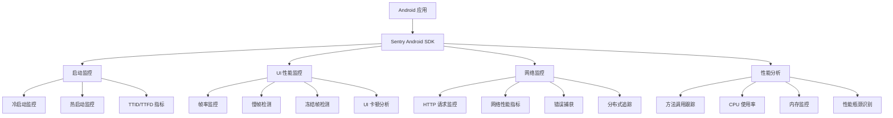

# Sentry Android 性能监控完整指南

本文档详细介绍 Sentry Android SDK 的性能监控机制，包括启动监控、UI 卡顿监控、网络监控和性能分析等核心功能。

## 🎯 性能监控架构概览



## 1. 启动性能监控

### 1.1 启动类型检测

Sentry 自动检测并监控两种启动类型：

```java
public enum AppStartType {
    COLD,    // 冷启动：进程从零开始创建
    WARM     // 热启动：进程已存在，重新启动Activity
}
```

**冷启动监控流程：**
1. 进程创建 → ContentProvider 初始化
2. Application.onCreate() 执行
3. Activity 创建和首帧绘制
4. TTID (Time To Initial Display) 测量

**热启动监控流程：**
1. Activity 重新创建
2. 前台恢复
3. 首帧绘制完成

### 1.2 关键性能指标

| 指标 | 说明 | 阈值建议 |
|------|------|----------|
| **TTID** | Time To Initial Display - 首次显示时间 | < 1.5s |
| **TTFD** | Time To Full Display - 完全显示时间 | < 3s |
| **冷启动时间** | 进程创建到首帧绘制 | < 2s |
| **热启动时间** | Activity 重启到首帧绘制 | < 500ms |

### 1.3 启动监控配置

```kotlin
SentryAndroid.init(this) { options ->
    // 启用启动监控
    options.isEnableAppStartTracking = true
    
    // 启用性能 V2 (推荐)
    options.isEnablePerformanceV2 = true
    
    // 设置采样率
    options.tracesSampleRate = 1.0
}
```

## 2. UI 性能监控

### 2.1 帧率监控机制

Sentry 提供两种帧率监控方式：

**Performance V1 (Activity 级别):**
- 使用 `FrameMetricsAggregator`
- 在 Activity 生命周期中收集帧数据
- 适用于整个 Activity 的性能分析

**Performance V2 (Span 级别):**
- 使用 `SentryFrameMetricsCollector`
- 基于 Choreographer 实时监控
- 提供更精确的 Span 级别帧分析

### 2.2 帧性能标准

```java
// 帧性能判断标准
public class FrameStandards {
    // 60fps 设备
    private static final long FRAME_16MS = 16_666_667L; // 16.67ms (纳秒)
    
    // 90fps 设备  
    private static final long FRAME_11MS = 11_111_111L; // 11.11ms (纳秒)
    
    // 120fps 设备
    private static final long FRAME_8MS = 8_333_333L;   // 8.33ms (纳秒)
    
    // 冻结帧阈值
    private static final long FROZEN_FRAME = 700_000_000L; // 700ms (纳秒)
    
    public static boolean isSlow(long frameDuration, long expectedDuration) {
        return frameDuration > expectedDuration;
    }
    
    public static boolean isFrozen(long frameDuration) {
        return frameDuration > FROZEN_FRAME;
    }
}
```

### 2.3 UI 监控指标

| 指标 | 说明 | 计算方式 |
|------|------|----------|
| **总帧数** | 监控期间渲染的总帧数 | 累计计数 |
| **慢帧数** | 超过期望帧时间的帧数 | 帧时间 > 期望时间 |
| **冻结帧数** | 超过 700ms 的帧数 | 帧时间 > 700ms |
| **慢帧率** | 慢帧占总帧数的比例 | 慢帧数 / 总帧数 |
| **冻结帧率** | 冻结帧占总帧数的比例 | 冻结帧数 / 总帧数 |

### 2.4 UI 监控配置

```kotlin
SentryAndroid.init(this) { options ->
    // 启用帧率监控
    options.isEnableFramesTracking = true
    
    // 启用性能 V2 (推荐用于精确监控)
    options.isEnablePerformanceV2 = true
    
    // 设置慢帧阈值 (可选，默认根据设备刷新率自动计算)
    options.frameMetricsCollectorOptions.apply {
        // 自定义慢帧阈值 (纳秒)
        // slowFrameThresholdNanos = 16_666_667L // 16.67ms for 60fps
    }
}
```

## 3. 网络性能监控

### 3.1 HTTP 请求监控

Sentry 通过 OkHttp 拦截器自动监控网络请求：

```kotlin
// 自动集成 (推荐)
val client = OkHttpClient.Builder()
    .addInterceptor(SentryOkHttpInterceptor())
    .build()

// 手动配置
val client = OkHttpClient.Builder()
    .addInterceptor(SentryOkHttpInterceptor(
        hub = HubAdapter.getInstance(),
        captureFailedRequests = true
    ))
    .eventListener(SentryOkHttpEventListener())
    .build()
```

### 3.2 网络性能指标

| 指标 | 说明 | 用途 |
|------|------|------|
| **DNS 解析时间** | 域名解析耗时 | 网络连接优化 |
| **连接建立时间** | TCP 连接建立耗时 | 服务器响应分析 |
| **SSL 握手时间** | HTTPS 握手耗时 | 安全连接优化 |
| **请求发送时间** | 请求数据发送耗时 | 上传性能分析 |
| **等待时间** | 服务器处理时间 | 后端性能分析 |
| **响应接收时间** | 响应数据接收耗时 | 下载性能分析 |
| **总请求时间** | 完整请求周期耗时 | 整体网络性能 |

### 3.3 网络监控配置

```kotlin
SentryAndroid.init(this) { options ->
    // 启用网络监控
    options.isEnableNetworkEventBreadcrumbs = true
    
    // 配置失败请求捕获
    options.captureFailedRequests = true
    
    // 设置失败状态码范围
    options.failedRequestStatusCodes = listOf(
        HttpStatusCodeRange(400, 599) // 4xx 和 5xx 错误
    )
    
    // 配置网络请求目标
    options.failedRequestTargets = listOf("api.example.com")
}
```

## 4. 性能分析 (Profiling)

### 4.1 方法调用跟踪

Sentry 使用 Android Debug API 进行方法调用跟踪：

```kotlin
// 启用性能分析
SentryAndroid.init(this) { options ->
    // 启用 Profiling
    options.profilesSampleRate = 1.0
    
    // 配置 Profiling 选项
    options.profilingTracesIntervalMillis = 10_000 // 10秒间隔
}
```

### 4.2 性能数据收集

**事务性能分析：**
- 与事务生命周期绑定
- 收集事务执行期间的性能数据
- 适用于特定操作的性能分析

**连续性能分析：**
- 独立于事务运行
- 持续收集应用性能数据
- 适用于整体应用性能监控

### 4.3 性能指标

| 类型 | 指标 | 说明 |
|------|------|------|
| **CPU** | CPU 使用率 | 处理器占用情况 |
| **内存** | 内存使用量 | 堆内存占用 |
| **方法调用** | 调用栈信息 | 方法执行路径和耗时 |
| **线程** | 线程状态 | 线程创建和切换 |

## 5. 最佳实践

### 5.1 性能监控配置建议

```kotlin
SentryAndroid.init(this) { options ->
    // 基础配置
    options.dsn = "YOUR_DSN"
    
    // 性能监控
    options.tracesSampleRate = 0.1 // 生产环境建议 10%
    options.profilesSampleRate = 0.1 // 生产环境建议 10%
    
    // 启动监控
    options.isEnableAppStartTracking = true
    
    // UI 监控
    options.isEnableFramesTracking = true
    options.isEnablePerformanceV2 = true
    
    // 网络监控
    options.isEnableNetworkEventBreadcrumbs = true
    options.captureFailedRequests = true
    
    // 会话监控
    options.isEnableAutoSessionTracking = true
    
    // 调试配置 (仅开发环境)
    if (BuildConfig.DEBUG) {
        options.isDebug = true
        options.tracesSampleRate = 1.0
        options.profilesSampleRate = 1.0
    }
}
```

### 5.2 性能优化建议

**启动性能优化：**
1. 延迟非关键初始化
2. 使用 ContentProvider 进行早期初始化
3. 优化 Application.onCreate() 逻辑
4. 减少主线程阻塞操作

**UI 性能优化：**
1. 避免主线程执行耗时操作
2. 优化布局层次结构
3. 使用 RecyclerView 替代 ListView
4. 合理使用图片缓存和压缩

**网络性能优化：**
1. 使用连接池复用连接
2. 启用 HTTP/2 和 GZIP 压缩
3. 实现请求缓存策略
4. 优化 API 响应大小

### 5.3 监控数据分析

**关键指标监控：**
- 启动时间趋势分析
- 帧率性能分布
- 网络请求成功率
- 性能瓶颈识别

**告警设置：**
- 启动时间超过阈值
- 慢帧率超过 5%
- 冻结帧率超过 1%
- 网络请求失败率超过 5%

## 6. 故障排查

### 6.1 常见问题

**启动监控无数据：**
- 检查是否启用 `isEnableAppStartTracking`
- 确认应用是前台启动
- 验证启动时间是否在合理范围内

**帧率监控异常：**
- 确认设备支持 FrameMetrics API (API 24+)
- 检查是否启用 `isEnableFramesTracking`
- 验证 Performance V2 配置

**网络监控缺失：**
- 确认 OkHttp 拦截器正确配置
- 检查网络请求目标配置
- 验证失败状态码范围设置

### 6.2 调试技巧

```kotlin
// 启用详细日志
SentryAndroid.init(this) { options ->
    options.isDebug = true
    options.setLogger(AndroidLogger())
    
    // 设置日志级别
    options.diagnosticLevel = SentryLevel.DEBUG
}

// 手动验证性能数据
Sentry.startTransaction("test_transaction", "manual").use { transaction ->
    // 执行测试代码
    Thread.sleep(1000)
    
    // 添加自定义指标
    transaction.setMeasurement("custom_metric", 100.0, MeasurementUnit.Duration.MILLISECOND)
}
```

通过以上配置和最佳实践，您可以全面监控 Android 应用的性能表现，及时发现和解决性能问题，提升用户体验。 