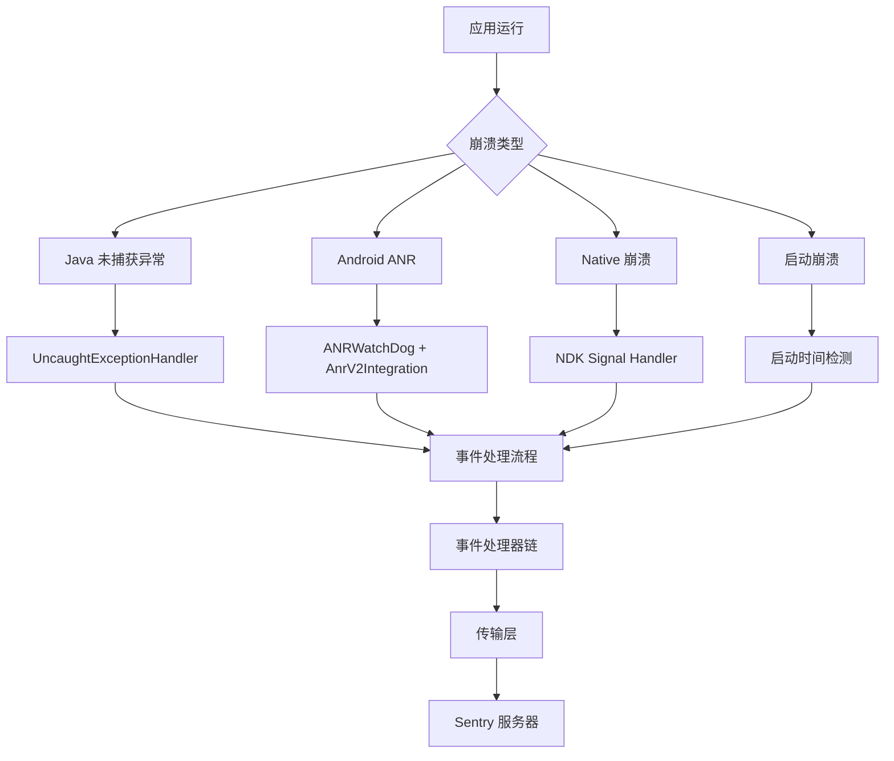
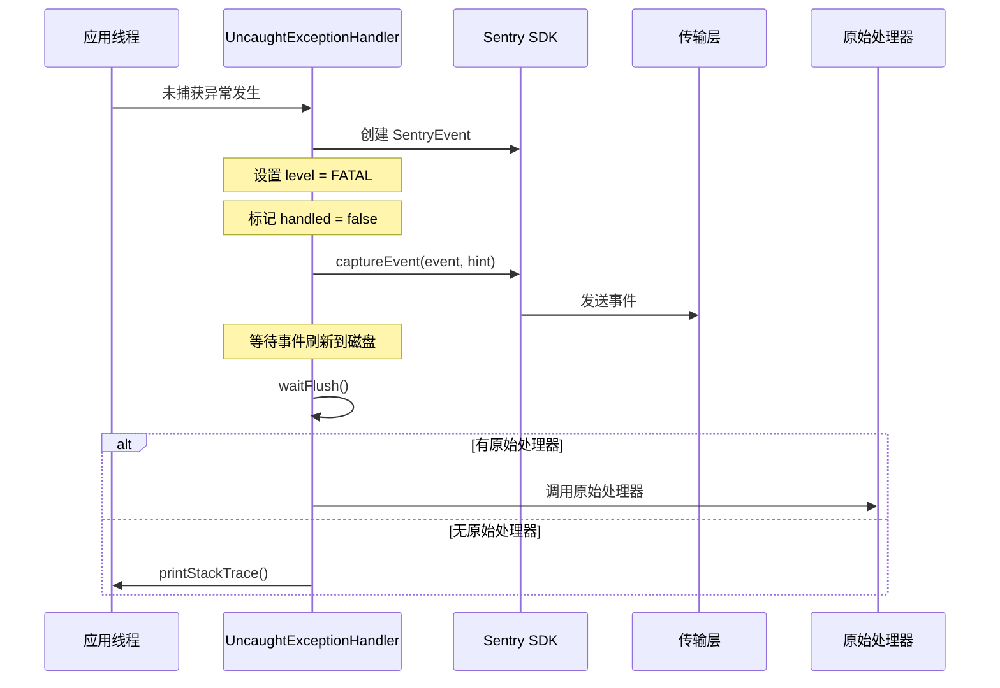
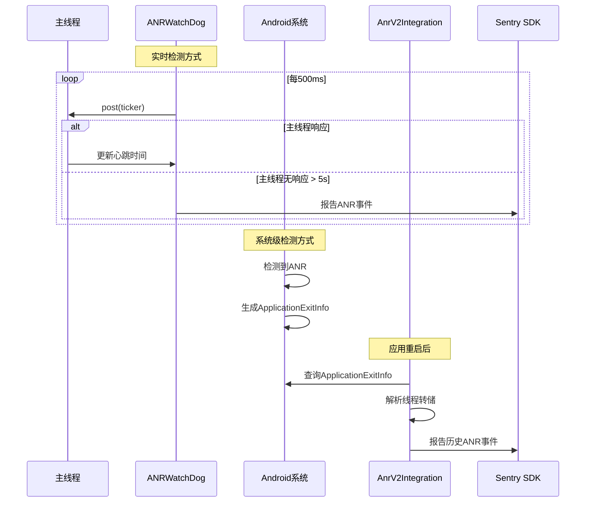
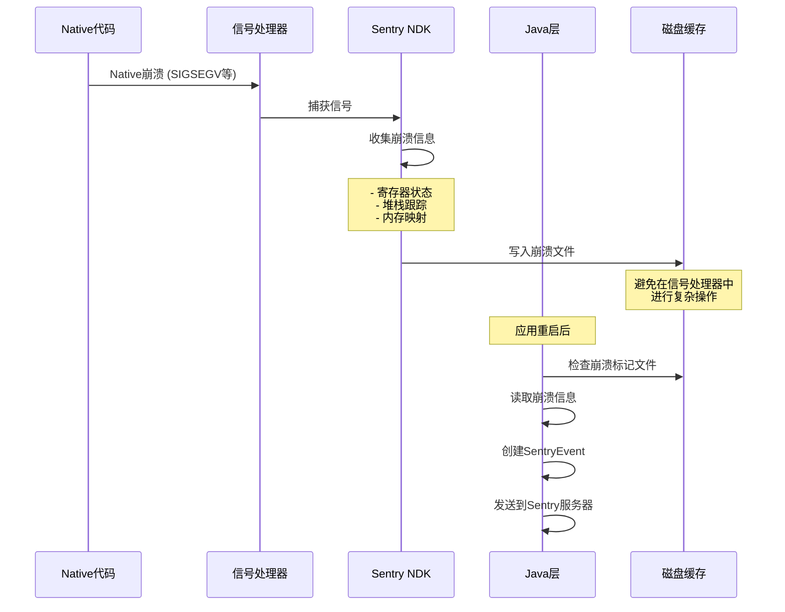
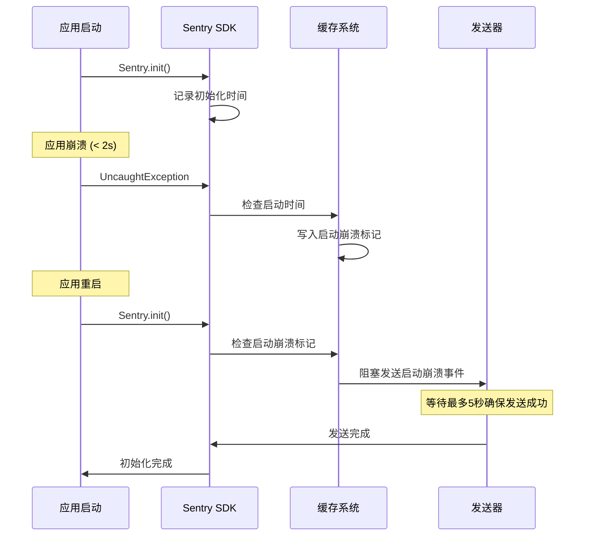
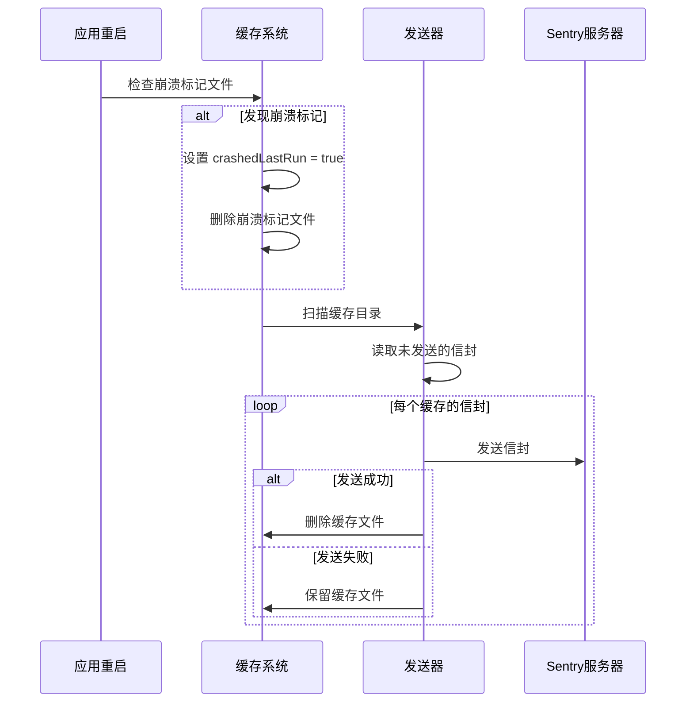

# Sentry 崩溃监控机制深度分析

本文档详细分析了 Sentry Java SDK 如何监控和处理各种类型的崩溃，包括 Java 异常、Android ANR、Native 崩溃等。

## 📁 核心代码文件结构

```
sentry-java/
├── sentry/src/main/java/io/sentry/
│   ├── UncaughtExceptionHandlerIntegration.java    # Java 未捕获异常处理
│   ├── DeduplicateMultithreadedEventProcessor.java # 多线程崩溃去重
│   ├── DuplicateEventDetectionEventProcessor.java  # 重复事件检测
│   ├── MainEventProcessor.java                     # 主事件处理器
│   ├── SentryClient.java                          # 事件捕获客户端
│   └── cache/EnvelopeCache.java                   # 离线缓存机制
├── sentry-android-core/src/main/java/io/sentry/android/core/
│   ├── ANRWatchDog.java                           # ANR 实时检测
│   ├── AnrIntegration.java                        # ANR 集成（旧版）
│   ├── AnrV2Integration.java                      # ANR 集成（新版）
│   ├── NdkIntegration.java                        # NDK 集成
│   ├── ApplicationNotResponding.java              # ANR 异常类
│   └── cache/AndroidEnvelopeCache.java           # Android 缓存实现
└── sentry-android-ndk/src/main/java/io/sentry/android/ndk/
    ├── SentryNdk.java                             # NDK 初始化
    └── NdkScopeObserver.java                      # 作用域同步
```

## 🎯 崩溃监控概览

Sentry 通过多层监控机制来捕获不同类型的崩溃：



## 1. Java 未捕获异常监控

### 1.1 核心机制：UncaughtExceptionHandlerIntegration

**文件路径**: `sentry/src/main/java/io/sentry/UncaughtExceptionHandlerIntegration.java`

```java
public final class UncaughtExceptionHandlerIntegration 
    implements Integration, Thread.UncaughtExceptionHandler, Closeable {
    
    private @Nullable Thread.UncaughtExceptionHandler defaultExceptionHandler;
    private @Nullable IScopes scopes;
    private @Nullable SentryOptions options;
    private final @NotNull UncaughtExceptionHandler threadAdapter;
    
    @Override
    public void register(final @NotNull IScopes scopes, final @NotNull SentryOptions options) {
        this.scopes = Objects.requireNonNull(scopes, "Scopes are required");
        this.options = Objects.requireNonNull(options, "SentryOptions is required");
        
        if (this.options.isEnableUncaughtExceptionHandler()) {
            // 保存原有的异常处理器
            final Thread.UncaughtExceptionHandler currentHandler = 
                threadAdapter.getDefaultUncaughtExceptionHandler();
            
            if (currentHandler != null) {
                if (currentHandler instanceof UncaughtExceptionHandlerIntegration) {
                    // 避免重复注册
                    final UncaughtExceptionHandlerIntegration currentHandlerIntegration =
                        (UncaughtExceptionHandlerIntegration) currentHandler;
                    defaultExceptionHandler = currentHandlerIntegration.defaultExceptionHandler;
                } else {
                    defaultExceptionHandler = currentHandler;
                }
            }
            
            // 设置 Sentry 的异常处理器
            threadAdapter.setDefaultUncaughtExceptionHandler(this);
        }
    }
}
```

### 1.2 异常捕获流程



### 1.3 关键实现细节

#### 异常包装机制
**文件路径**: `sentry/src/main/java/io/sentry/UncaughtExceptionHandlerIntegration.java:185-193`

```java
@TestOnly
@NotNull
static Throwable getUnhandledThrowable(
    final @NotNull Thread thread, final @NotNull Throwable thrown) {
    final Mechanism mechanism = new Mechanism();
    mechanism.setHandled(false);  // 标记为未处理
    mechanism.setType("UncaughtExceptionHandler");
    
    return new ExceptionMechanismException(mechanism, thrown, thread);
}
```

#### 阻塞刷新机制
**文件路径**: `sentry/src/main/java/io/sentry/UncaughtExceptionHandlerIntegration.java:95-140`

```java
@Override
public void uncaughtException(Thread thread, Throwable thrown) {
    if (options != null && scopes != null) {
        options.getLogger().log(SentryLevel.INFO, "Uncaught exception received.");
        
        try {
            final UncaughtExceptionHint exceptionHint =
                new UncaughtExceptionHint(options.getFlushTimeoutMillis(), options.getLogger());
            final Throwable throwable = getUnhandledThrowable(thread, thrown);
            final SentryEvent event = new SentryEvent(throwable);
            event.setLevel(SentryLevel.FATAL);
            
            // 处理事务状态
            final ITransaction transaction = scopes.getTransaction();
            if (transaction == null && event.getEventId() != null) {
                exceptionHint.setFlushable(event.getEventId());
            }
            final Hint hint = HintUtils.createWithTypeCheckHint(exceptionHint);
            
            final @NotNull SentryId sentryId = scopes.captureEvent(event, hint);
            final boolean isEventDropped = sentryId.equals(SentryId.EMPTY_ID);
            final EventDropReason eventDropReason = HintUtils.getEventDropReason(hint);
            
            // 特殊处理多线程去重情况
            if (!isEventDropped || EventDropReason.MULTITHREADED_DEDUPLICATION.equals(eventDropReason)) {
                // 阻塞等待事件刷新到磁盘
                if (!exceptionHint.waitFlush()) {
                    options.getLogger().log(SentryLevel.WARNING, 
                        "Timed out waiting to flush event to disk before crashing. Event: %s",
                        event.getEventId());
                }
            }
        } catch (Throwable e) {
            options.getLogger().log(SentryLevel.ERROR, 
                "Error sending uncaught exception to Sentry.", e);
        }
        
        // 调用原始异常处理器
        if (defaultExceptionHandler != null) {
            options.getLogger().log(SentryLevel.INFO, "Invoking inner uncaught exception handler.");
            defaultExceptionHandler.uncaughtException(thread, thrown);
        } else {
            if (options.isPrintUncaughtStackTrace()) {
                thrown.printStackTrace();
            }
        }
    }
}
```

## 2. Android ANR 监控

### 2.1 双重 ANR 检测机制

Sentry Android 提供两种 ANR 检测方式：

#### 方式一：ANRWatchDog (实时检测)
**文件路径**: `sentry-android-core/src/main/java/io/sentry/android/core/ANRWatchDog.java`

```java
final class ANRWatchDog extends Thread {
    private final boolean reportInDebug;
    private final ANRListener anrListener;
    private final MainLooperHandler uiHandler;
    private final ICurrentDateProvider timeProvider;
    private long pollingIntervalMs;  // 默认 500ms
    private final long timeoutIntervalMillis;  // 默认 5000ms
    private volatile long lastKnownActiveUiTimestampMs = 0;
    private final AtomicBoolean reported = new AtomicBoolean(false);
    private final @NotNull Context context;
    
    @SuppressWarnings("UnnecessaryLambda")
    private final Runnable ticker = () -> {
        lastKnownActiveUiTimestampMs = timeProvider.getCurrentTimeMillis();
        reported.set(false);
    };
    
    @Override
    public void run() {
        // 初始化时假设没有 ANR
        ticker.run();
        
        while (!isInterrupted()) {
            uiHandler.post(ticker);  // 向主线程发送心跳
            
            try {
                Thread.sleep(pollingIntervalMs);
            } catch (InterruptedException e) {
                // 处理中断
                Thread.currentThread().interrupt();
                return;
            }
            
            final long unresponsiveDurationMs = 
                timeProvider.getCurrentTimeMillis() - lastKnownActiveUiTimestampMs;
            
            // 检查是否超过 ANR 阈值
            if (unresponsiveDurationMs > timeoutIntervalMillis) {
                // 调试模式下的特殊处理
                if (!reportInDebug && (Debug.isDebuggerConnected() || Debug.waitingForDebugger())) {
                    logger.log(SentryLevel.DEBUG, 
                        "An ANR was detected but ignored because the debugger is connected.");
                    reported.set(true);
                    continue;
                }
                
                // 验证系统确实处于 ANR 状态并报告
                if (isProcessNotResponding() && reported.compareAndSet(false, true)) {
                    final String message = 
                        "Application Not Responding for at least " + timeoutIntervalMillis + " ms.";
                    final ApplicationNotResponding error = 
                        new ApplicationNotResponding(message, uiHandler.getThread());
                    anrListener.onAppNotResponding(error);
                }
            }
        }
    }
    
    // 通过 ActivityManager 验证进程是否真的处于 ANR 状态
    private boolean isProcessNotResponding() {
        final ActivityManager am = (ActivityManager) context.getSystemService(Context.ACTIVITY_SERVICE);
        if (am != null) {
            try {
                List<ActivityManager.ProcessErrorStateInfo> processesInErrorState = 
                    am.getProcessesInErrorState();
                if (processesInErrorState != null) {
                    for (ActivityManager.ProcessErrorStateInfo item : processesInErrorState) {
                        if (item.condition == ActivityManager.ProcessErrorStateInfo.NOT_RESPONDING) {
                            return true;
                        }
                    }
                }
                return false;
            } catch (Throwable e) {
                logger.log(SentryLevel.ERROR, "Error getting ActivityManager#getProcessesInErrorState.", e);
            }
        }
        return true;  // 如果无法获取 ActivityManager，假设是 ANR
    }
}
```

#### 方式二：AnrV2Integration (系统级检测)
**文件路径**: `sentry-android-core/src/main/java/io/sentry/android/core/AnrV2Integration.java`

```java
public final class AnrV2Integration implements Integration {
    
    @SuppressLint("NewApi") // Android 11+ 才支持
    @Override
    public void register(@NotNull IScopes scopes, @NotNull SentryOptions options) {
        this.options = (SentryAndroidOptions) options;
        
        if (this.options.isAnrEnabled()) {
            try {
                options.getExecutorService()
                    .submit(new AnrProcessor(context, scopes, this.options, dateProvider));
            } catch (Throwable e) {
                options.getLogger().log(SentryLevel.DEBUG, "Failed to start AnrProcessor.", e);
            }
        }
    }
    
    static class AnrProcessor implements Runnable {
        @SuppressLint("NewApi")
        @Override
        public void run() {
            final ActivityManager activityManager =
                (ActivityManager) context.getSystemService(Context.ACTIVITY_SERVICE);
            
            // 获取历史进程退出信息
            final List<ApplicationExitInfo> applicationExitInfoList =
                activityManager.getHistoricalProcessExitReasons(null, 0, 0);
                
            for (ApplicationExitInfo exitInfo : applicationExitInfoList) {
                if (exitInfo.getReason() == ApplicationExitInfo.REASON_ANR) {
                    reportAsSentryEvent(exitInfo, shouldEnrich);
                }
            }
        }
    }
    
    private void reportAsSentryEvent(final @NotNull ApplicationExitInfo exitInfo, final boolean shouldEnrich) {
        final long anrTimestamp = exitInfo.getTimestamp();
        final boolean isBackground = 
            exitInfo.getImportance() != ActivityManager.RunningAppProcessInfo.IMPORTANCE_FOREGROUND;
        
        // 解析系统提供的线程转储
        final ParseResult result = parseThreadDump(exitInfo, isBackground);
        if (result.type == ParseResult.Type.NO_DUMP) {
            options.getLogger().log(SentryLevel.WARNING, 
                "Not reporting ANR event as there was no thread dump for the ANR %s", 
                exitInfo.toString());
            return;
        }
        
        final AnrV2Hint anrHint = new AnrV2Hint(
            options.getFlushTimeoutMillis(), options.getLogger(), 
            anrTimestamp, shouldEnrich, isBackground);
        final Hint hint = HintUtils.createWithTypeCheckHint(anrHint);
        
        final SentryEvent event = new SentryEvent();
        if (result.type == ParseResult.Type.DUMP) {
            event.setThreads(result.threads);  // 设置线程信息
            if (result.debugImages != null) {
                final DebugMeta debugMeta = new DebugMeta();
                debugMeta.setImages(result.debugImages);
                event.setDebugMeta(debugMeta);
            }
        }
        
        event.setLevel(SentryLevel.FATAL);
        event.setTimestamp(DateUtils.getDateTime(anrTimestamp));
        
        // 可选：附加原始线程转储
        if (options.isAttachAnrThreadDump() && result.dump != null) {
            hint.setThreadDump(Attachment.fromThreadDump(result.dump));
        }
        
        final @NotNull SentryId sentryId = scopes.captureEvent(event, hint);
        final boolean isEventDropped = sentryId.equals(SentryId.EMPTY_ID);
        if (!isEventDropped) {
            // 阻塞等待事件刷新到磁盘
            if (!anrHint.waitFlush()) {
                options.getLogger().log(SentryLevel.WARNING, 
                    "Timed out waiting to flush ANR event to disk. Event: %s", 
                    event.getEventId());
            }
        }
    }
}
```

### 2.2 ANR 检测流程



### 2.3 线程转储解析

```java
public class ThreadDumpParser {
    public @NotNull List<SentryThread> parse(final @NotNull Lines lines) {
        final List<SentryThread> threads = new ArrayList<>();
        
        while (lines.hasNext()) {
            final String line = lines.next();
            
            if (THREAD_STATE_RE.matcher(line).matches()) {
                final SentryThread thread = parseThread(lines, line, isBackground);
                if (thread != null) {
                    threads.add(thread);
                }
            }
        }
        
        return threads;
    }
    
    private @Nullable SentryThread parseThread(Lines lines, String threadLine, boolean isBackground) {
        // 解析线程名称、状态、ID等信息
        final String threadName = extractThreadName(threadLine);
        final String threadState = extractThreadState(threadLine);
        
        final SentryThread sentryThread = new SentryThread();
        sentryThread.setName(threadName);
        sentryThread.setState(threadState);
        
        if (threadName != null && threadName.equals("main")) {
            sentryThread.setMain(true);
            sentryThread.setCrashed(true);  // ANR中主线程被标记为崩溃
        }
        
        // 解析堆栈跟踪
        final SentryStackTrace stackTrace = parseStacktrace(lines, sentryThread);
        sentryThread.setStacktrace(stackTrace);
        
        return sentryThread;
    }
}
```

## 3. Native 崩溃监控

### 3.1 NDK 集成架构

**文件路径**: `sentry-android-ndk/src/main/java/io/sentry/android/ndk/SentryNdk.java`

```java
@ApiStatus.Internal
public final class SentryNdk {
    
    private static final @NotNull CountDownLatch loadLibraryLatch = new CountDownLatch(1);
    
    static {
        // 在后台线程加载 Native 库
        new Thread(() -> {
            try {
                io.sentry.ndk.SentryNdk.loadNativeLibraries();
            } catch (Throwable t) {
                // 忽略加载错误，init() 时会再次抛出异常
            } finally {
                loadLibraryLatch.countDown();
            }
        }, "SentryNdkLoadLibs").start();
    }
    
    /**
     * 初始化 NDK 集成
     */
    public static void init(@NotNull final SentryAndroidOptions options) {
        SentryNdkUtil.addPackage(options.getSdkVersion());
        
        try {
            // 等待 Native 库加载完成（最多 2 秒）
            if (loadLibraryLatch.await(2000, TimeUnit.MILLISECONDS)) {
                final @NotNull NdkOptions ndkOptions = new NdkOptions(
                    Objects.requireNonNull(options.getDsn(), "DSN is required for sentry-ndk"),
                    options.isDebug(),
                    Objects.requireNonNull(options.getOutboxPath(), "outbox path is required for sentry-ndk"),
                    options.getRelease(),
                    options.getEnvironment(),
                    options.getDist(),
                    options.getMaxBreadcrumbs(),
                    options.getNativeSdkName()
                );
                
                // 配置 Native 异常处理策略
                final int handlerStrategy = options.getNdkHandlerStrategy();
                if (handlerStrategy == NdkHandlerStrategy.SENTRY_HANDLER_STRATEGY_DEFAULT.getValue()) {
                    ndkOptions.setNdkHandlerStrategy(
                        io.sentry.ndk.NdkHandlerStrategy.SENTRY_HANDLER_STRATEGY_DEFAULT);
                } else if (handlerStrategy == NdkHandlerStrategy.SENTRY_HANDLER_STRATEGY_CHAIN_AT_START.getValue()) {
                    ndkOptions.setNdkHandlerStrategy(
                        io.sentry.ndk.NdkHandlerStrategy.SENTRY_HANDLER_STRATEGY_CHAIN_AT_START);
                }
                
                // 配置性能监控采样率
                final @Nullable Double tracesSampleRate = options.getTracesSampleRate();
                if (tracesSampleRate == null) {
                    ndkOptions.setTracesSampleRate(0.0f);
                } else {
                    ndkOptions.setTracesSampleRate(tracesSampleRate.floatValue());
                }
                
                // 初始化 Native SDK
                io.sentry.ndk.SentryNdk.init(ndkOptions);
                
                // 启用作用域同步（将 Java 层的用户信息、标签等同步到 Native 层）
                if (options.isEnableScopeSync()) {
                    options.addScopeObserver(new NdkScopeObserver(options));
                }
                
                // 设置调试镜像加载器
                options.setDebugImagesLoader(new DebugImagesLoader(options, new NativeModuleListLoader()));
            } else {
                throw new IllegalStateException("Timeout waiting for Sentry NDK library to load");
            }
        } catch (InterruptedException e) {
            throw new IllegalStateException("Thread interrupted while waiting for NDK libs to be loaded", e);
        }
    }
    
    /** 关闭 NDK 集成 */
    public static void close() {
        try {
            if (loadLibraryLatch.await(2000, TimeUnit.MILLISECONDS)) {
                io.sentry.ndk.SentryNdk.close();
            } else {
                throw new IllegalStateException("Timeout waiting for Sentry NDK library to load");
            }
        } catch (InterruptedException e) {
            throw new IllegalStateException("Thread interrupted while waiting for NDK libs to be loaded", e);
        }
    }
}
```

### 3.2 Native 崩溃处理流程



### 3.3 作用域同步机制

**文件路径**: `sentry-android-ndk/src/main/java/io/sentry/android/ndk/NdkScopeObserver.java`

```java
@ApiStatus.Internal
public final class NdkScopeObserver extends ScopeObserverAdapter {
    
    private final @NotNull SentryOptions options;
    private final @NotNull INativeScope nativeScope;
    
    public NdkScopeObserver(final @NotNull SentryOptions options) {
        this(options, new NativeScope());
    }
    
    @Override
    public void setUser(final @Nullable User user) {
        try {
            options.getExecutorService().submit(() -> {
                if (user == null) {
                    // 移除用户信息
                    nativeScope.removeUser();
                } else {
                    nativeScope.setUser(
                        user.getId(),
                        user.getEmail(), 
                        user.getIpAddress(),
                        user.getUsername()
                    );
                }
            });
        } catch (Throwable e) {
            options.getLogger().log(SentryLevel.ERROR, e, "Scope sync setUser has an error.");
        }
    }
    
    @Override
    public void addBreadcrumb(final @NotNull Breadcrumb crumb) {
        try {
            options.getExecutorService().submit(() -> {
                String level = null;
                if (crumb.getLevel() != null) {
                    level = crumb.getLevel().name().toLowerCase(Locale.ROOT);
                }
                final String timestamp = DateUtils.getTimestamp(crumb.getTimestamp());
                
                String data = null;
                try {
                    final Map<String, Object> dataRef = crumb.getData();
                    if (!dataRef.isEmpty()) {
                        data = options.getSerializer().serialize(dataRef);
                    }
                } catch (Throwable e) {
                    options.getLogger().log(SentryLevel.ERROR, e, "Breadcrumb data is not serializable.");
                }
                
                nativeScope.addBreadcrumb(
                    level,
                    crumb.getMessage(),
                    crumb.getCategory(),
                    crumb.getType(),
                    timestamp,
                    data);
            });
        } catch (Throwable e) {
            options.getLogger().log(SentryLevel.ERROR, e, "Scope sync addBreadcrumb has an error.");
        }
    }
    
    @Override
    public void setTag(final @NotNull String key, final @NotNull String value) {
        try {
            options.getExecutorService().submit(() -> nativeScope.setTag(key, value));
        } catch (Throwable e) {
            options.getLogger().log(SentryLevel.ERROR, e, "Scope sync setTag(%s) has an error.", key);
        }
    }
    
    @Override
    public void removeTag(final @NotNull String key) {
        try {
            options.getExecutorService().submit(() -> nativeScope.removeTag(key));
        } catch (Throwable e) {
            options.getLogger().log(SentryLevel.ERROR, e, "Scope sync removeTag(%s) has an error.", key);
        }
    }
    
    @Override
    public void setExtra(final @NotNull String key, final @NotNull String value) {
        try {
            options.getExecutorService().submit(() -> nativeScope.setExtra(key, value));
        } catch (Throwable e) {
            options.getLogger().log(SentryLevel.ERROR, e, "Scope sync setExtra(%s) has an error.", key);
        }
    }
    
    @Override
    public void removeExtra(final @NotNull String key) {
        try {
            options.getExecutorService().submit(() -> nativeScope.removeExtra(key));
        } catch (Throwable e) {
            options.getLogger().log(SentryLevel.ERROR, e, "Scope sync removeExtra(%s) has an error.", key);
        }
    }
    
    @Override
    public void setTrace(@Nullable SpanContext spanContext, @NotNull IScope scope) {
        if (spanContext == null) {
            return;
        }
        
        try {
            options.getExecutorService().submit(() ->
                nativeScope.setTrace(
                    spanContext.getTraceId().toString(), 
                    spanContext.getSpanId().toString()));
        } catch (Throwable e) {
            options.getLogger().log(SentryLevel.ERROR, e, "Scope sync setTrace failed.");
        }
    }
}
```

## 4. 启动崩溃检测

### 4.1 启动崩溃定义

启动崩溃是指在应用启动后的短时间内（默认2秒）发生的崩溃：

**文件路径**: `sentry-android-core/src/main/java/io/sentry/android/core/cache/AndroidEnvelopeCache.java`

```java
@ApiStatus.Internal
public final class AndroidEnvelopeCache extends EnvelopeCache {
    
    public static final String LAST_ANR_REPORT = "last_anr_report";
    private final @NotNull ICurrentDateProvider currentDateProvider;
    
    public AndroidEnvelopeCache(final @NotNull SentryAndroidOptions options) {
        this(options, AndroidCurrentDateProvider.getInstance());
    }
    
    @Override
    public void store(@NotNull SentryEnvelope envelope, @NotNull Hint hint) {
        super.store(envelope, hint);
        
        final SentryAndroidOptions options = (SentryAndroidOptions) this.options;
        final TimeSpan sdkInitTimeSpan = AppStartMetrics.getInstance().getSdkInitTimeSpan();
        
        // 检测启动崩溃
        if (HintUtils.hasType(hint, UncaughtExceptionHandlerIntegration.UncaughtExceptionHint.class)
            && sdkInitTimeSpan.hasStarted()) {
            
            long timeSinceSdkInit = 
                currentDateProvider.getCurrentTimeMillis() - sdkInitTimeSpan.getStartUptimeMs();
                
            if (timeSinceSdkInit <= options.getStartupCrashDurationThresholdMillis()) {
                options.getLogger().log(DEBUG, 
                    "Startup Crash detected %d milliseconds after SDK init. Writing a startup crash marker file to disk.",
                    timeSinceSdkInit);
                writeStartupCrashMarkerFile();
            }
        }
        
        // 处理 ANR V2 事件
        HintUtils.runIfHasType(hint, AnrV2Integration.AnrV2Hint.class, (anrHint) -> {
            final @Nullable Long timestamp = anrHint.timestamp();
            options.getLogger().log(SentryLevel.DEBUG, 
                "Writing last reported ANR marker with timestamp %d", timestamp);
            writeLastReportedAnrMarker(timestamp);
        });
    }
    
    private void writeStartupCrashMarkerFile() {
        // 使用 outbox 路径，确保与混合 SDK 兼容
        final String outboxPath = options.getOutboxPath();
        if (outboxPath == null) {
            options.getLogger().log(DEBUG, 
                "Outbox path is null, the startup crash marker file will not be written");
            return;
        }
        
        final File crashMarkerFile = new File(outboxPath, STARTUP_CRASH_MARKER_FILE);
        try {
            crashMarkerFile.createNewFile();
        } catch (Throwable e) {
            options.getLogger().log(ERROR, 
                "Error writing the startup crash marker file to the disk", e);
        }
    }
    
    public static boolean hasStartupCrashMarker(final @NotNull SentryOptions options) {
        final String outboxPath = options.getOutboxPath();
        if (outboxPath == null) {
            options.getLogger().log(DEBUG, 
                "Outbox path is null, the startup crash marker file does not exist");
            return false;
        }
        
        final File crashMarkerFile = new File(outboxPath, STARTUP_CRASH_MARKER_FILE);
        try {
            final boolean exists = crashMarkerFile.exists();
            if (exists) {
                if (!crashMarkerFile.delete()) {
                    options.getLogger().log(ERROR, 
                        "Failed to delete the startup crash marker file. %s.",
                        crashMarkerFile.getAbsolutePath());
                }
            }
            return exists;
        } catch (Throwable e) {
            options.getLogger().log(ERROR, 
                "Error reading/deleting the startup crash marker file on the disk", e);
        }
        return false;
    }
}
```

### 4.2 启动崩溃处理



## 5. 事件处理流程

### 5.1 事件捕获统一入口

```java
public class SentryClient implements ISentryClient {
    @Override
    public @NotNull SentryId captureEvent(
        @NotNull SentryEvent event, 
        @Nullable IScope scope, 
        @Nullable Hint hint) {
        
        // 1. 验证和预处理
        if (shouldApplyScopeData(event, hint)) {
            event = applyScope(event, scope, hint);
        }
        
        // 2. 事件处理器链
        event = processEvent(event, hint, options.getEventProcessors());
        if (scope != null) {
            event = processEvent(event, hint, scope.getEventProcessors());
        }
        
        // 3. beforeSend 回调
        event = executeBeforeSend(event, hint);
        
        // 4. 构建信封并发送
        final SentryEnvelope envelope = buildEnvelope(event, attachments, session, traceContext);
        return sendEnvelope(envelope, hint);
    }
}
```

### 5.2 事件处理器链


#### 关键处理器说明

**MainEventProcessor**: 添加设备信息、线程信息、上下文数据
**文件路径**: `sentry/src/main/java/io/sentry/MainEventProcessor.java`

```java
@ApiStatus.Internal
public final class MainEventProcessor implements EventProcessor, Closeable {
    
    private final @NotNull SentryOptions options;
    private final @NotNull SentryThreadFactory sentryThreadFactory;
    private final @NotNull SentryExceptionFactory sentryExceptionFactory;
    private volatile @Nullable HostnameCache hostnameCache = null;
    
    @Override
    public @NotNull SentryEvent process(final @NotNull SentryEvent event, final @NotNull Hint hint) {
        setCommons(event);        // 设置通用信息（release、environment、dist等）
        setExceptions(event);     // 处理异常信息
        setDebugMeta(event);      // 设置调试元数据
        setModules(event);        // 设置模块信息
        
        if (shouldApplyScopeData(event, hint)) {
            processNonCachedEvent(event);  // 处理非缓存事件
            setThreads(event, hint);       // 设置线程信息
        }
        
        return event;
    }
    
    private boolean shouldApplyScopeData(final @NotNull SentryBaseEvent event, final @NotNull Hint hint) {
        if (HintUtils.shouldApplyScopeData(hint)) {
            return true;
        } else {
            options.getLogger().log(SentryLevel.DEBUG,
                "Event was cached so not applying data relevant to the current app execution/version: %s",
                event.getEventId());
            return false;
        }
    }
    
    private void setThreads(final @NotNull SentryEvent event, final @NotNull Hint hint) {
        if (event.getThreads() != null) {
            // 标记崩溃线程
            if (HintUtils.hasType(hint, UncaughtExceptionHandlerIntegration.UncaughtExceptionHint.class)) {
                final SentryException unhandledException = event.getUnhandledException();
                if (unhandledException != null) {
                    final Long threadId = unhandledException.getThreadId();
                    if (threadId != null) {
                        for (SentryThread thread : event.getThreads()) {
                            if (threadId.equals(thread.getId())) {
                                thread.setCrashed(true);
                                break;
                            }
                        }
                    }
                }
            }
        } else if (options.isAttachThreads() && !isCachedHint(hint)) {
            // 附加线程信息
            event.setThreads(sentryThreadFactory.getAllThreads());
        } else if (options.isAttachStacktrace() && !isCachedHint(hint) && event.getThrowable() == null) {
            // 只附加当前线程堆栈
            event.setThreads(sentryThreadFactory.getCurrentThread());
        }
    }
    
    @Override
    public @Nullable Long getOrder() {
        return 0L;  // 最高优先级
    }
}
```

**DeduplicateMultithreadedEventProcessor**: 多线程崩溃去重
**文件路径**: `sentry/src/main/java/io/sentry/DeduplicateMultithreadedEventProcessor.java`

```java
/**
 * 去重同时发生的相同类型崩溃事件的事件处理器。
 * 这种情况可能发生在 OutOfMemory 错误或 CursorWindowAllocationException 等
 * 与内存不足时分配内存相关的错误中。
 */
public final class DeduplicateMultithreadedEventProcessor implements EventProcessor {
    
    private final @NotNull Map<String, Long> processedEvents = 
        Collections.synchronizedMap(new HashMap<>());
    private final @NotNull SentryOptions options;
    
    @Override
    public @Nullable SentryEvent process(final @NotNull SentryEvent event, final @NotNull Hint hint) {
        // 只处理来自 UncaughtExceptionHandler 的崩溃
        if (!HintUtils.hasType(hint, UncaughtExceptionHandlerIntegration.UncaughtExceptionHint.class)) {
            return event;
        }
        
        final SentryException exception = event.getUnhandledException();
        if (exception == null) return event;
        
        final String type = exception.getType();
        if (type == null) return event;
        
        final Long currentEventTid = exception.getThreadId();
        if (currentEventTid == null) return event;
        
        // 检查是否已经处理过相同类型的异常
        final Long tid = processedEvents.get(type);
        if (tid != null && !tid.equals(currentEventTid)) {
            options.getLogger().log(SentryLevel.INFO,
                "Event %s has been dropped due to multi-threaded deduplication",
                event.getEventId());
            // 丢弃重复的多线程崩溃
            HintUtils.setEventDropReason(hint, EventDropReason.MULTITHREADED_DEDUPLICATION);
            return null;
        }
        
        processedEvents.put(type, currentEventTid);
        return event;
    }
    
    @Override
    public @Nullable Long getOrder() {
        return 7000L;  // 较低优先级，在主要处理器之后执行
    }
}
```

## 6. 传输和持久化

### 6.1 离线缓存机制

**文件路径**: `sentry/src/main/java/io/sentry/cache/EnvelopeCache.java`

```java
@Open
@ApiStatus.Internal
public class EnvelopeCache extends CacheStrategy implements IEnvelopeCache {
    
    public static final String SUFFIX_ENVELOPE_FILE = ".envelope";
    public static final String CRASH_MARKER_FILE = "last_crash";
    public static final String NATIVE_CRASH_MARKER_FILE = ".sentry-native/" + CRASH_MARKER_FILE;
    public static final String STARTUP_CRASH_MARKER_FILE = "startup_crash";
    
    private final CountDownLatch previousSessionLatch;
    private final @NotNull Map<SentryEnvelope, String> fileNameMap = new WeakHashMap<>();
    protected final @NotNull AutoClosableReentrantLock cacheLock = new AutoClosableReentrantLock();
    
    @Override
    public void store(final @NotNull SentryEnvelope envelope, final @NotNull Hint hint) {
        Objects.requireNonNull(envelope, "Envelope is required.");
        
        rotateCacheIfNeeded(allEnvelopeFiles());
        
        // 处理会话相关逻辑
        handleSessionHints(hint, envelope);
        
        final File envelopeFile = getEnvelopeFile(envelope);
        if (envelopeFile.exists()) {
            options.getLogger().log(WARNING,
                "Not adding Envelope to offline storage because it already exists: %s",
                envelopeFile.getAbsolutePath());
            return;
        } else {
            options.getLogger().log(DEBUG, 
                "Adding Envelope to offline storage: %s", envelopeFile.getAbsolutePath());
        }
        
        // 将信封写入磁盘
        writeEnvelopeToDisk(envelopeFile, envelope);
        
        // 写入崩溃标记文件（当即将崩溃时）
        if (HintUtils.hasType(hint, UncaughtExceptionHandlerIntegration.UncaughtExceptionHint.class)) {
            writeCrashMarkerFile();
        }
    }
    
    private void writeCrashMarkerFile() {
        final File crashMarkerFile = new File(options.getCacheDirPath(), CRASH_MARKER_FILE);
        try (final OutputStream outputStream = new FileOutputStream(crashMarkerFile)) {
            final String timestamp = DateUtils.getTimestamp(DateUtils.getCurrentDateTime());
            outputStream.write(timestamp.getBytes(UTF_8));
            outputStream.flush();
        } catch (Throwable e) {
            options.getLogger().log(ERROR, "Error writing the crash marker file to the disk", e);
        }
    }
    
    private void handleSessionHints(final @NotNull Hint hint, final @NotNull SentryEnvelope envelope) {
        final File currentSessionFile = getCurrentSessionFile(directory.getAbsolutePath());
        final File previousSessionFile = getPreviousSessionFile(directory.getAbsolutePath());
        
        if (HintUtils.hasType(hint, SessionEnd.class)) {
            if (!currentSessionFile.delete()) {
                options.getLogger().log(WARNING, "Current envelope doesn't exist.");
            }
        }
        
        if (HintUtils.hasType(hint, AbnormalExit.class)) {
            tryEndPreviousSession(hint);
        }
        
        if (HintUtils.hasType(hint, SessionStart.class)) {
            // 处理会话开始逻辑
            updateCurrentSession(currentSessionFile, envelope);
            
            // 检查崩溃标记文件
            boolean crashedLastRun = checkCrashMarkers();
            SentryCrashLastRunState.getInstance().setCrashedLastRun(crashedLastRun);
            
            flushPreviousSession();
        }
    }
    
    private boolean checkCrashMarkers() {
        boolean crashedLastRun = false;
        
        // 检查 Native 崩溃标记
        final File nativeCrashMarkerFile = new File(options.getCacheDirPath(), NATIVE_CRASH_MARKER_FILE);
        if (nativeCrashMarkerFile.exists()) {
            crashedLastRun = true;
        }
        
        // 检查 Java 崩溃标记
        if (!crashedLastRun) {
            final File javaCrashMarkerFile = new File(options.getCacheDirPath(), CRASH_MARKER_FILE);
            if (javaCrashMarkerFile.exists()) {
                options.getLogger().log(INFO, "Crash marker file exists, crashedLastRun will return true.");
                crashedLastRun = true;
                if (!javaCrashMarkerFile.delete()) {
                    options.getLogger().log(ERROR,
                        "Failed to delete the crash marker file. %s.",
                        javaCrashMarkerFile.getAbsolutePath());
                }
            }
        }
        
        return crashedLastRun;
    }
}
```

### 6.2 崩溃恢复流程



## 7. 性能优化策略

### 7.1 异步处理

```java
public class UncaughtExceptionHandlerIntegration {
    @Override
    public void uncaughtException(Thread thread, Throwable thrown) {
        try {
            // 创建事件（同步，快速）
            final SentryEvent event = new SentryEvent(throwable);
            event.setLevel(SentryLevel.FATAL);
            
            // 捕获事件（可能异步）
            final @NotNull SentryId sentryId = scopes.captureEvent(event, hint);
            
            // 阻塞等待刷新（确保数据不丢失）
            if (!exceptionHint.waitFlush()) {
                options.getLogger().log(SentryLevel.WARNING, 
                    "Timed out waiting to flush event to disk before crashing.");
            }
        } catch (Throwable e) {
            // 异常处理不能影响原始崩溃流程
            options.getLogger().log(SentryLevel.ERROR, 
                "Error sending uncaught exception to Sentry.", e);
        }
        
        // 调用原始异常处理器
        if (defaultExceptionHandler != null) {
            defaultExceptionHandler.uncaughtException(thread, thrown);
        }
    }
}
```

### 7.2 内存管理

```java
public class SentryClient {
    private @NotNull SentryId sendEnvelope(@NotNull SentryEnvelope envelope, @Nullable Hint hint) {
        try {
            // 发送前清理 hint 中的大对象
            hint.clear();
            
            if (hint == null) {
                transport.send(envelope);
            } else {
                transport.send(envelope, hint);
            }
        } finally {
            // 确保资源释放
            if (hint != null) {
                hint.clear();
            }
        }
    }
}
```

## 8. 配置和最佳实践

### 8.1 关键配置选项

```java
// 基础配置
options.setDsn("YOUR_DSN");
options.setEnvironment("production");
options.setRelease("1.0.0");

// 崩溃相关配置
options.setEnableUncaughtExceptionHandler(true);  // 启用未捕获异常处理
options.setFlushTimeoutMillis(5000);              // 崩溃时刷新超时
options.setPrintUncaughtStackTrace(false);        // 生产环境关闭堆栈打印

// Android 特定配置
options.setAnrEnabled(true);                      // 启用ANR检测
options.setAnrTimeoutIntervalMillis(5000);        // ANR超时时间
options.setAnrReportInDebug(false);               // 调试时不报告ANR

// Native 崩溃配置
options.setEnableNdk(true);                       // 启用NDK崩溃捕获
options.setEnableScopeSync(true);                 // 启用作用域同步

// 启动崩溃配置
options.setStartupCrashDurationThresholdMillis(2000);  // 启动崩溃时间阈值
options.setStartupCrashFlushTimeoutMillis(5000);       // 启动崩溃刷新超时
```

### 8.2 最佳实践

#### ✅ 推荐做法
- **尽早初始化**: 在 Application.onCreate() 中初始化 Sentry
- **合理配置超时**: 根据应用特点调整刷新超时时间
- **启用所有监控**: 同时启用 Java、ANR、Native 崩溃监控
- **测试崩溃恢复**: 验证崩溃后的数据恢复机制

#### ❌ 避免做法
- **在崩溃处理器中执行复杂操作**: 可能导致二次崩溃
- **忽略启动崩溃**: 启动崩溃往往影响更严重
- **禁用缓存机制**: 可能导致崩溃数据丢失
- **过短的超时时间**: 可能导致崩溃数据未完全写入

## 9. 故障排查

### 9.1 常见问题

**Q: 崩溃事件没有上报？**
A: 检查网络连接、DSN配置、是否启用了相应的集成

**Q: ANR 检测不准确？**
A: 调整 ANR 超时时间，检查是否在调试模式下运行

**Q: Native 崩溃信息不完整？**
A: 确保符号文件已上传，检查 NDK 版本兼容性

**Q: 启动崩溃处理缓慢？**
A: 调整启动崩溃刷新超时时间，优化网络配置

### 9.2 调试技巧

```java
// 启用详细日志
options.setDebug(true);
options.setLogger(new SystemOutLogger());

// 监控崩溃处理状态
options.setBeforeEnvelopeCallback((envelope, hint) -> {
    System.out.println("Sending envelope: " + envelope.getHeader().getEventId());
});

// 检查崩溃标记文件
File crashMarker = new File(options.getCacheDirPath(), "sentry-java-crash-marker");
if (crashMarker.exists()) {
    System.out.println("Previous session crashed");
}
```

## 9. 集成初始化流程

### 9.1 Android 集成初始化

**文件路径**: `sentry-android-core/src/main/java/io/sentry/android/core/AndroidOptionsInitializer.java`

```java
static void installDefaultIntegrations(
    final @NotNull Context context,
    final @NotNull SentryAndroidOptions options,
    final @NotNull BuildInfoProvider buildInfoProvider,
    final @NotNull LoadClass loadClass,
    final @NotNull ActivityFramesTracker activityFramesTracker,
    final boolean isFragmentAvailable,
    final boolean isTimberAvailable,
    final boolean isReplayAvailable) {

    // 读取启动崩溃标记，避免重复 I/O 操作
    LazyEvaluator<Boolean> startupCrashMarkerEvaluator =
        new LazyEvaluator<>(() -> AndroidEnvelopeCache.hasStartupCrashMarker(options));

    // 发送缓存的信封（优先处理启动崩溃）
    options.addIntegration(
        new SendCachedEnvelopeIntegration(
            new SendFireAndForgetEnvelopeSender(() -> options.getCacheDirPath()),
            startupCrashMarkerEvaluator));

    // NDK 集成（必须在文件观察器之前）
    final Class<?> sentryNdkClass = loadClass.loadClass(SENTRY_NDK_CLASS_NAME, options.getLogger());
    options.addIntegration(new NdkIntegration(sentryNdkClass));

    // 文件观察器集成
    options.addIntegration(EnvelopeFileObserverIntegration.getOutboxFileObserver());

    // 发送 outbox 中的缓存信封
    options.addIntegration(
        new SendCachedEnvelopeIntegration(
            new SendFireAndForgetOutboxSender(() -> options.getOutboxPath()),
            startupCrashMarkerEvaluator));

    // ANR 集成（根据 Android 版本选择）
    options.addIntegration(AnrIntegrationFactory.create(context, options.getLogger()));

    // 其他集成...
    options.addIntegration(new ActivityLifecycleIntegration(application, buildInfoProvider, activityFramesTracker));
    options.addIntegration(new AppLifecycleIntegration());
    options.addIntegration(new SystemEventsBreadcrumbsIntegration(context));
    options.addIntegration(new AppComponentsBreadcrumbsIntegration(context));
    options.addIntegration(new NetworkBreadcrumbsIntegration(context, buildInfoProvider, options.getLogger()));
    options.addIntegration(new TempSensorBreadcrumbsIntegration(context));
    options.addIntegration(new PhoneStateBreadcrumbsIntegration(context));
}
```

### 9.2 启动崩溃处理流程

**文件路径**: `sentry-android-core/src/main/java/io/sentry/android/core/SendCachedEnvelopeIntegration.java`

```java
final class SendCachedEnvelopeIntegration implements Integration {
    
    private final @NotNull LazyEvaluator<Boolean> startupCrashMarkerEvaluator;
    private final AtomicBoolean startupCrashHandled = new AtomicBoolean(false);
    
    @Override
    public void register(@NotNull IScopes scopes, @NotNull SentryOptions options) {
        // 提交发送任务到执行器
        final Future<?> future = options.getExecutorService().submit(() -> {
            try {
                if (sender == null) {
                    options.getLogger().log(SentryLevel.ERROR, 
                        "SendCachedEnvelopeIntegration factory is null.");
                    return;
                }
                sender.send();
            } catch (Throwable e) {
                options.getLogger().log(SentryLevel.ERROR, 
                    "Failed trying to send cached events.", e);
            }
        });
        
        // 如果存在启动崩溃标记，阻塞等待发送完成
        if (startupCrashMarkerEvaluator.getValue() && startupCrashHandled.compareAndSet(false, true)) {
            options.getLogger().log(SentryLevel.DEBUG, "Startup Crash marker exists, blocking flush.");
            try {
                future.get(options.getStartupCrashFlushTimeoutMillis(), TimeUnit.MILLISECONDS);
            } catch (TimeoutException e) {
                options.getLogger().log(SentryLevel.DEBUG, 
                    "Synchronous send timed out, continuing in the background.");
            }
        }
    }
}
```

## 10. 性能优化和最佳实践

### 10.1 关键性能优化

#### 异步处理
- **后台线程加载**: NDK 库在后台线程加载，避免阻塞主线程
- **异步作用域同步**: 所有 Native 作用域同步操作都在后台执行
- **非阻塞事件处理**: 除崩溃场景外，事件处理不阻塞应用

#### 内存管理
- **弱引用映射**: 使用 `WeakHashMap` 存储文件映射，避免内存泄漏
- **及时清理**: 事件发送后立即清理 Hint 对象
- **缓存轮转**: 自动清理过期的缓存文件

#### 去重机制
- **多线程去重**: 防止同一类型异常在多个线程同时报告
- **重复事件检测**: 基于异常对象的弱引用检测重复事件
- **ANR 去重**: 防止同一 ANR 被多次报告

### 10.2 配置最佳实践

```java
// 生产环境推荐配置
SentryAndroid.init(this, options -> {
    options.setDsn("YOUR_DSN");
    options.setEnvironment("production");
    options.setRelease("1.0.0");
    
    // 崩溃监控配置
    options.setEnableUncaughtExceptionHandler(true);
    options.setFlushTimeoutMillis(5000);
    options.setPrintUncaughtStackTrace(false);
    
    // ANR 监控配置
    options.setAnrEnabled(true);
    options.setAnrTimeoutIntervalMillis(5000);
    options.setAnrReportInDebug(false);
    
    // Native 崩溃配置
    options.setEnableNdk(true);
    options.setEnableScopeSync(true);
    
    // 启动崩溃配置
    options.setStartupCrashDurationThresholdMillis(2000);
    options.setStartupCrashFlushTimeoutMillis(5000);
    
    // 性能优化配置
    options.setMaxCacheItems(30);
    options.setEnableDeduplication(true);
    options.setAttachThreads(true);
    options.setAttachStacktrace(true);
});
```

## 总结

Sentry Java SDK 的崩溃监控机制通过精心设计的多层架构，实现了对各种类型崩溃的全面、可靠监控：

### 🎯 核心特性
1. **全面覆盖**: Java异常、Android ANR、Native崩溃、启动崩溃
2. **可靠传输**: 离线缓存、重试机制、阻塞刷新
3. **性能优化**: 异步处理、内存管理、智能去重
4. **易于集成**: 自动注册、合理默认值、灵活配置

### 🔧 技术亮点
- **双重 ANR 检测**: 结合实时检测和系统级检测，确保准确性
- **智能启动崩溃处理**: 阻塞发送确保关键崩溃数据不丢失
- **多线程崩溃去重**: 防止内存不足等场景下的重复报告
- **Native-Java 作用域同步**: 确保 Native 崩溃包含完整上下文

### 📊 监控覆盖
| 崩溃类型 | 检测机制 | 文件路径 | 特殊处理 |
|---------|---------|----------|----------|
| Java 未捕获异常 | UncaughtExceptionHandler | `UncaughtExceptionHandlerIntegration.java` | 阻塞刷新、多线程去重 |
| Android ANR | ANRWatchDog + AnrV2 | `ANRWatchDog.java`, `AnrV2Integration.java` | 双重检测、线程转储解析 |
| Native 崩溃 | NDK Signal Handler | `SentryNdk.java`, `NdkIntegration.java` | 作用域同步、调试镜像 |
| 启动崩溃 | 时间阈值检测 | `AndroidEnvelopeCache.java` | 阻塞发送、优先处理 |

这套完整的崩溃监控机制确保了在各种异常情况下，崩溃信息都能被准确捕获并可靠地发送到 Sentry 服务器，为开发者提供完整、准确的崩溃分析数据，助力应用质量提升。 