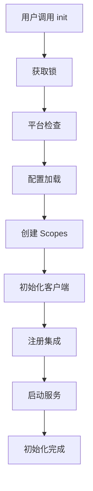
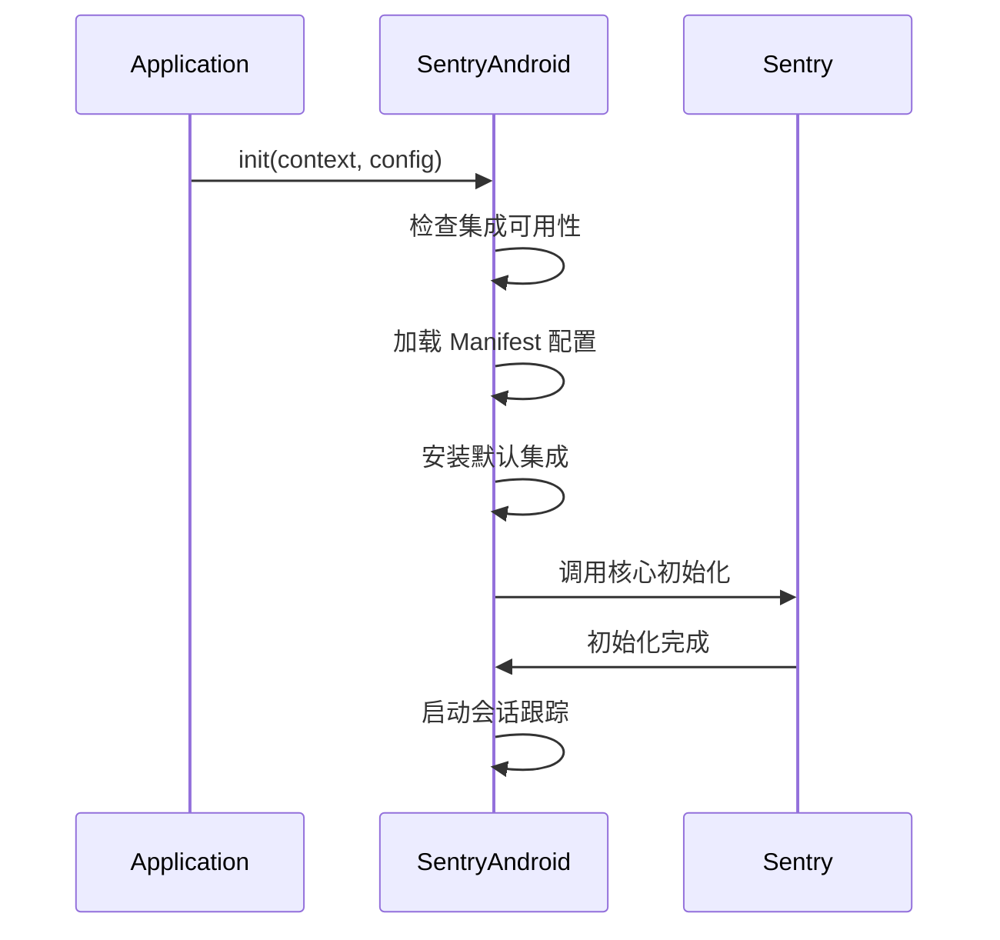

# Sentry 初始化快速参考

## 🚀 核心初始化步骤

### 1. 基本 Java 初始化
```java
Sentry.init(options -> {
    options.setDsn("YOUR_DSN_HERE");
    options.setDebug(true);
});
```

### 2. Android 初始化
```java
SentryAndroid.init(this, options -> {
    options.setDsn("YOUR_DSN_HERE");
    options.setDebug(true);
});
```

## 📋 初始化流程概览



## 🔧 关键组件

| 组件 | 作用 | 关键类 |
|------|------|--------|
| **Sentry** | 主入口类 | `Sentry.java` |
| **Options** | 配置管理 | `SentryOptions.java` |
| **Scopes** | 上下文管理 | `IScopes.java` |
| **Client** | 事件处理 | `SentryClient.java` |
| **Transport** | 网络传输 | `ITransport.java` |
| **Integration** | 框架集成 | `Integration.java` |

## ⚙️ 配置优先级

1. 🔴 **用户代码** - `options.setXxx()`
2. 🟠 **配置文件** - `sentry.properties`
3. 🟡 **系统属性** - `-Dsentry.xxx`
4. 🟢 **环境变量** - `SENTRY_XXX`
5. 🔵 **Manifest** - `<meta-data>` (Android)
6. ⚪ **默认值**

## 🔒 线程安全机制

```java
// 全局锁保护初始化
private static final AutoClosableReentrantLock lock = new AutoClosableReentrantLock();

// volatile 变量确保可见性
private static volatile IScopes rootScopes = NoOpScopes.getInstance();
```

## 📱 Android 特定流程



## 🔌 常用集成

### Java 集成
- `UncaughtExceptionHandlerIntegration` - 全局异常捕获
- `ShutdownHookIntegration` - 应用关闭处理

### Android 集成
- `ActivityLifecycleIntegration` - Activity 生命周期
- `AnrIntegration` - ANR 检测
- `NetworkBreadcrumbsIntegration` - 网络监控
- `FragmentLifecycleIntegration` - Fragment 生命周期

### Spring 集成
- `SentrySpringIntegration` - Spring 框架集成
- `SentryWebMvcIntegration` - Web MVC 集成

## 🎯 最佳实践

### ✅ 推荐做法
- 在应用启动时尽早初始化
- 使用环境变量管理不同环境的 DSN
- 启用调试模式进行问题排查
- 合理设置采样率控制数据量

### ❌ 避免做法
- 重复调用 `init()` 方法
- 在代码中硬编码敏感信息
- 忽略初始化异常
- 在生产环境启用调试模式

## 🐛 常见问题

### Q: 初始化失败怎么办？
A: 检查 DSN 格式、网络连接、权限配置

### Q: Android 上集成不生效？
A: 确认使用 `SentryAndroid.init()` 而非 `Sentry.init()`

### Q: 如何自定义集成？
A: 实现 `Integration` 接口并在配置中添加

### Q: 性能影响如何？
A: SDK 使用异步处理，对应用性能影响极小

## 📊 监控指标

初始化完成后可监控：
- 错误捕获率
- 性能指标
- 用户会话
- 发布健康度

## 🔍 调试技巧

```java
// 启用详细日志
options.setDebug(true);
options.setLogger(new SystemOutLogger());

// 检查初始化状态
if (Sentry.isEnabled()) {
    System.out.println("Sentry 初始化成功");
}
```

## 📚 相关文档

- [完整初始化流程图](./sentry-initialization-flow.md)
- [详细实现说明](./sentry-initialization-details.md)
- [官方文档](https://docs.sentry.io/platforms/java/)

---

💡 **提示**: 这个快速参考涵盖了 Sentry 初始化的核心要点，详细信息请参考完整文档。 