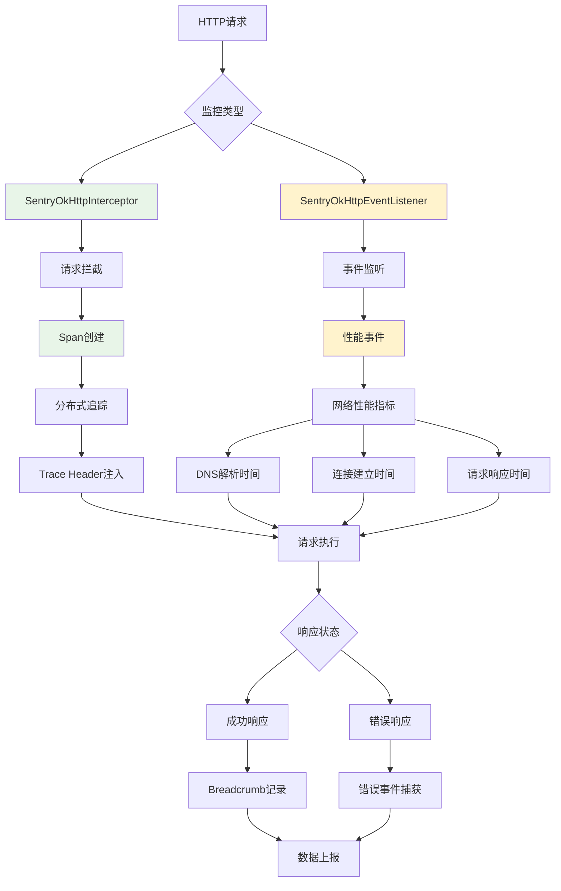

# Sentry 网络监控机制深度分析

本文档详细分析了 Sentry Java SDK 的网络监控功能，包括 OkHttp 集成、网络性能监控、HTTP 错误捕获、分布式追踪等核心实现。

## 🎯 网络监控概览

Sentry 通过拦截器和事件监听器，为 HTTP 请求提供全面的监控和追踪：



## 1. SentryOkHttpInterceptor - 请求拦截器

### 1.1 核心功能架构

```kotlin
public open class SentryOkHttpInterceptor(
    private val scopes: IScopes = ScopesAdapter.getInstance(),
    private val beforeSpan: BeforeSpanCallback? = null,
    private val captureFailedRequests: Boolean = true,
    private val failedRequestStatusCodes: List<HttpStatusCodeRange> = listOf(
        HttpStatusCodeRange(HttpStatusCodeRange.DEFAULT_MIN, HttpStatusCodeRange.DEFAULT_MAX)
    ),
    private val failedRequestTargets: List<String> = listOf(DEFAULT_PROPAGATION_TARGETS)
) : Interceptor {
    
    companion object {
        private const val TRACE_ORIGIN = "auto.http.okhttp"
    }
}
```

### 1.2 请求拦截处理

```kotlin
override fun intercept(chain: Interceptor.Chain): Response {
    var request = chain.request()
    
    val urlDetails = UrlUtils.parse(request.url.toString())
    val url = urlDetails.urlOrFallback
    val method = request.method
    
    val span: ISpan?
    val okHttpEvent: SentryOkHttpEvent?
    
    // 检查是否有事件监听器创建的span
    if (SentryOkHttpEventListener.eventMap.containsKey(chain.call())) {
        // 从事件监听器读取span
        okHttpEvent = SentryOkHttpEventListener.eventMap[chain.call()]
        span = okHttpEvent?.callSpan
    } else {
        // 从当前scope读取span
        okHttpEvent = null
        val parentSpan = if (Platform.isAndroid()) scopes.transaction else scopes.span
        span = parentSpan?.startChild("http.client", "$method $url")
    }
    
    val startTimestamp = CurrentDateProvider.getInstance().currentTimeMillis
    span?.spanContext?.origin = TRACE_ORIGIN
    
    // 应用URL详情到span
    urlDetails.applyToSpan(span)
    
    val isFromEventListener = okHttpEvent != null
    var response: Response? = null
    var code: Int? = null
    
    try {
        val requestBuilder = request.newBuilder()
        
        // 添加分布式追踪头
        if (!isIgnored()) {
            TracingUtils.traceIfAllowed(
                scopes,
                request.url.toString(),
                request.headers(BaggageHeader.BAGGAGE_HEADER),
                span
            )?.let { tracingHeaders ->
                requestBuilder.addHeader(
                    tracingHeaders.sentryTraceHeader.name,
                    tracingHeaders.sentryTraceHeader.value
                )
                tracingHeaders.baggageHeader?.let {
                    requestBuilder.removeHeader(BaggageHeader.BAGGAGE_HEADER)
                    requestBuilder.addHeader(it.name, it.value)
                }
            }
        }
        
        request = requestBuilder.build()
        response = chain.proceed(request)
        code = response.code
        
        // 设置响应状态
        span?.setData(SpanDataConvention.HTTP_STATUS_CODE_KEY, code)
        span?.status = SpanStatus.fromHttpStatusCode(code)
        
        // 捕获客户端错误
        if (shouldCaptureClientError(request, response)) {
            if (isFromEventListener && okHttpEvent != null) {
                okHttpEvent.setClientErrorResponse(response)
            } else {
                SentryOkHttpUtils.captureClientError(scopes, request, response)
            }
        }
        
        return response
    } catch (e: IOException) {
        span?.apply {
            this.throwable = e
            this.status = SpanStatus.INTERNAL_ERROR
        }
        throw e
    } finally {
        // 更新请求详情（拦截器可能会修改请求）
        okHttpEvent?.setRequest(request)
        
        finishSpan(span, request, response, isFromEventListener, okHttpEvent)
        
        // 发送面包屑（如果不是从事件监听器来的）
        if (!isFromEventListener) {
            sendBreadcrumb(request, code, response, startTimestamp)
        }
    }
}
```

### 1.3 错误捕获机制

```kotlin
private fun shouldCaptureClientError(request: Request, response: Response): Boolean {
    if (!captureFailedRequests) {
        return false
    }
    
    // 检查状态码范围
    val statusCode = response.code
    val isFailedStatusCode = failedRequestStatusCodes.any { range ->
        statusCode >= range.min && statusCode <= range.max
    }
    
    if (!isFailedStatusCode) {
        return false
    }
    
    // 检查目标URL匹配
    val url = request.url.toString()
    return PropagationTargetsUtils.contain(failedRequestTargets, url)
}

// 在 SentryOkHttpUtils 中处理错误捕获
internal object SentryOkHttpUtils {
    internal fun captureClientError(scopes: IScopes, request: Request, response: Response) {
        val urlDetails = UrlUtils.parse(request.url.toString())
        
        val mechanism = Mechanism().apply {
            type = "SentryOkHttpInterceptor"
        }
        
        val exception = SentryHttpClientException(
            "HTTP Client Error with status code: ${response.code}"
        )
        
        val mechanismException = ExceptionMechanismException(
            mechanism, 
            exception, 
            Thread.currentThread(), 
            true
        )
        
        val event = SentryEvent(mechanismException)
        
        val hint = Hint()
        hint.set(TypeCheckHint.OKHTTP_REQUEST, request)
        hint.set(TypeCheckHint.OKHTTP_RESPONSE, response)
        
        // 设置请求信息
        event.request = Request().apply {
            this.url = urlDetails.urlOrFallback
            this.method = request.method
            this.headers = HttpUtils.filterOutSecurityHeaders(request.headers.toMultimap())
            
            // 如果启用了PII发送，包含查询参数
            if (scopes.options.isSendDefaultPii) {
                this.queryString = urlDetails.query
            }
        }
        
        // 设置响应信息
        event.contexts.setResponse(
            Response().apply {
                this.statusCode = response.code
                this.headers = HttpUtils.filterOutSecurityHeaders(response.headers.toMultimap())
            }
        )
        
        scopes.captureEvent(event, hint)
    }
}
```

### 1.4 面包屑记录

```kotlin
private fun sendBreadcrumb(
    request: Request,
    code: Int?,
    response: Response?,
    startTimestamp: Long
) {
    val urlDetails = UrlUtils.parse(request.url.toString())
    val breadcrumb = Breadcrumb().apply {
        type = "http"
        category = "http"
        setData("url", urlDetails.urlOrFallback)
        setData("method", request.method.uppercase())
        setData(SpanDataConvention.HTTP_START_TIMESTAMP, startTimestamp)
        
        code?.let { setData("status_code", it) }
        
        if (scopes.options.isSendDefaultPii) {
            urlDetails.query?.let { setData("http.query", it) }
            urlDetails.fragment?.let { setData("http.fragment", it) }
        }
        
        // 计算请求持续时间
        val endTimestamp = CurrentDateProvider.getInstance().currentTimeMillis
        val duration = endTimestamp - startTimestamp
        setData("duration", duration)
        
        // 设置级别
        level = when {
            code == null -> SentryLevel.ERROR
            code >= 400 -> SentryLevel.WARNING
            else -> SentryLevel.INFO
        }
    }
    
    val hint = Hint()
    hint.set(TypeCheckHint.OKHTTP_REQUEST, request)
    response?.let { hint.set(TypeCheckHint.OKHTTP_RESPONSE, it) }
    
    scopes.addBreadcrumb(breadcrumb, hint)
}
```

## 2. SentryOkHttpEventListener - 性能事件监听

### 2.1 事件监听架构

```kotlin
public open class SentryOkHttpEventListener(
    private val scopes: IScopes = ScopesAdapter.getInstance(),
    private val originalEventListenerCreator: ((call: Call) -> EventListener)? = null
) : EventListener() {
    
    companion object {
        // 性能事件常量
        internal const val PROXY_SELECT_EVENT = "http.client.proxy_select_ms"
        internal const val DNS_EVENT = "http.client.resolve_dns_ms"
        internal const val CONNECT_EVENT = "http.connect_ms"
        internal const val SECURE_CONNECT_EVENT = "http.connect.secure_connect_ms"
        internal const val CONNECTION_EVENT = "http.connection_ms"
        internal const val REQUEST_HEADERS_EVENT = "http.connection.request_headers_ms"
        internal const val REQUEST_BODY_EVENT = "http.connection.request_body_ms"
        internal const val RESPONSE_HEADERS_EVENT = "http.connection.response_headers_ms"
        internal const val RESPONSE_BODY_EVENT = "http.connection.response_body_ms"
        
        // 事件映射表
        internal val eventMap: MutableMap<Call, SentryOkHttpEvent> = ConcurrentHashMap()
    }
}
```

### 2.2 网络性能事件跟踪

```kotlin
// DNS解析监控
override fun dnsStart(call: Call, domainName: String) {
    originalEventListener?.dnsStart(call, domainName)
    if (!canCreateEventSpan()) return
    
    val okHttpEvent: SentryOkHttpEvent = eventMap[call] ?: return
    okHttpEvent.onEventStart(DNS_EVENT)
}

override fun dnsEnd(call: Call, domainName: String, inetAddressList: List<InetAddress>) {
    originalEventListener?.dnsEnd(call, domainName, inetAddressList)
    if (!canCreateEventSpan()) return
    
    val okHttpEvent: SentryOkHttpEvent = eventMap[call] ?: return
    okHttpEvent.onEventFinish(DNS_EVENT) { span ->
        span.setData("domain_name", domainName)
        if (inetAddressList.isNotEmpty()) {
            span.setData("dns_addresses", inetAddressList.joinToString { it.toString() })
        }
    }
}

// 连接建立监控
override fun connectStart(call: Call, inetSocketAddress: InetSocketAddress, proxy: Proxy) {
    originalEventListener?.connectStart(call, inetSocketAddress, proxy)
    if (!canCreateEventSpan()) return
    
    val okHttpEvent: SentryOkHttpEvent = eventMap[call] ?: return
    okHttpEvent.onEventStart(CONNECT_EVENT)
}

override fun connectEnd(
    call: Call,
    inetSocketAddress: InetSocketAddress,
    proxy: Proxy,
    protocol: Protocol?
) {
    originalEventListener?.connectEnd(call, inetSocketAddress, proxy, protocol)
    if (!canCreateEventSpan()) return
    
    val okHttpEvent: SentryOkHttpEvent = eventMap[call] ?: return
    okHttpEvent.setProtocol(protocol?.name)
    okHttpEvent.onEventFinish(CONNECT_EVENT)
}

// 连接失败处理
override fun connectFailed(
    call: Call,
    inetSocketAddress: InetSocketAddress,
    proxy: Proxy,
    protocol: Protocol?,
    ioe: IOException
) {
    originalEventListener?.connectFailed(call, inetSocketAddress, proxy, protocol, ioe)
    if (!canCreateEventSpan()) return
    
    val okHttpEvent: SentryOkHttpEvent = eventMap[call] ?: return
    okHttpEvent.setProtocol(protocol?.name)
    okHttpEvent.setError(ioe.message)
    okHttpEvent.onEventFinish(CONNECT_EVENT) { span ->
        span.throwable = ioe
        span.status = SpanStatus.INTERNAL_ERROR
    }
}

// SSL握手监控
override fun secureConnectStart(call: Call) {
    originalEventListener?.secureConnectStart(call)
    if (!canCreateEventSpan()) return
    
    val okHttpEvent: SentryOkHttpEvent = eventMap[call] ?: return
    okHttpEvent.onEventStart(SECURE_CONNECT_EVENT)
}

override fun secureConnectEnd(call: Call, handshake: Handshake?) {
    originalEventListener?.secureConnectEnd(call, handshake)
    if (!canCreateEventSpan()) return
    
    val okHttpEvent: SentryOkHttpEvent = eventMap[call] ?: return
    okHttpEvent.onEventFinish(SECURE_CONNECT_EVENT)
}

// 请求体监控
override fun requestBodyStart(call: Call) {
    originalEventListener?.requestBodyStart(call)
    if (!canCreateEventSpan()) return
    
    val okHttpEvent: SentryOkHttpEvent = eventMap[call] ?: return
    okHttpEvent.onEventStart(REQUEST_BODY_EVENT)
}

override fun requestBodyEnd(call: Call, byteCount: Long) {
    originalEventListener?.requestBodyEnd(call, byteCount)
    if (!canCreateEventSpan()) return
    
    val okHttpEvent: SentryOkHttpEvent = eventMap[call] ?: return
    okHttpEvent.onEventFinish(REQUEST_BODY_EVENT) { span ->
        if (byteCount > 0) {
            span.setData("http.request_content_length", byteCount)
        }
    }
    okHttpEvent.setRequestBodySize(byteCount)
}

// 响应体监控
override fun responseBodyStart(call: Call) {
    originalEventListener?.responseBodyStart(call)
    if (!canCreateEventSpan()) return
    
    val okHttpEvent: SentryOkHttpEvent = eventMap[call] ?: return
    okHttpEvent.onEventStart(RESPONSE_BODY_EVENT)
}

override fun responseBodyEnd(call: Call, byteCount: Long) {
    originalEventListener?.responseBodyEnd(call, byteCount)
    if (!canCreateEventSpan()) return
    
    val okHttpEvent: SentryOkHttpEvent = eventMap[call] ?: return
    okHttpEvent.setResponseBodySize(byteCount)
    okHttpEvent.onEventFinish(RESPONSE_BODY_EVENT) { span ->
        if (byteCount > 0) {
            span.setData(SpanDataConvention.HTTP_RESPONSE_CONTENT_LENGTH_KEY, byteCount)
        }
    }
}
```

### 2.3 请求失败处理

```kotlin
override fun requestFailed(call: Call, ioe: IOException) {
    originalEventListener?.requestFailed(call, ioe)
    if (!canCreateEventSpan()) return
    
    val okHttpEvent: SentryOkHttpEvent = eventMap[call] ?: return
    okHttpEvent.setError(ioe.message)
    
    // requestFailed可能在requestHeaders或requestBody之后发生
    // 如果requestHeaders已经完成，我们不改变其状态
    okHttpEvent.onEventFinish(REQUEST_HEADERS_EVENT) { span ->
        if (!span.isFinished) {
            span.status = SpanStatus.INTERNAL_ERROR
            span.throwable = ioe
        }
    }
    
    okHttpEvent.onEventFinish(REQUEST_BODY_EVENT) { span ->
        span.status = SpanStatus.INTERNAL_ERROR
        span.throwable = ioe
    }
}

override fun callFailed(call: Call, ioe: IOException) {
    originalEventListener?.callFailed(call, ioe)
    if (!canCreateEventSpan()) return
    
    val okHttpEvent: SentryOkHttpEvent = eventMap[call] ?: return
    okHttpEvent.setError(ioe.message)
    okHttpEvent.finishCall { span ->
        span.status = SpanStatus.INTERNAL_ERROR
        span.throwable = ioe
    }
}
```

## 3. SentryOkHttpEvent - 事件数据管理

### 3.1 事件数据结构

```kotlin
internal class SentryOkHttpEvent(private val scopes: IScopes, private val request: Request) {
    private val eventDates: MutableMap<String, SentryDate> = ConcurrentHashMap()
    private val breadcrumb: Breadcrumb
    internal val callSpan: ISpan?
    private var response: Response? = null
    private var clientErrorResponse: Response? = null
    private val isEventFinished = AtomicBoolean(false)
    private var url: String
    private var method: String
    
    init {
        val urlDetails = UrlUtils.parse(request.url.toString())
        url = urlDetails.urlOrFallback
        method = request.method
        
        // 创建调用span，包含所有其他span
        val parentSpan = if (Platform.isAndroid()) scopes.transaction else scopes.span
        callSpan = parentSpan?.startChild("http.client")
        callSpan?.spanContext?.origin = TRACE_ORIGIN
        
        // 创建面包屑
        breadcrumb = Breadcrumb().apply {
            type = "http"
            category = "http"
            setData(
                SpanDataConvention.HTTP_START_TIMESTAMP,
                CurrentDateProvider.getInstance().currentTimeMillis
            )
        }
        
        setRequest(request)
    }
}
```

### 3.2 事件时间跟踪

```kotlin
fun onEventStart(eventName: String) {
    eventDates[eventName] = CurrentDateProvider.getInstance().now()
}

fun onEventFinish(eventName: String, spanDataCallback: ((ISpan) -> Unit)? = null) {
    val startDate = eventDates[eventName] ?: return
    val endDate = CurrentDateProvider.getInstance().now()
    
    // 创建子span
    val span = callSpan?.startChild(eventName)
    span?.setStartDate(startDate)
    span?.finish(endDate)
    
    // 应用回调
    span?.let { spanDataCallback?.invoke(it) }
    
    // 移除事件记录
    eventDates.remove(eventName)
}

fun finishCall(spanDataCallback: ((ISpan) -> Unit)? = null) {
    if (isEventFinished.compareAndSet(false, true)) {
        callSpan?.let { span ->
            spanDataCallback?.invoke(span)
            span.finish()
        }
        
        // 发送面包屑
        sendBreadcrumb()
        
        // 处理客户端错误
        clientErrorResponse?.let { response ->
            SentryOkHttpUtils.captureClientError(scopes, request, response)
        }
    }
}
```

### 3.3 请求响应数据设置

```kotlin
fun setRequest(request: Request) {
    val urlDetails = UrlUtils.parse(request.url.toString())
    url = urlDetails.urlOrFallback
    
    val host: String = request.url.host
    val encodedPath: String = request.url.encodedPath
    method = request.method
    
    // 更新span描述和数据
    callSpan?.description = "$method $url"
    urlDetails.applyToSpan(callSpan)
    
    // 更新面包屑数据
    breadcrumb.setData("host", host)
    breadcrumb.setData("path", encodedPath)
    if (urlDetails.url != null) {
        breadcrumb.setData("url", urlDetails.url!!)
    }
    breadcrumb.setData("method", method.uppercase())
    
    if (scopes.options.isSendDefaultPii) {
        urlDetails.query?.let { breadcrumb.setData("http.query", it) }
        urlDetails.fragment?.let { breadcrumb.setData("http.fragment", it) }
    }
    
    // 设置span数据
    callSpan?.setData("url", url)
    callSpan?.setData("host", host)
    callSpan?.setData("path", encodedPath)
    callSpan?.setData(SpanDataConvention.HTTP_METHOD_KEY, method.uppercase())
}

fun setResponse(response: Response) {
    this.response = response
    breadcrumb.setData("protocol", response.protocol.name)
    breadcrumb.setData("status_code", response.code)
    callSpan?.setData("protocol", response.protocol.name)
    callSpan?.setData(SpanDataConvention.HTTP_STATUS_CODE_KEY, response.code)
}

fun setRequestBodySize(byteCount: Long) {
    if (byteCount > 0) {
        breadcrumb.setData("request_body_size", byteCount)
        callSpan?.setData("http.request_content_length", byteCount)
    }
}

fun setResponseBodySize(byteCount: Long) {
    if (byteCount > 0) {
        breadcrumb.setData("response_body_size", byteCount)
        callSpan?.setData(SpanDataConvention.HTTP_RESPONSE_CONTENT_LENGTH_KEY, byteCount)
    }
}
```

## 4. 分布式追踪集成

### 4.1 Trace Header 注入

```kotlin
// 在 TracingUtils 中处理追踪头注入
object TracingUtils {
    fun traceIfAllowed(
        scopes: IScopes,
        url: String,
        baggageHeaders: List<String>?,
        span: ISpan?
    ): TracingHeaders? {
        
        // 检查是否应该传播追踪
        if (!PropagationTargetsUtils.contain(
                scopes.options.tracePropagationTargets, 
                url
            )) {
            return null
        }
        
        val sentryTraceHeader = span?.toSentryTrace()
        if (sentryTraceHeader == null) {
            return null
        }
        
        // 创建baggage头
        val baggageHeader = scopes.options.baggageManager?.toBaggageHeader(
            scopes.baggage,
            baggageHeaders
        )
        
        return TracingHeaders(sentryTraceHeader, baggageHeader)
    }
}

data class TracingHeaders(
    val sentryTraceHeader: SentryTraceHeader,
    val baggageHeader: BaggageHeader?
)
```

### 4.2 传播目标配置

```kotlin
// 配置追踪传播目标
options.setTracePropagationTargets(listOf(
    "api.example.com",
    "*.internal.com",
    "localhost"
))

// 默认传播目标
public static final String DEFAULT_PROPAGATION_TARGETS = ".*";

// 检查URL是否匹配传播目标
object PropagationTargetsUtils {
    fun contain(targets: List<String>, url: String): Boolean {
        if (targets.isEmpty()) {
            return false
        }
        
        return targets.any { target ->
            when {
                target == DEFAULT_PROPAGATION_TARGETS -> true
                target.contains("*") -> {
                    val regex = target.replace("*", ".*").toRegex()
                    regex.matches(url)
                }
                else -> url.contains(target, ignoreCase = true)
            }
        }
    }
}
```

## 5. Apollo GraphQL 集成

### 5.1 Apollo 拦截器

```kotlin
class SentryApollo4HttpInterceptor @JvmOverloads constructor(
    private val scopes: IScopes = ScopesAdapter.getInstance(),
    private val beforeSpan: BeforeSpanCallback? = null,
    private val captureFailedRequests: Boolean = DEFAULT_CAPTURE_FAILED_REQUESTS,
    private val failedRequestTargets: List<String> = listOf(DEFAULT_PROPAGATION_TARGETS)
) : HttpInterceptor {
    
    override suspend fun intercept(
        request: HttpRequest,
        chain: HttpInterceptorChain
    ): HttpResponse {
        
        val url = request.url
        val method = request.method.name
        
        // 创建span
        val parentSpan = if (Platform.isAndroid()) scopes.transaction else scopes.span
        val span = parentSpan?.startChild("http.client", "$method $url")
        span?.spanContext?.origin = TRACE_ORIGIN
        
        // 设置span数据
        span?.setData(SpanDataConvention.HTTP_METHOD_KEY, method)
        span?.setData("url", url)
        
        val startTimestamp = CurrentDateProvider.getInstance().currentTimeMillis
        var response: HttpResponse? = null
        
        try {
            // 注入追踪头
            val requestBuilder = request.newBuilder()
            
            TracingUtils.traceIfAllowed(scopes, url, null, span)?.let { tracingHeaders ->
                requestBuilder.addHeader(
                    tracingHeaders.sentryTraceHeader.name,
                    tracingHeaders.sentryTraceHeader.value
                )
                tracingHeaders.baggageHeader?.let {
                    requestBuilder.addHeader(it.name, it.value)
                }
            }
            
            response = chain.proceed(requestBuilder.build())
            
            // 设置响应状态
            span?.setData(SpanDataConvention.HTTP_STATUS_CODE_KEY, response.statusCode)
            span?.status = SpanStatus.fromHttpStatusCode(response.statusCode)
            
            // 检查GraphQL错误
            if (captureFailedRequests && shouldCaptureGraphQLError(response)) {
                captureGraphQLError(request, response)
            }
            
            return response
            
        } catch (e: Exception) {
            span?.apply {
                this.throwable = e
                this.status = SpanStatus.INTERNAL_ERROR
            }
            throw e
        } finally {
            span?.finish()
            sendBreadcrumb(request, response, startTimestamp)
        }
    }
    
    private suspend fun shouldCaptureGraphQLError(response: HttpResponse): Boolean {
        // 检查响应体中是否包含GraphQL错误
        val body = response.body?.readUtf8()
        return body?.contains("\"errors\"") == true
    }
}
```

## 6. 配置和最佳实践

### 6.1 基本配置

```kotlin
// 创建OkHttp客户端
val client = OkHttpClient.Builder()
    .addInterceptor(SentryOkHttpInterceptor())
    .eventListener(SentryOkHttpEventListener())
    .build()

// 高级配置
val client = OkHttpClient.Builder()
    .addInterceptor(
        SentryOkHttpInterceptor(
            captureFailedRequests = true,
            failedRequestStatusCodes = listOf(
                HttpStatusCodeRange(400, 599)  // 捕获4xx和5xx错误
            ),
            failedRequestTargets = listOf("api.example.com")
        )
    )
    .eventListener(SentryOkHttpEventListener())
    .build()
```

### 6.2 Sentry 选项配置

```kotlin
// 配置追踪传播
options.setTracePropagationTargets(listOf(
    "api.example.com",
    "*.internal.com"
))

// 启用PII发送（包含查询参数等敏感信息）
options.isSendDefaultPii = true

// 配置HTTP状态码范围
options.setFailedRequestStatusCodes(listOf(
    HttpStatusCodeRange(400, 499),  // 客户端错误
    HttpStatusCodeRange(500, 599)   // 服务器错误
))

// 配置失败请求目标
options.setFailedRequestTargets(listOf(
    "api.example.com",
    "*.internal.com"
))
```

### 6.3 自定义Span回调

```kotlin
val interceptor = SentryOkHttpInterceptor { span, request, response ->
    // 自定义span数据
    span.setData("custom.user_agent", request.header("User-Agent"))
    span.setData("custom.request_id", response?.header("X-Request-ID"))
    
    // 根据条件修改span
    if (request.url.encodedPath.contains("/api/v1/")) {
        span.setTag("api.version", "v1")
    }
    
    // 可以返回null来丢弃span
    span
}
```

### 6.4 性能优化建议

#### ✅ 推荐做法

1. **合理配置传播目标**
   ```kotlin
   // 只对内部API启用追踪传播
   options.setTracePropagationTargets(listOf(
       "api.internal.com",
       "*.internal.com"
   ))
   ```

2. **选择性错误捕获**
   ```kotlin
   // 只捕获服务器错误
   options.setFailedRequestStatusCodes(listOf(
       HttpStatusCodeRange(500, 599)
   ))
   ```

3. **保护敏感信息**
   ```kotlin
   // 生产环境关闭PII发送
   options.isSendDefaultPii = false
   ```

#### ❌ 避免做法

- **过度的追踪传播**：会增加请求头大小和处理开销
- **捕获所有HTTP错误**：可能产生大量噪音事件
- **在生产环境发送PII**：可能泄露敏感信息

### 6.5 网络性能指标

#### 关键指标说明

```kotlin
// DNS解析时间
"http.client.resolve_dns_ms"

// 连接建立时间
"http.connect_ms"

// SSL握手时间
"http.connect.secure_connect_ms"

// 请求头发送时间
"http.connection.request_headers_ms"

// 请求体发送时间
"http.connection.request_body_ms"

// 响应头接收时间
"http.connection.response_headers_ms"

// 响应体接收时间
"http.connection.response_body_ms"
```

#### 性能分析示例

```kotlin
// 分析网络性能瓶颈
fun analyzeNetworkPerformance(spans: List<ISpan>) {
    spans.filter { it.operation == "http.client" }.forEach { httpSpan ->
        val children = httpSpan.children
        
        val dnsTime = children.find { it.operation.contains("resolve_dns") }?.duration
        val connectTime = children.find { it.operation.contains("connect_ms") }?.duration
        val responseTime = children.find { it.operation.contains("response_headers") }?.duration
        
        println("DNS: ${dnsTime}ms, Connect: ${connectTime}ms, Response: ${responseTime}ms")
        
        // 识别性能瓶颈
        when {
            dnsTime > 1000 -> println("DNS解析慢")
            connectTime > 2000 -> println("连接建立慢")
            responseTime > 5000 -> println("服务器响应慢")
        }
    }
}
```

## 7. 故障排查

### 7.1 常见问题

**Q: 网络请求没有被监控？**
A: 检查拦截器和事件监听器是否正确添加到OkHttp客户端

**Q: 分布式追踪不工作？**
A: 检查 `tracePropagationTargets` 配置，确保目标URL匹配

**Q: 产生太多HTTP错误事件？**
A: 调整 `failedRequestStatusCodes` 和 `failedRequestTargets` 配置

**Q: 性能事件数据不完整？**
A: 确保同时使用拦截器和事件监听器

### 7.2 调试技巧

```kotlin
// 启用网络监控调试
options.setDebug(true)
options.setLogger(object : ILogger {
    override fun log(level: SentryLevel, message: String, vararg args: Any?) {
        if (message.contains("http") || message.contains("network")) {
            println("[$level] $message")
        }
    }
})

// 检查span创建
val transaction = Sentry.startTransaction("test", "http")
val httpSpan = transaction.startChild("http.client", "GET https://api.example.com")
println("HTTP Span created: ${httpSpan.spanId}")

// 监控网络事件
SentryOkHttpEventListener.eventMap.forEach { (call, event) ->
    println("Call: ${call.request().url}, Event: ${event.callSpan?.description}")
}

// 检查面包屑
Sentry.configureScope { scope ->
    scope.breadcrumbs.filter { it.type == "http" }.forEach { breadcrumb ->
        println("HTTP Breadcrumb: ${breadcrumb.data}")
    }
}
```

## 总结

Sentry 的网络监控机制通过拦截器和事件监听器的双重架构，为 HTTP 请求提供了全面的监控和分析能力：

### 🎯 **核心优势**

1. **双重监控架构**: 拦截器处理业务逻辑，事件监听器提供性能细节
2. **分布式追踪**: 自动注入追踪头，支持跨服务调用链追踪
3. **智能错误捕获**: 可配置的错误状态码和目标URL匹配
4. **详细性能指标**: DNS、连接、SSL等各阶段的精确时间测量
5. **多框架支持**: OkHttp、Apollo GraphQL等主流网络库集成

### 🔍 **技术特点**

- **非侵入式集成**: 通过拦截器模式，无需修改业务代码
- **性能友好**: 异步处理，最小化对请求性能的影响
- **数据安全**: 可配置的PII过滤和敏感信息保护
- **灵活配置**: 支持自定义错误捕获规则和传播目标

### 📊 **应用价值**

通过这套网络监控系统，开发者可以：
- 识别网络性能瓶颈和优化点
- 监控API错误率和响应时间
- 追踪跨服务的请求调用链
- 分析网络故障的根本原因
- 优化用户体验和应用稳定性

这套机制为现代分布式应用的网络层监控提供了强有力的工具支撑，帮助开发者构建更可靠、更高性能的网络服务。 