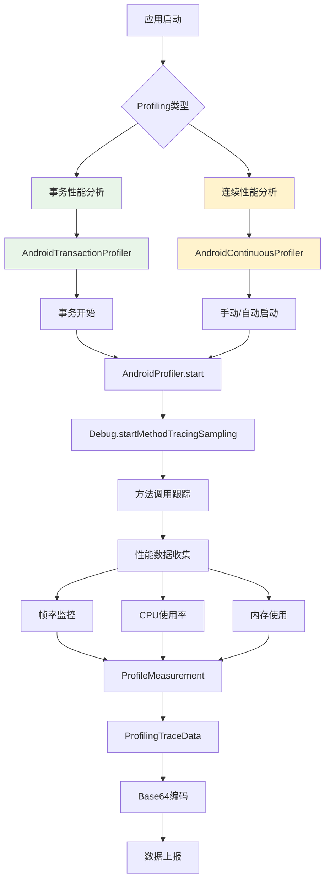

# Sentry Profiling 性能分析深度解析

本文档详细分析了 Sentry Java SDK 的 Profiling 功能，包括事务性能分析、连续性能分析、性能数据收集、方法调用跟踪等核心实现。

## 🎯 Profiling 功能概览

Sentry Profiling 通过方法调用跟踪和性能指标收集，为开发者提供深度的性能洞察：



## 1. Profiling 架构设计

### 1.1 核心接口定义

```java
// 事务性能分析器接口
public interface ITransactionProfiler {
    boolean isRunning();
    void start();
    void bindTransaction(@NotNull ITransaction transaction);
    
    @Nullable ProfilingTraceData onTransactionFinish(
        @NotNull ITransaction transaction,
        @Nullable List<PerformanceCollectionData> performanceCollectionData,
        @NotNull SentryOptions options
    );
    
    void close();
}

// 连续性能分析器接口
public interface IContinuousProfiler {
    void startProfiler(@NotNull ProfileLifecycle profileLifecycle, @Nullable TracesSampler tracesSampler);
    void stopProfiler(@NotNull ProfileLifecycle profileLifecycle);
    boolean isRunning();
    @NotNull SentryId getProfilerId();
    void close();
}
```

### 1.2 ProfileLifecycle 枚举

```java
public enum ProfileLifecycle {
    TRACE,   // 跟随事务生命周期
    MANUAL   // 手动控制
}
```

## 2. AndroidProfiler - 核心性能分析器

### 2.1 核心数据结构

```java
public class AndroidProfiler {
    // 性能分析开始数据
    public static class ProfileStartData {
        public final long startNanos;           // 开始时间戳（纳秒）
        public final long startCpuMillis;       // 开始CPU时间（毫秒）
        public final @NotNull Date startTimestamp; // 开始时间
    }
    
    // 性能分析结束数据
    public static class ProfileEndData {
        public final long endNanos;             // 结束时间戳（纳秒）
        public final long endCpuMillis;         // 结束CPU时间（毫秒）
        public final @NotNull File traceFile;  // 跟踪文件
        public final @NotNull Map<String, ProfileMeasurement> measurementsMap; // 性能指标
        public final boolean didTimeout;       // 是否超时
    }
}
```

### 2.2 性能分析启动

```java
@SuppressLint("NewApi")
public @Nullable ProfileStartData start() {
    try (final @NotNull ISentryLifecycleToken ignored = lock.acquire()) {
        // 检查采样间隔
        if (intervalUs == 0) {
            logger.log(SentryLevel.WARNING, "Disabling profiling because intervalUs is set to %d", intervalUs);
            return null;
        }
        
        if (isRunning) {
            logger.log(SentryLevel.WARNING, "Profiling has already started...");
            return null;
        }
        
        // 创建跟踪文件
        traceFile = new File(traceFilesDir, SentryUUID.generateSentryId() + ".trace");
        
        // 清理之前的数据
        measurementsMap.clear();
        screenFrameRateMeasurements.clear();
        slowFrameRenderMeasurements.clear();
        frozenFrameRenderMeasurements.clear();
        
        // 启动帧率监控
        frameMetricsCollectorId = frameMetricsCollector.startCollection(
            (frameStartNanos, frameEndNanos, durationNanos, delayNanos, isSlow, isFrozen, refreshRate) -> {
                final long frameTimestampRelativeNanos = frameStartNanos - profileStartNanos;
                final Date timestamp = DateUtils.getDateTime(profileStartTimestamp.getTime() + frameTimestampRelativeNanos / 1_000_000L);
                
                // 收集慢帧数据
                if (isSlow) {
                    slowFrameRenderMeasurements.addLast(
                        new ProfileMeasurementValue(frameTimestampRelativeNanos, durationNanos, timestamp)
                    );
                }
                
                // 收集冻结帧数据
                if (isFrozen) {
                    frozenFrameRenderMeasurements.addLast(
                        new ProfileMeasurementValue(frameTimestampRelativeNanos, durationNanos, timestamp)
                    );
                }
                
                // 收集屏幕刷新率数据
                if (refreshRate != lastRefreshRate) {
                    lastRefreshRate = refreshRate;
                    screenFrameRateMeasurements.addLast(
                        new ProfileMeasurementValue(frameTimestampRelativeNanos, refreshRate, timestamp)
                    );
                }
            }
        );
        
        // 设置超时机制（30秒）
        if (timeoutExecutorService != null) {
            scheduledFinish = timeoutExecutorService.schedule(
                () -> endAndCollect(true, null), 
                PROFILING_TIMEOUT_MILLIS
            );
        }
        
        // 记录开始时间
        profileStartNanos = SystemClock.elapsedRealtimeNanos();
        final @NotNull Date profileStartTimestamp = DateUtils.getCurrentDateTime();
        long profileStartCpuMillis = Process.getElapsedCpuTime();
        
        try {
            // 启动方法跟踪采样
            Debug.startMethodTracingSampling(traceFile.getPath(), BUFFER_SIZE_BYTES, intervalUs);
            isRunning = true;
            return new ProfileStartData(profileStartNanos, profileStartCpuMillis, profileStartTimestamp);
        } catch (Throwable e) {
            endAndCollect(false, null);
            logger.log(SentryLevel.ERROR, "Unable to start a profile: ", e);
            isRunning = false;
            return null;
        }
    }
}
```

### 2.3 性能分析结束

```java
@SuppressLint("NewApi")
public @Nullable ProfileEndData endAndCollect(
    final boolean isTimeout,
    final @Nullable List<PerformanceCollectionData> performanceCollectionData) {
    
    try (final @NotNull ISentryLifecycleToken ignored = lock.acquire()) {
        if (!isRunning) {
            logger.log(SentryLevel.WARNING, "Profiler not running");
            return null;
        }
        
        try {
            // 停止方法跟踪
            Debug.stopMethodTracing();
        } catch (Throwable e) {
            logger.log(SentryLevel.ERROR, "Error while stopping profiling: ", e);
        } finally {
            isRunning = false;
        }
        
        // 停止帧率监控
        frameMetricsCollector.stopCollection(frameMetricsCollectorId);
        
        long transactionEndNanos = SystemClock.elapsedRealtimeNanos();
        long transactionEndCpuMillis = Process.getElapsedCpuTime();
        
        if (traceFile == null) {
            logger.log(SentryLevel.ERROR, "Trace file does not exists");
            return null;
        }
        
        // 整理性能指标
        if (!slowFrameRenderMeasurements.isEmpty()) {
            measurementsMap.put(
                ProfileMeasurement.ID_SLOW_FRAME_RENDERS,
                new ProfileMeasurement(ProfileMeasurement.UNIT_NANOSECONDS, slowFrameRenderMeasurements)
            );
        }
        
        if (!frozenFrameRenderMeasurements.isEmpty()) {
            measurementsMap.put(
                ProfileMeasurement.ID_FROZEN_FRAME_RENDERS,
                new ProfileMeasurement(ProfileMeasurement.UNIT_NANOSECONDS, frozenFrameRenderMeasurements)
            );
        }
        
        if (!screenFrameRateMeasurements.isEmpty()) {
            measurementsMap.put(
                ProfileMeasurement.ID_SCREEN_FRAME_RATES,
                new ProfileMeasurement(ProfileMeasurement.UNIT_HZ, screenFrameRateMeasurements)
            );
        }
        
        // 处理性能收集数据
        putPerformanceCollectionDataInMeasurements(performanceCollectionData);
        
        // 取消超时任务
        if (scheduledFinish != null) {
            scheduledFinish.cancel(true);
            scheduledFinish = null;
        }
        
        return new ProfileEndData(
            transactionEndNanos, 
            transactionEndCpuMillis, 
            isTimeout, 
            traceFile, 
            measurementsMap
        );
    }
}
```

### 2.4 性能数据处理

```java
private void putPerformanceCollectionDataInMeasurements(
    final @Nullable List<PerformanceCollectionData> performanceCollectionData) {
    
    // 时间戳差异计算（System.currentTimeMillis() 转 SystemClock.elapsedRealtimeNanos()）
    long timestampDiff = SystemClock.elapsedRealtimeNanos() - profileStartNanos 
        - TimeUnit.MILLISECONDS.toNanos(System.currentTimeMillis());
    
    if (performanceCollectionData != null) {
        final @NotNull ArrayDeque<ProfileMeasurementValue> memoryUsageMeasurements = new ArrayDeque<>();
        final @NotNull ArrayDeque<ProfileMeasurementValue> nativeMemoryUsageMeasurements = new ArrayDeque<>();
        final @NotNull ArrayDeque<ProfileMeasurementValue> cpuUsageMeasurements = new ArrayDeque<>();
        
        synchronized (performanceCollectionData) {
            for (PerformanceCollectionData performanceData : performanceCollectionData) {
                CpuCollectionData cpuData = performanceData.getCpuData();
                MemoryCollectionData memoryData = performanceData.getMemoryData();
                
                // 处理CPU使用率数据
                if (cpuData != null) {
                    cpuUsageMeasurements.add(
                        new ProfileMeasurementValue(
                            cpuData.getTimestamp().nanoTimestamp() + timestampDiff,
                            cpuData.getCpuUsagePercentage(),
                            cpuData.getTimestamp()
                        )
                    );
                }
                
                // 处理堆内存使用数据
                if (memoryData != null && memoryData.getUsedHeapMemory() > -1) {
                    memoryUsageMeasurements.add(
                        new ProfileMeasurementValue(
                            memoryData.getTimestamp().nanoTimestamp() + timestampDiff,
                            memoryData.getUsedHeapMemory(),
                            memoryData.getTimestamp()
                        )
                    );
                }
                
                // 处理原生内存使用数据
                if (memoryData != null && memoryData.getUsedNativeMemory() > -1) {
                    nativeMemoryUsageMeasurements.add(
                        new ProfileMeasurementValue(
                            memoryData.getTimestamp().nanoTimestamp() + timestampDiff,
                            memoryData.getUsedNativeMemory(),
                            memoryData.getTimestamp()
                        )
                    );
                }
            }
        }
        
        // 添加到性能指标映射
        if (!cpuUsageMeasurements.isEmpty()) {
            measurementsMap.put(
                ProfileMeasurement.ID_CPU_USAGE,
                new ProfileMeasurement(ProfileMeasurement.UNIT_PERCENT, cpuUsageMeasurements)
            );
        }
        
        if (!memoryUsageMeasurements.isEmpty()) {
            measurementsMap.put(
                ProfileMeasurement.ID_MEMORY_FOOTPRINT,
                new ProfileMeasurement(ProfileMeasurement.UNIT_BYTES, memoryUsageMeasurements)
            );
        }
        
        if (!nativeMemoryUsageMeasurements.isEmpty()) {
            measurementsMap.put(
                ProfileMeasurement.ID_MEMORY_NATIVE_FOOTPRINT,
                new ProfileMeasurement(ProfileMeasurement.UNIT_BYTES, nativeMemoryUsageMeasurements)
            );
        }
    }
}
```

## 3. AndroidTransactionProfiler - 事务性能分析

### 3.1 事务绑定机制

```java
public class AndroidTransactionProfiler implements ITransactionProfiler {
    private int transactionsCounter = 0;
    private @Nullable ProfilingTransactionData currentProfilingTransactionData;
    private @Nullable AndroidProfiler profiler;
    
    @Override
    public void bindTransaction(final @NotNull ITransaction transaction) {
        try (final @NotNull ISentryLifecycleToken ignored = lock.acquire()) {
            // 如果性能分析器正在运行，但没有绑定事务数据，在此绑定
            if (transactionsCounter > 0 && currentProfilingTransactionData == null) {
                currentProfilingTransactionData = new ProfilingTransactionData(
                    transaction, 
                    profileStartNanos, 
                    profileStartCpuMillis
                );
            }
        }
    }
    
    @Override
    public @Nullable ProfilingTraceData onTransactionFinish(
        final @NotNull ITransaction transaction,
        final @Nullable List<PerformanceCollectionData> performanceCollectionData,
        final @NotNull SentryOptions options) {
        
        try (final @NotNull ISentryLifecycleToken ignored = lock.acquire()) {
            return onTransactionFinish(
                transaction.getName(),
                transaction.getEventId().toString(),
                transaction.getSpanContext().getTraceId().toString(),
                false,
                performanceCollectionData,
                options
            );
        }
    }
}
```

### 3.2 事务完成处理

```java
private @Nullable ProfilingTraceData onTransactionFinish(
    final @NotNull String transactionName,
    final @NotNull String transactionId,
    final @NotNull String traceId,
    final boolean isTimeout,
    final @Nullable List<PerformanceCollectionData> performanceCollectionData,
    final @NotNull SentryOptions options) {
    
    try (final @NotNull ISentryLifecycleToken ignored = lock.acquire()) {
        if (profiler == null) {
            return null;
        }
        
        // 检查当前事务是否在性能分析中
        if (currentProfilingTransactionData == null 
            || !currentProfilingTransactionData.getId().equals(transactionId)) {
            logger.log(SentryLevel.INFO,
                "Transaction %s (%s) finished, but was not currently being profiled. Skipping",
                transactionName, traceId);
            return null;
        }
        
        if (transactionsCounter > 0) {
            transactionsCounter--;
        }
        
        logger.log(SentryLevel.DEBUG, "Transaction %s (%s) finished.", transactionName, traceId);
        
        // 如果还有其他事务在运行，只更新当前事务数据
        if (transactionsCounter != 0) {
            if (currentProfilingTransactionData != null) {
                currentProfilingTransactionData.notifyFinish(
                    SystemClock.elapsedRealtimeNanos(),
                    profileStartNanos,
                    Process.getElapsedCpuTime(),
                    profileStartCpuMillis
                );
            }
            return null;
        }
        
        // 所有事务都完成，结束性能分析
        final AndroidProfiler.ProfileEndData endData = profiler.endAndCollect(isTimeout, performanceCollectionData);
        if (endData == null) {
            logger.log(SentryLevel.INFO, "Profiler returned null on end.");
            return null;
        }
        
        // 计算事务持续时间
        final long transactionDurationNanos = endData.endNanos - profileStartNanos;
        
        // 创建事务列表
        final List<ProfilingTransactionData> transactionList = new ArrayList<>();
        if (currentProfilingTransactionData != null) {
            currentProfilingTransactionData.notifyFinish(
                endData.endNanos, profileStartNanos, endData.endCpuMillis, profileStartCpuMillis);
            transactionList.add(currentProfilingTransactionData);
        }
        
        // 获取设备信息
        final String[] abis = Build.SUPPORTED_ABIS;
        String totalMem = "0";
        if (context != null) {
            totalMem = String.valueOf(getTotalMem(context));
        }
        
        // 创建性能跟踪数据
        return new ProfilingTraceData(
            endData.traceFile,
            profileStartTimestamp,
            transactionList,
            transactionName,
            transactionId,
            traceId,
            Long.toString(transactionDurationNanos),
            buildInfoProvider.getSdkInfoVersion(),
            abis != null && abis.length > 0 ? abis[0] : "",
            () -> CpuInfoUtils.getInstance().readMaxFrequencies(),
            buildInfoProvider.getManufacturer(),
            buildInfoProvider.getModel(),
            buildInfoProvider.getVersionRelease(),
            buildInfoProvider.isEmulator(),
            totalMem,
            options.getProguardUuid(),
            options.getRelease(),
            options.getEnvironment(),
            (endData.didTimeout || isTimeout) 
                ? ProfilingTraceData.TRUNCATION_REASON_TIMEOUT 
                : ProfilingTraceData.TRUNCATION_REASON_NORMAL,
            endData.measurementsMap
        );
    }
}
```

## 4. AndroidContinuousProfiler - 连续性能分析

### 4.1 连续性能分析启动

```java
public class AndroidContinuousProfiler implements IContinuousProfiler, RateLimiter.IRateLimitObserver {
    private static final long MAX_CHUNK_DURATION_MILLIS = 60000; // 60秒一个块
    
    @Override
    public void startProfiler(
        final @NotNull ProfileLifecycle profileLifecycle, 
        final @Nullable TracesSampler tracesSampler) {
        
        try (final @NotNull ISentryLifecycleToken ignored = lock.acquire()) {
            switch (profileLifecycle) {
                case TRACE:
                    rootSpanCounter++;
                    // 如果已经在运行，不重复启动
                    if (isRunning) {
                        return;
                    }
                    break;
                case MANUAL:
                    // 手动模式直接启动
                    break;
            }
            
            // 采样决策
            if (tracesSampler != null) {
                final TracesSamplingDecision samplingDecision = tracesSampler.sample(null);
                shouldSample = samplingDecision != null && samplingDecision.getSampled();
                isSampled = shouldSample;
            }
            
            if (!shouldSample) {
                logger.log(SentryLevel.DEBUG, "Profiler is not sampled, not starting.");
                return;
            }
            
            start();
        }
    }
    
    private void start() {
        // 检查API版本支持
        if (buildInfoProvider.getSdkInfoVersion() < Build.VERSION_CODES.LOLLIPOP_MR1) return;
        
        init();
        if (profiler == null) {
            return;
        }
        
        // 检查速率限制
        if (scopes != null) {
            final @Nullable RateLimiter rateLimiter = scopes.getRateLimiter();
            if (rateLimiter != null && 
                (rateLimiter.isActiveForCategory(All) || 
                 rateLimiter.isActiveForCategory(DataCategory.ProfileChunkUi))) {
                logger.log(SentryLevel.WARNING, "SDK is rate limited. Stopping profiler.");
                stop(false);
                return;
            }
            
            // 检查网络连接状态
            if (scopes.getOptions().getConnectionStatusProvider().getConnectionStatus() == DISCONNECTED) {
                logger.log(SentryLevel.WARNING, "Device is offline. Stopping profiler.");
                stop(false);
                return;
            }
        }
        
        // 启动性能分析
        final AndroidProfiler.ProfileStartData startData = profiler.start();
        if (startData == null) {
            return;
        }
        
        isRunning = true;
        
        // 生成ID
        if (profilerId == SentryId.EMPTY_ID) {
            profilerId = new SentryId();
        }
        if (chunkId == SentryId.EMPTY_ID) {
            chunkId = new SentryId();
        }
        
        // 启动性能收集器
        if (performanceCollector != null) {
            performanceCollector.start(chunkId.toString());
        }
        
        // 设置定时停止（60秒后）
        try {
            stopFuture = executorService.schedule(() -> stop(true), MAX_CHUNK_DURATION_MILLIS);
        } catch (RejectedExecutionException e) {
            logger.log(SentryLevel.ERROR, 
                "Failed to schedule profiling chunk finish. Did you call Sentry.close()?", e);
            shouldStop = true;
        }
    }
}
```

### 4.2 性能块处理

```java
private void stop(final boolean isTimeout) {
    try (final @NotNull ISentryLifecycleToken ignored = lock.acquire()) {
        if (!isRunning) {
            return;
        }
        
        if (profiler == null) {
            return;
        }
        
        // 停止性能收集器
        List<PerformanceCollectionData> performanceCollectionData = null;
        if (performanceCollector != null) {
            performanceCollectionData = performanceCollector.stop(chunkId.toString());
        }
        
        // 结束性能分析
        final AndroidProfiler.ProfileEndData endData = profiler.endAndCollect(isTimeout, performanceCollectionData);
        if (endData == null) {
            logger.log(SentryLevel.INFO, "Profiler returned null on end.");
            return;
        }
        
        isRunning = false;
        
        // 取消定时任务
        if (stopFuture != null) {
            stopFuture.cancel(true);
            stopFuture = null;
        }
        
        // 创建性能块
        final ProfileChunk.Builder builder = new ProfileChunk.Builder();
        builder.setProfilerId(profilerId);
        builder.setChunkId(chunkId);
        builder.setTimestamp(startProfileChunkTimestamp);
        builder.setTraceFile(endData.traceFile);
        builder.setMeasurements(endData.measurementsMap);
        
        // 添加到待发送列表
        try (final @NotNull ISentryLifecycleToken ignored2 = payloadLock.acquire()) {
            payloadBuilders.add(builder);
        }
        
        // 发送性能块
        executorService.submit(() -> {
            try (final @NotNull ISentryLifecycleToken ignored3 = payloadLock.acquire()) {
                for (ProfileChunk.Builder payloadBuilder : payloadBuilders) {
                    final ProfileChunk profileChunk = payloadBuilder.build();
                    if (scopes != null) {
                        scopes.captureProfileChunk(profileChunk);
                    }
                }
                payloadBuilders.clear();
            }
        });
        
        // 重置状态
        chunkId = SentryId.EMPTY_ID;
        
        // 如果需要继续运行，重新启动
        if (!shouldStop && !isClosed.get()) {
            start();
        }
    }
}
```

## 5. ProfilingTraceData - 性能跟踪数据

### 5.1 数据结构

```java
public final class ProfilingTraceData implements JsonUnknown, JsonSerializable {
    // 截断原因常量
    public static final String TRUNCATION_REASON_NORMAL = "normal";
    public static final String TRUNCATION_REASON_TIMEOUT = "timeout";
    public static final String TRUNCATION_REASON_BACKGROUNDED = "backgrounded";
    
    // 核心数据
    private final @NotNull File traceFile;                    // 跟踪文件
    private final @NotNull Date profileStartTimestamp;       // 性能分析开始时间
    private final @NotNull List<ProfilingTransactionData> transactions; // 事务列表
    private final @NotNull String transactionName;           // 事务名称
    private final @NotNull String transactionId;             // 事务ID
    private final @NotNull String traceId;                   // 跟踪ID
    private final @NotNull String durationNanos;             // 持续时间（纳秒）
    private final @NotNull String truncationReason;          // 截断原因
    private final @NotNull Map<String, ProfileMeasurement> measurementsMap; // 性能指标
    
    // 设备信息
    private int androidApiLevel;                              // Android API级别
    private @NotNull String deviceLocale;                    // 设备语言
    private @NotNull String deviceManufacturer;              // 设备制造商
    private @NotNull String deviceModel;                     // 设备型号
    private @NotNull String deviceOsBuildNumber;             // OS构建号
    private @NotNull String deviceOsName;                    // OS名称
    private @NotNull String deviceOsVersion;                 // OS版本
    private boolean deviceIsEmulator;                        // 是否模拟器
    private @NotNull String cpuArchitecture;                 // CPU架构
    private @NotNull List<Integer> deviceCpuFrequencies;     // CPU频率
    private @NotNull String devicePhysicalMemoryBytes;       // 物理内存
    
    // 应用信息
    private @NotNull String platform;                        // 平台
    private @NotNull String buildId;                         // 构建ID
    private @Nullable String release;                        // 版本
    private @Nullable String environment;                    // 环境
    private @Nullable String sampledProfile;                 // Base64编码的性能数据
}
```

### 5.2 性能数据编码

```java
// 在 SentryEnvelopeItem 中处理性能数据编码
public static @NotNull SentryEnvelopeItem fromProfilingTrace(
    final @NotNull ProfilingTraceData profilingTraceData,
    final long maxTraceFileSize,
    final @NotNull ISerializer serializer) throws SentryEnvelopeException {
    
    final CachedItem cachedItem = new CachedItem(() -> {
        if (!traceFile.exists()) {
            throw new SentryEnvelopeException(
                String.format("Dropping profiling trace data, because the file '%s' doesn't exists",
                    traceFile.getName()));
        }
        
        // 读取跟踪文件并Base64编码
        final byte[] traceFileBytes = readBytesFromFile(traceFile.getPath(), maxTraceFileSize);
        final @NotNull String base64Trace = Base64.encodeToString(traceFileBytes, NO_WRAP | NO_PADDING);
        
        if (base64Trace.isEmpty()) {
            throw new SentryEnvelopeException("Profiling trace file is empty");
        }
        
        profilingTraceData.setSampledProfile(base64Trace);
        profilingTraceData.readDeviceCpuFrequencies();
        
        try (final ByteArrayOutputStream stream = new ByteArrayOutputStream();
             final Writer writer = new BufferedWriter(new OutputStreamWriter(stream, UTF_8))) {
            
            serializer.serialize(profilingTraceData, writer);
            return stream.toByteArray();
            
        } catch (IOException e) {
            throw new SentryEnvelopeException(
                String.format("Failed to serialize profiling trace data\n%s", e.getMessage()));
        } finally {
            // 删除跟踪文件
            traceFile.delete();
        }
    });
    
    SentryEnvelopeItemHeader itemHeader = new SentryEnvelopeItemHeader(
        SentryItemType.Profile,
        () -> cachedItem.getBytes().length,
        "application-json",
        traceFile.getName()
    );
    
    return new SentryEnvelopeItem(itemHeader, cachedItem);
}
```

## 6. 性能指标收集

### 6.1 ProfileMeasurement 结构

```java
public final class ProfileMeasurement implements JsonSerializable {
    // 指标ID常量
    public static final String ID_CPU_USAGE = "cpu_usage";
    public static final String ID_MEMORY_FOOTPRINT = "memory_footprint";
    public static final String ID_MEMORY_NATIVE_FOOTPRINT = "memory_native_footprint";
    public static final String ID_SLOW_FRAME_RENDERS = "slow_frame_renders";
    public static final String ID_FROZEN_FRAME_RENDERS = "frozen_frame_renders";
    public static final String ID_SCREEN_FRAME_RATES = "screen_frame_rates";
    
    // 单位常量
    public static final String UNIT_NANOSECONDS = "nanosecond";
    public static final String UNIT_BYTES = "byte";
    public static final String UNIT_PERCENT = "percent";
    public static final String UNIT_HZ = "hz";
    
    private final @NotNull String unit;                                    // 单位
    private final @NotNull List<ProfileMeasurementValue> values;          // 值列表
}

public final class ProfileMeasurementValue implements JsonSerializable {
    private final long relativeStartNs;    // 相对开始时间（纳秒）
    private final double value;            // 值
    private final @NotNull Date timestamp; // 时间戳
}
```

### 6.2 性能数据收集器集成

```java
// 在 SentryTracer 中集成性能收集器
public final class SentryTracer implements ITransaction {
    private final @Nullable CompositePerformanceCollector compositePerformanceCollector;
    
    // 事务开始时启动性能收集
    SentryTracer(final @NotNull TransactionContext context, ...) {
        // ...
        
        if (compositePerformanceCollector != null) {
            compositePerformanceCollector.start(this);
        }
    }
    
    // 事务结束时停止性能收集
    private void finishInternal(final @Nullable SpanStatus finishStatus, final @Nullable SentryDate finishTimestamp) {
        final @NotNull AtomicReference<List<PerformanceCollectionData>> performanceCollectionData = new AtomicReference<>();
        
        this.root.setSpanFinishedCallback(span -> {
            // ...
            
            if (compositePerformanceCollector != null) {
                performanceCollectionData.set(compositePerformanceCollector.stop(this));
            }
        });
        
        root.finish(finishStatus.spanStatus, finishTimestamp);
        
        // 生成性能跟踪数据
        ProfilingTraceData profilingTraceData = null;
        if (Boolean.TRUE.equals(isSampled()) && Boolean.TRUE.equals(isProfileSampled())) {
            profilingTraceData = scopes.getOptions()
                .getTransactionProfiler()
                .onTransactionFinish(this, performanceCollectionData.get(), scopes.getOptions());
        }
    }
}
```

## 7. 配置和最佳实践

### 7.1 关键配置选项

```java
// 启用性能分析
options.setProfilesSampleRate(0.1);  // 10% 采样率

// 连续性能分析
options.setContinuousProfilingEnabled(true);
options.setContinuousProfilingAutoStart(true);

// 性能分析采样间隔（微秒）
options.setProfilingTracesIntervalMillis(10);  // 10ms间隔

// 性能分析超时时间
options.setProfilingTimeoutMillis(30000);  // 30秒超时

// 跟踪文件最大大小
options.setMaxTraceFileSize(5 * 1024 * 1024);  // 5MB

// 启用性能收集器
options.setEnablePerformanceV2(true);
```

### 7.2 性能优化建议

#### ✅ 推荐做法

1. **合理设置采样率**
   ```java
   // 生产环境：低采样率
   options.setProfilesSampleRate(0.01);  // 1%
   
   // 开发环境：高采样率
   options.setProfilesSampleRate(1.0);   // 100%
   ```

2. **选择合适的采样间隔**
   ```java
   // 高精度分析：短间隔
   options.setProfilingTracesIntervalMillis(5);   // 5ms
   
   // 常规分析：中等间隔
   options.setProfilingTracesIntervalMillis(10);  // 10ms
   
   // 低开销分析：长间隔
   options.setProfilingTracesIntervalMillis(20);  // 20ms
   ```

3. **限制跟踪文件大小**
   ```java
   // 移动设备：较小文件
   options.setMaxTraceFileSize(3 * 1024 * 1024);  // 3MB
   
   // 高端设备：较大文件
   options.setMaxTraceFileSize(8 * 1024 * 1024);  // 8MB
   ```

#### ❌ 避免做法

- **过高的采样率**：会显著影响应用性能
- **过短的采样间隔**：会产生巨大的跟踪文件
- **在低端设备上启用高精度分析**：可能导致ANR

### 7.3 性能影响评估

#### CPU 开销估算

```java
// 估算公式
public class ProfilingOverhead {
    public static double estimateCpuOverhead(int intervalMs, double baselineOverhead) {
        // 基础开销 + 采样频率相关开销
        double samplingOverhead = 1000.0 / intervalMs * 0.001; // 每次采样0.1%开销
        return baselineOverhead + samplingOverhead;
    }
    
    // 示例：10ms间隔，基础开销1%
    // 总开销约 1% + (1000/10)*0.001 = 1% + 0.1% = 1.1%
}
```

#### 存储开销估算

```java
public class ProfilingStorage {
    public static long estimateTraceFileSize(int durationSeconds, int intervalMs) {
        // 每次采样约100字节（方法调用信息）
        int samplesPerSecond = 1000 / intervalMs;
        int totalSamples = durationSeconds * samplesPerSecond;
        return totalSamples * 100L;  // 字节
    }
    
    // 示例：30秒事务，10ms间隔
    // 约 30 * (1000/10) * 100 = 300KB
}
```

## 8. 故障排查

### 8.1 常见问题

**Q: 性能分析没有数据？**
A: 检查采样率设置，确保 `profilesSampleRate` > 0，且事务被采样

**Q: 跟踪文件过大？**
A: 增加采样间隔或减少分析持续时间，检查 `maxTraceFileSize` 设置

**Q: 应用性能下降明显？**
A: 降低采样率，增加采样间隔，或在低端设备上禁用性能分析

**Q: 连续性能分析不工作？**
A: 检查 `continuousProfilingEnabled` 设置，确保有活跃的事务或手动启动

### 8.2 调试技巧

```java
// 启用性能分析调试日志
options.setDebug(true);
options.setLogger(new SystemOutLogger());

// 监控性能分析状态
ITransactionProfiler transactionProfiler = options.getTransactionProfiler();
System.out.println("Transaction profiler running: " + transactionProfiler.isRunning());

IContinuousProfiler continuousProfiler = options.getContinuousProfiler();
System.out.println("Continuous profiler running: " + continuousProfiler.isRunning());
System.out.println("Profiler ID: " + continuousProfiler.getProfilerId());

// 检查跟踪文件
File tracesDir = new File(options.getCacheDirPath(), "profiling_traces");
System.out.println("Traces dir exists: " + tracesDir.exists());
System.out.println("Trace files count: " + (tracesDir.listFiles() != null ? tracesDir.listFiles().length : 0));

// 手动触发性能分析
Sentry.startTransaction("manual-profiling", "test").finish();
```

## 总结

Sentry 的 Profiling 功能通过精密的方法调用跟踪和全面的性能指标收集，为开发者提供了深度的性能分析能力：

### 🎯 **核心优势**

1. **双重分析模式**: 事务性能分析和连续性能分析满足不同需求
2. **方法级跟踪**: 基于 Android Debug API 的精确方法调用跟踪
3. **全面性能指标**: CPU、内存、帧率等多维度性能数据
4. **智能采样**: 灵活的采样策略平衡数据价值和性能影响
5. **设备信息集成**: 完整的设备和环境信息关联

### 🔍 **技术特点**

- **低开销设计**: 可配置的采样间隔和文件大小限制
- **数据压缩**: Base64编码和文件压缩减少传输开销
- **异常处理**: 完善的超时和错误处理机制
- **内存管理**: 自动清理跟踪文件和缓存数据

### 📊 **应用价值**

通过这套 Profiling 系统，开发者可以：
- 识别性能瓶颈方法和调用路径
- 分析CPU和内存使用模式
- 监控UI渲染性能
- 优化关键业务流程性能
- 对比不同版本的性能表现

这套机制在保证应用性能的前提下，为深度性能优化提供了强有力的数据支撑和分析工具。 