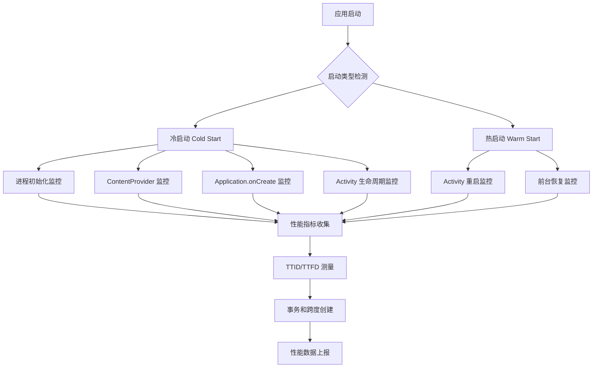
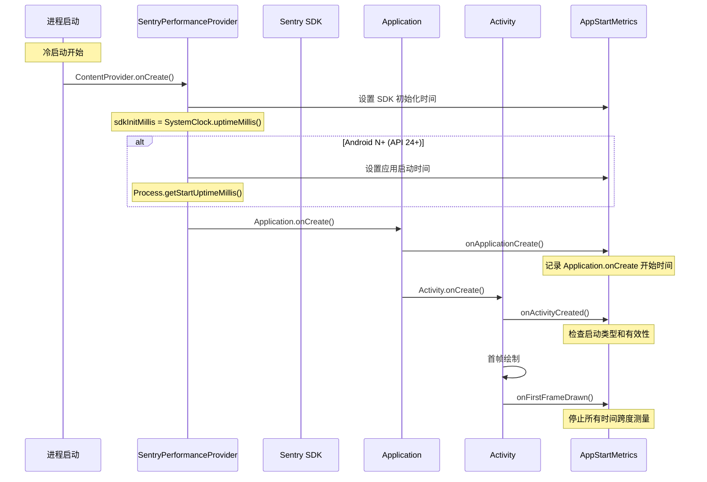
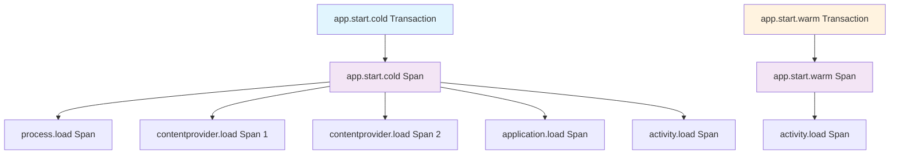

# Sentry 启动监控机制深度分析

本文档详细分析了 Sentry Android SDK 如何监控应用的冷启动和热启动，包括启动类型检测、性能指标收集、时间跨度测量等核心机制。

## 🎯 启动监控概览

Sentry 通过多层监控机制来全面跟踪应用启动性能：



## 1. 启动类型检测机制

### 1.1 启动类型定义

```java
public enum AppStartType {
    UNKNOWN,    // 未知类型
    COLD,       // 冷启动：进程从零开始创建
    WARM        // 热启动：进程已存在，重新启动Activity
}
```

### 1.2 启动类型判断逻辑

```java
private void setColdStart(final @Nullable Bundle savedInstanceState) {
    if (!firstActivityCreated) {
        final @NotNull TimeSpan appStartSpan = AppStartMetrics.getInstance().getAppStartTimeSpan();
        
        // 判断是否为热启动的条件：
        // 1. 应用启动跨度已经开始并停止（进程重启但未杀死）
        // 2. 冷启动无效（后台启动，如通过BroadcastReceiver）
        if ((appStartSpan.hasStarted() && appStartSpan.hasStopped())
            || (!AppStartMetrics.getInstance().isColdStartValid())) {
            
            // 重启应用启动测量，标记为热启动
            AppStartMetrics.getInstance().restartAppStart(lastPausedUptimeMillis);
            AppStartMetrics.getInstance().setAppStartType(AppStartMetrics.AppStartType.WARM);
        } else {
            // 根据 savedInstanceState 判断启动类型
            AppStartMetrics.getInstance().setAppStartType(
                savedInstanceState == null 
                    ? AppStartMetrics.AppStartType.COLD    // 无状态保存 = 冷启动
                    : AppStartMetrics.AppStartType.WARM    // 有状态保存 = 热启动
            );
        }
    }
}
```

### 1.3 冷启动有效性检查

```java
public boolean isColdStartValid() {
    return appLaunchedInForeground && !appLaunchTooLong;
}

// 前台重要性检查
private void checkCreateTimeOnMain(final @NotNull Application application) {
    new Handler(Looper.getMainLooper()).post(() -> {
        // 如果没有Activity被创建，说明应用在后台启动
        if (onCreateTime == null) {
            appLaunchedInForeground = false;
            
            // 停止应用启动分析器，因为后台启动的分析没有意义
            if (appStartProfiler != null && appStartProfiler.isRunning()) {
                appStartProfiler.close();
                appStartProfiler = null;
            }
        }
        application.unregisterActivityLifecycleCallbacks(instance);
    });
}

// 启动时间过长检查
@Override
public void onActivityCreated(@NonNull Activity activity, @Nullable Bundle savedInstanceState) {
    if (!appLaunchedInForeground || onCreateTime != null) {
        return;
    }
    onCreateTime = new SentryNanotimeDate();
    
    final long spanStartMillis = appStartSpan.getStartTimestampMs();
    final long spanEndMillis = appStartSpan.hasStopped() 
        ? appStartSpan.getProjectedStopTimestampMs() 
        : System.currentTimeMillis();
    final long durationMillis = spanEndMillis - spanStartMillis;
    
    // 如果应用启动超过1分钟，认为是异常情况
    if (durationMillis > TimeUnit.MINUTES.toMillis(1)) {
        appLaunchTooLong = true;
    }
}
```

## 2. 时间跨度测量体系

### 2.1 核心时间跨度

Sentry 使用多个 `TimeSpan` 来精确测量启动过程的各个阶段：

```java
public class AppStartMetrics {
    private final @NotNull TimeSpan appStartSpan;           // 应用启动总时间
    private final @NotNull TimeSpan sdkInitTimeSpan;        // SDK初始化时间
    private final @NotNull TimeSpan applicationOnCreate;    // Application.onCreate时间
    private final @NotNull Map<ContentProvider, TimeSpan> contentProviderOnCreates; // ContentProvider创建时间
    private final @NotNull List<ActivityLifecycleTimeSpan> activityLifecycles;      // Activity生命周期时间
}
```

### 2.2 时间测量流程



### 2.3 时间戳获取策略

```java
// Performance V2 (Android N+): 使用进程启动时间
@SuppressLint("NewApi")
private void onAppLaunched(final @Nullable Context context, final @NotNull AppStartMetrics appStartMetrics) {
    // SDK初始化时间：使用静态字段初始化时间
    final @NotNull TimeSpan sdkInitTimeSpan = appStartMetrics.getSdkInitTimeSpan();
    sdkInitTimeSpan.setStartedAt(sdkInitMillis);
    
    // 应用启动时间：需要 API 24+
    if (buildInfoProvider.getSdkInfoVersion() >= android.os.Build.VERSION_CODES.N) {
        final @NotNull TimeSpan appStartTimespan = appStartMetrics.getAppStartTimeSpan();
        appStartTimespan.setStartedAt(Process.getStartUptimeMillis());
    }
}

// 回退策略：使用 SDK 初始化时间
public @NotNull TimeSpan getAppStartTimeSpanWithFallback(final @NotNull SentryAndroidOptions options) {
    // 如果启动时间过长或后台启动，返回空跨度
    if (!isColdStartValid()) {
        return new TimeSpan();
    }
    
    if (options.isEnablePerformanceV2()) {
        final @NotNull TimeSpan appStartSpan = getAppStartTimeSpan();
        if (appStartSpan.hasStarted()) {
            return appStartSpan;
        }
    }
    
    // 回退：使用 SDK 初始化时间跨度
    return getSdkInitTimeSpan();
}
```

## 3. 冷启动监控详解

### 3.1 冷启动阶段划分

冷启动被细分为多个可测量的阶段：

```mermaid
gantt
    title 冷启动时间线
    dateFormat X
    axisFormat %s
    
    section 进程初始化
    Process Init    :0, 100
    
    section ContentProvider
    Provider 1      :100, 150
    Provider 2      :150, 200
    
    section Application
    Application.onCreate :200, 300
    
    section Activity
    Activity.onCreate    :300, 400
    Activity.onStart     :400, 450
    Activity.onResume    :450, 500
    
    section 渲染
    First Frame     :500, 600
    Full Display    :600, 800
```



### 3.2 进程初始化监控

```java
public @NotNull TimeSpan createProcessInitSpan() {
    final @NotNull TimeSpan processInitSpan = new TimeSpan();
    processInitSpan.setup(
        "Process Initialization",
        appStartSpan.getStartTimestampMs(),      // 进程启动时间
        appStartSpan.getStartUptimeMs(),
        CLASS_LOADED_UPTIME_MS                   // 类加载完成时间
    );
    return processInitSpan;
}
```

### 3.3 ContentProvider 监控

```java
// 通过字节码插桩自动调用
public static void onContentProviderCreate(final @NotNull ContentProvider contentProvider) {
    final long now = SystemClock.uptimeMillis();
    
    final TimeSpan measurement = new TimeSpan();
    measurement.setStartedAt(now);
    getInstance().contentProviderOnCreates.put(contentProvider, measurement);
}

public static void onContentProviderPostCreate(final @NotNull ContentProvider contentProvider) {
    final long now = SystemClock.uptimeMillis();
    
    final @Nullable TimeSpan measurement = getInstance().contentProviderOnCreates.get(contentProvider);
    if (measurement != null && measurement.hasNotStopped()) {
        measurement.setDescription(contentProvider.getClass().getName() + ".onCreate");
        measurement.setStoppedAt(now);
    }
}
```

### 3.4 Application.onCreate 监控

```java
// 通过字节码插桩自动调用
public static void onApplicationCreate(final @NotNull Application application) {
    final long now = SystemClock.uptimeMillis();
    
    final @NotNull AppStartMetrics instance = getInstance();
    if (instance.applicationOnCreate.hasNotStarted()) {
        instance.applicationOnCreate.setStartedAt(now);
    }
}

public static void onApplicationPostCreate(final @NotNull Application application) {
    final long now = SystemClock.uptimeMillis();
    
    final @NotNull AppStartMetrics instance = getInstance();
    if (instance.applicationOnCreate.hasNotStopped()) {
        instance.applicationOnCreate.setDescription(application.getClass().getName() + ".onCreate");
        instance.applicationOnCreate.setStoppedAt(now);
    }
}
```

## 4. 热启动监控详解

### 4.1 热启动触发条件

热启动在以下情况下发生：

1. **进程重启但未杀死**：应用在后台时被系统回收部分资源
2. **Activity 重新创建**：用户从最近任务或其他应用返回
3. **后台启动转前台**：通过通知、快捷方式等方式启动

### 4.2 热启动重置机制

```java
public void restartAppStart(final long uptimeMillis) {
    shouldSendStartMeasurements = true;
    appLaunchTooLong = false;
    appLaunchedInForeground = true;
    
    // 重置应用启动跨度
    appStartSpan.reset();
    appStartSpan.start();
    appStartSpan.setStartedAt(uptimeMillis);
    
    // 更新类加载时间为当前启动时间
    CLASS_LOADED_UPTIME_MS = appStartSpan.getStartUptimeMs();
}
```

### 4.3 热启动时间测量

```java
// 热启动不包含进程初始化、ContentProvider 和 Application.onCreate
private void attachAppStartSpans(final @NotNull AppStartMetrics appStartMetrics, final @NotNull SentryTransaction txn) {
    // 只有冷启动才包含进程初始化、ContentProvider 和 Application.onCreate 跨度
    if (appStartMetrics.getAppStartType() != AppStartMetrics.AppStartType.COLD) {
        return;
    }
    
    // ... 添加冷启动特有的跨度
}
```

## 5. TTID 和 TTFD 监控

### 5.1 关键性能指标

- **TTID (Time To Initial Display)**: 首次内容显示时间
- **TTFD (Time To Full Display)**: 完全显示时间

```java
private void onFirstFrameDrawn(final @Nullable ISpan ttfdSpan, final @Nullable ISpan ttidSpan) {
    // 停止应用启动时间测量
    final @NotNull AppStartMetrics appStartMetrics = AppStartMetrics.getInstance();
    final @NotNull TimeSpan appStartTimeSpan = appStartMetrics.getAppStartTimeSpan();
    final @NotNull TimeSpan sdkInitTimeSpan = appStartMetrics.getSdkInitTimeSpan();
    
    if (appStartTimeSpan.hasStarted() && appStartTimeSpan.hasNotStopped()) {
        appStartTimeSpan.stop();
    }
    if (sdkInitTimeSpan.hasStarted() && sdkInitTimeSpan.hasNotStopped()) {
        sdkInitTimeSpan.stop();
    }
    
    // 设置 TTID 测量值
    if (options != null && ttidSpan != null) {
        final SentryDate endDate = options.getDateProvider().now();
        final long durationNanos = endDate.diff(ttidSpan.getStartDate());
        final long durationMillis = TimeUnit.NANOSECONDS.toMillis(durationNanos);
        
        ttidSpan.setMeasurement(MeasurementValue.KEY_TIME_TO_INITIAL_DISPLAY, durationMillis, MILLISECOND);
        finishSpan(ttidSpan, endDate);
    }
}
```

### 5.2 TTFD 超时处理

```java
private static final long TTFD_TIMEOUT_MILLIS = 25000; // 25秒超时

private void finishExceededTtfdSpan(final @Nullable ISpan ttfdSpan, final @Nullable ISpan ttidSpan) {
    if (ttfdSpan == null || ttfdSpan.isFinished()) {
        return;
    }
    
    ttfdSpan.setDescription(getExceededTtfdDesc(ttfdSpan));
    
    // 将 TTFD 跨度的结束时间设置为等于 TTID 跨度
    final @Nullable SentryDate ttidEndDate = ttidSpan != null ? ttidSpan.getFinishDate() : null;
    final @NotNull SentryDate ttfdEndDate = ttidEndDate != null ? ttidEndDate : ttfdSpan.getStartDate();
    
    finishSpan(ttfdSpan, ttfdEndDate, SpanStatus.DEADLINE_EXCEEDED);
}
```

## 6. 性能数据收集和上报

### 6.1 测量值生成

```java
@Override
public @NotNull SentryTransaction process(@NotNull SentryTransaction transaction, @NotNull Hint hint) {
    final @NotNull AppStartMetrics appStartMetrics = AppStartMetrics.getInstance();
    
    if (hasAppStartSpan(transaction) && appStartMetrics.shouldSendStartMeasurements()) {
        final @NotNull TimeSpan appStartTimeSpan = appStartMetrics.getAppStartTimeSpanWithFallback(options);
        final long appStartUpDurationMs = appStartTimeSpan.getDurationMs();
        
        if (appStartUpDurationMs != 0) {
            final MeasurementValue value = new MeasurementValue(
                (float) appStartUpDurationMs, 
                MeasurementUnit.Duration.MILLISECOND.apiName()
            );
            
            // 根据启动类型设置不同的测量键
            final String appStartKey = appStartMetrics.getAppStartType() == AppStartMetrics.AppStartType.COLD
                ? MeasurementValue.KEY_APP_START_COLD    // "app_start_cold"
                : MeasurementValue.KEY_APP_START_WARM;   // "app_start_warm"
            
            transaction.getMeasurements().put(appStartKey, value);
            
            // 附加详细的启动跨度（仅冷启动）
            attachAppStartSpans(appStartMetrics, transaction);
            appStartMetrics.onAppStartSpansSent();
        }
    }
    
    return transaction;
}
```

### 6.2 跨度层次结构



### 6.3 跨度数据转换

```java
@NotNull
private static SentrySpan timeSpanToSentrySpan(
    final @NotNull TimeSpan span,
    final @Nullable SpanId parentSpanId,
    final @NotNull SentryId traceId,
    final @NotNull String operation) {
    
    final Map<String, Object> defaultSpanData = new HashMap<>(4);
    defaultSpanData.put(SpanDataConvention.THREAD_ID, AndroidThreadChecker.mainThreadSystemId);
    defaultSpanData.put(SpanDataConvention.THREAD_NAME, "main");
    defaultSpanData.put(SpanDataConvention.CONTRIBUTES_TTID, true);
    defaultSpanData.put(SpanDataConvention.CONTRIBUTES_TTFD, true);
    
    return new SentrySpan(
        span.getStartTimestampSecs(),
        span.getProjectedStopTimestampSecs(),
        traceId,
        new SpanId(),
        parentSpanId,
        operation,
        span.getDescription(),
        SpanStatus.OK,
        APP_METRICS_ORIGIN,  // "auto.ui"
        new ConcurrentHashMap<>(),
        new ConcurrentHashMap<>(),
        defaultSpanData
    );
}
```

## 7. 启动性能分析

### 7.1 应用启动分析器

```java
private void launchAppStartProfiler(final @NotNull AppStartMetrics appStartMetrics) {
    // 读取分析配置文件
    final @NotNull File configFile = new File(cacheDir, APP_START_PROFILING_CONFIG_FILE_NAME);
    
    if (!configFile.exists() || !configFile.canRead()) {
        return; // 未启用应用启动分析
    }
    
    // 反序列化分析选项
    final @Nullable SentryAppStartProfilingOptions profilingOptions = 
        new JsonSerializer(SentryOptions.empty()).deserialize(reader, SentryAppStartProfilingOptions.class);
    
    if (profilingOptions != null && profilingOptions.isProfilingEnabled()) {
        // 创建采样决策
        final @NotNull TracesSamplingDecision appStartSamplingDecision = new TracesSamplingDecision(
            profilingOptions.isTraceSampled(),
            profilingOptions.getTraceSampleRate(),
            profilingOptions.isProfileSampled(),
            profilingOptions.getProfileSampleRate()
        );
        
        appStartMetrics.setAppStartSamplingDecision(appStartSamplingDecision);
        
        if (appStartSamplingDecision.getProfileSampled() && appStartSamplingDecision.getSampled()) {
            // 启动应用启动分析器
            final @NotNull ITransactionProfiler appStartProfiler = new AndroidTransactionProfiler(
                context, buildInfoProvider, frameMetricsCollector, logger,
                profilingOptions.getProfilingTracesDirPath(),
                profilingOptions.isProfilingEnabled(),
                profilingOptions.getProfilingTracesHz(),
                new SentryExecutorService()
            );
            
            appStartMetrics.setAppStartProfiler(appStartProfiler);
            appStartProfiler.start();
        }
    }
}
```

### 7.2 性能数据收集

```java
// 收集启动期间的性能数据
private void putPerformanceCollectionDataInMeasurements(
    final @Nullable List<PerformanceCollectionData> performanceCollectionData) {
    
    // 时间戳差异计算，因为 PerformanceCollectionData 使用 System.currentTimeMillis()
    // 而测量时间戳需要 SystemClock.elapsedRealtimeNanos() 的纳秒值
    long timestampDiff = SystemClock.elapsedRealtimeNanos() - profileStartNanos
        - TimeUnit.MILLISECONDS.toNanos(System.currentTimeMillis());
    
    // 处理性能数据...
}
```

## 8. 配置和最佳实践

### 8.1 关键配置选项

```java
// 启用性能监控
options.setTracingEnabled(true);
options.setTracesSampleRate(1.0);

// 启用 Performance V2 (推荐)
options.setEnablePerformanceV2(true);

// 启用 Activity 生命周期跟踪
options.setEnableActivityLifecycleTracingAutoFinish(true);
options.setIdleTimeout(3000L);

// 启用 TTFD 跨度
options.setEnableTimeToFullDisplayTracing(true);

// 启用应用启动分析
options.setProfilesSampleRate(1.0);
```

### 8.2 最佳实践

#### ✅ 推荐做法

1. **尽早初始化 Sentry**
   ```java
   // 在 Application.onCreate() 的最开始初始化
   public class MyApplication extends Application {
       @Override
       public void onCreate() {
           SentryAndroid.init(this, options -> {
               options.setDsn("YOUR_DSN");
               options.setEnablePerformanceV2(true);
           });
           super.onCreate();
       }
   }
   ```

2. **使用 SentryPerformanceProvider**
   ```xml
   <!-- 确保 SentryPerformanceProvider 在 AndroidManifest.xml 中正确配置 -->
   <provider
       android:name="io.sentry.android.core.SentryPerformanceProvider"
       android:authorities="${applicationId}.SentryPerformanceProvider"
       android:exported="false" />
   ```

3. **合理设置采样率**
   ```java
   options.setTracesSampleRate(0.1);  // 生产环境建议 10%
   options.setProfilesSampleRate(0.1); // 分析采样率
   ```

#### ❌ 避免做法

- **延迟初始化 Sentry**：会导致启动时间测量不准确
- **在 ContentProvider 中执行重操作**：会影响启动性能
- **忽略 TTFD 超时**：可能导致内存泄漏
- **过高的采样率**：影响应用性能和数据传输

### 8.3 性能优化建议

1. **减少 ContentProvider 数量**：合并或延迟加载非关键的 ContentProvider
2. **优化 Application.onCreate()**：将非关键初始化移到后台线程
3. **使用启动主题**：提供即时的视觉反馈
4. **监控启动指标**：定期检查 TTID 和 TTFD 指标

## 9. 故障排查

### 9.1 常见问题

**Q: 启动时间测量不准确？**
A: 检查是否启用了 Performance V2，确保 Android 版本 >= N (API 24)

**Q: 冷启动被误判为热启动？**
A: 检查应用是否在后台启动，或启动时间是否超过1分钟

**Q: TTFD 跨度一直超时？**
A: 检查是否正确调用了 `reportFullyDisplayed()` 或设置了合理的超时时间

**Q: 启动分析数据缺失？**
A: 确保分析配置文件存在且采样决策正确

### 9.2 调试技巧

```java
// 启用详细日志
options.setDebug(true);
options.setLogger(new SystemOutLogger());

// 检查启动指标
AppStartMetrics metrics = AppStartMetrics.getInstance();
System.out.println("App start type: " + metrics.getAppStartType());
System.out.println("Cold start valid: " + metrics.isColdStartValid());
System.out.println("App start duration: " + metrics.getAppStartTimeSpan().getDurationMs());

// 监控事务处理
options.setBeforeTransactionCallback((transaction, hint) -> {
    if (transaction.getName().contains("Activity")) {
        System.out.println("Processing activity transaction: " + transaction.getName());
    }
    return transaction;
});
```

## 总结

Sentry 的启动监控机制通过精密的时间测量和智能的启动类型检测，为开发者提供了全面的应用启动性能洞察：

### 🎯 **核心优势**

1. **精确测量**: 使用系统级 API 获取准确的启动时间
2. **智能检测**: 自动区分冷启动和热启动
3. **细粒度分析**: 分解启动过程的各个阶段
4. **性能分析**: 集成 CPU 和内存分析
5. **易于集成**: 自动化的字节码插桩和配置

### 🔍 **监控范围**

- **冷启动**: 进程初始化 → ContentProvider → Application → Activity → 首帧显示
- **热启动**: Activity 重启 → 首帧显示
- **性能指标**: TTID、TTFD、启动总时间
- **详细跨度**: 每个启动阶段的精确时间

### 📊 **数据价值**

通过这套监控机制，开发者可以：
- 识别启动性能瓶颈
- 优化关键启动路径
- 监控版本间的性能变化
- 提供更好的用户体验

这套机制确保了在各种启动场景下，都能准确捕获和分析应用的启动性能，为性能优化提供可靠的数据支撑。 