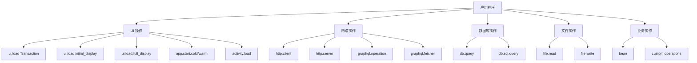
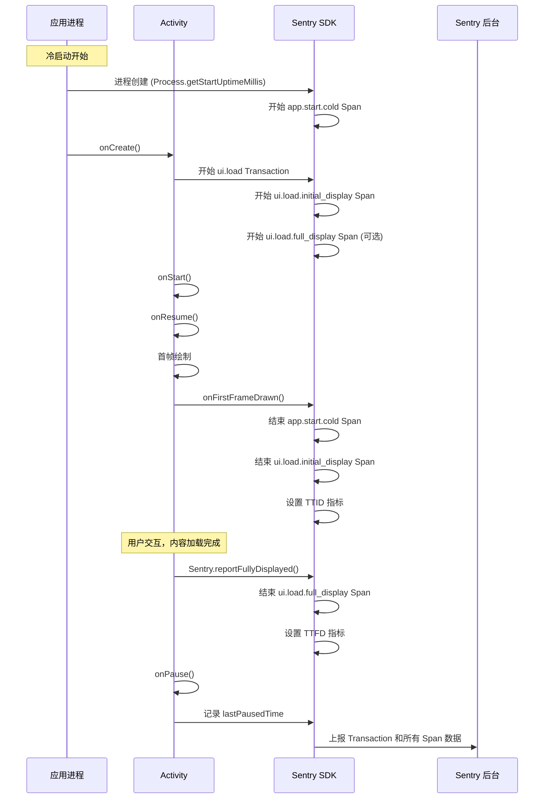
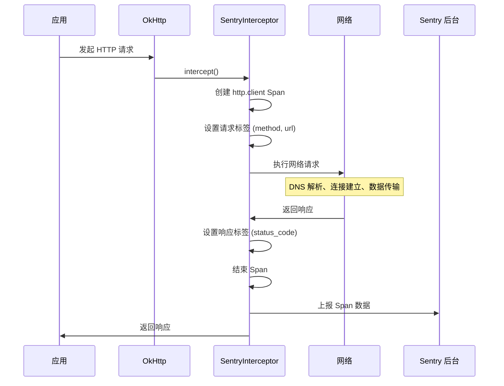
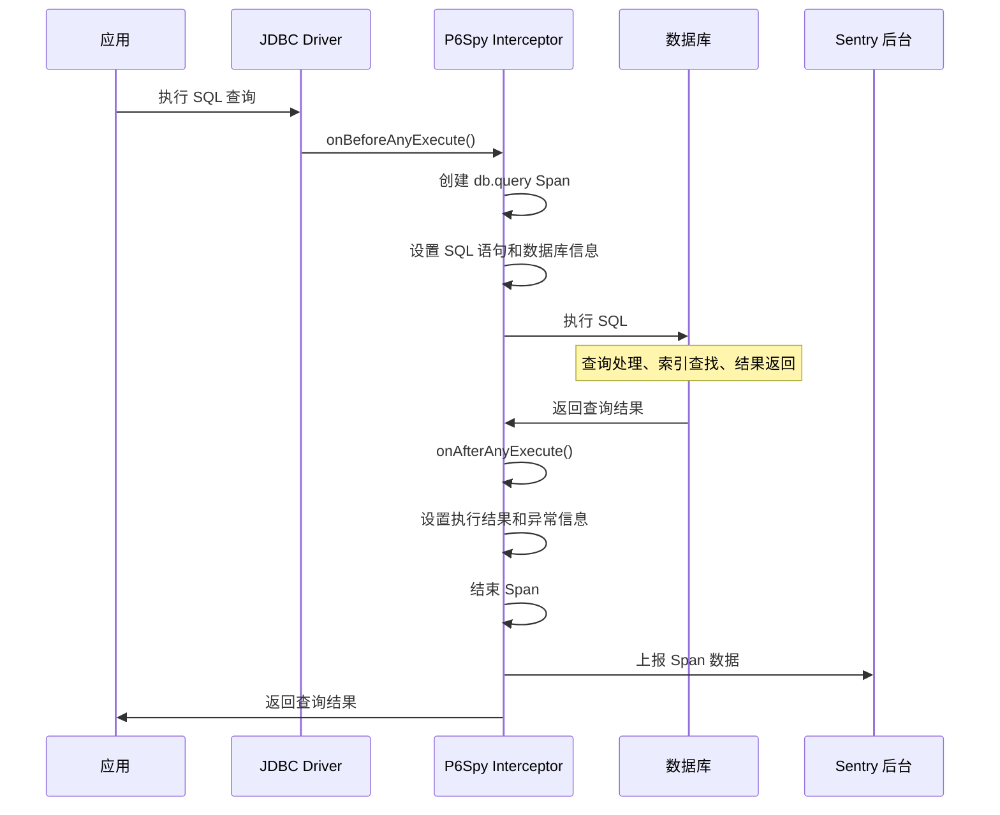

# Sentry Trace 操作字段监控机制详解

本文档详细说明 Sentry 管理后台中各种 Trace 数据字段的监控机制、触发时机和实现原理。

## 🎯 Trace 操作字段概览

Sentry Java/Android SDK 自动生成多种类型的 Trace 操作，每种操作都有特定的监控目的和触发时机：



## 1. UI 加载相关操作

### 1.1 ui.load (Transaction)

**操作类型**: `ui.load`  
**监控对象**: Activity 完整生命周期  
**触发时机**: Activity 创建时开始，Activity 销毁或超时时结束

```java
// 源码位置: ActivityLifecycleIntegration.java
static final String UI_LOAD_OP = "ui.load";

// 创建时机
ITransaction transaction = scopes.startTransaction(
    new TransactionContext(
        activityName,                    // 事务名称 (Activity 类名)
        TransactionNameSource.COMPONENT,
        UI_LOAD_OP,                     // 操作类型
        appStartSamplingDecision),
    transactionOptions);
```

**监控内容**:
- Activity 完整加载过程
- 包含所有子 Span (TTID、TTFD、App Start 等)
- 帧率性能指标
- 内存使用情况

### 1.2 ui.load.initial_display (TTID Span)

**操作类型**: `ui.load.initial_display`  
**监控对象**: Time To Initial Display - 首次显示时间  
**触发时机**: Activity 开始创建 → 首帧绘制完成

```java
// 源码位置: ActivityLifecycleIntegration.java
static final String TTID_OP = "ui.load.initial_display";

// 创建时机
final @NotNull ISpan ttidSpan = transaction.startChild(
    TTID_OP,
    getTtidDesc(activityName),  // "ActivityName initial display"
    ttidStartTime,              // 开始时间
    Instrumenter.SENTRY,
    spanOptions);

// 结束时机: onFirstFrameDrawn()
private void onFirstFrameDrawn(final @Nullable ISpan ttfdSpan, final @Nullable ISpan ttidSpan) {
    if (options != null && ttidSpan != null) {
        final SentryDate endDate = options.getDateProvider().now();
        final long durationNanos = endDate.diff(ttidSpan.getStartDate());
        final long durationMillis = TimeUnit.NANOSECONDS.toMillis(durationNanos);
        
        // 设置 TTID 指标
        ttidSpan.setMeasurement(
            MeasurementValue.KEY_TIME_TO_INITIAL_DISPLAY, 
            durationMillis, 
            MILLISECOND);
        
        finishSpan(ttidSpan, endDate);
    }
}
```

**关键时间点**:
1. **开始时间**: 
   - 首次 Activity: 应用启动时间 (`appStartTime`)
   - 后续 Activity: 上一个 Activity 的 `onPause()` 时间
2. **结束时间**: 首帧绘制完成时间
3. **测量指标**: `time_to_initial_display` (毫秒)

### 1.3 ui.load.full_display (TTFD Span)

**操作类型**: `ui.load.full_display`  
**监控对象**: Time To Full Display - 完全显示时间  
**触发时机**: Activity 开始创建 → 开发者调用 `Sentry.reportFullyDisplayed()`

```java
// 源码位置: ActivityLifecycleIntegration.java
static final String TTFD_OP = "ui.load.full_display";
static final long TTFD_TIMEOUT_MILLIS = 25000; // 25秒超时

// 创建时机 (需要启用 timeToFullDisplaySpanEnabled)
if (timeToFullDisplaySpanEnabled && fullyDisplayedReporter != null && options != null) {
    final @NotNull ISpan ttfdSpan = transaction.startChild(
        TTFD_OP,
        getTtfdDesc(activityName),  // "ActivityName full display"
        ttidStartTime,
        Instrumenter.SENTRY,
        spanOptions);
    
    ttfdSpanMap.put(activity, ttfdSpan);
    
    // 设置自动超时关闭
    ttfdAutoCloseFuture = options.getExecutorService().schedule(
        () -> finishExceededTtfdSpan(ttfdSpan, ttidSpan), 
        TTFD_TIMEOUT_MILLIS);
}

// 手动结束时机: Sentry.reportFullyDisplayed()
public static void reportFullyDisplayed() {
    getCurrentScopes().reportFullyDisplayed();
}
```

**结束条件**:
1. **正常结束**: 开发者调用 `Sentry.reportFullyDisplayed()`
2. **超时结束**: 25秒后自动结束，状态设为 `DEADLINE_EXCEEDED`
3. **早期调用**: 如果在首帧绘制前调用，会在首帧绘制时一起结束

**特殊处理**:
```java
private void onFullFrameDrawn(final @NotNull ISpan ttidSpan, final @NotNull ISpan ttfdSpan) {
    // 如果 TTID 还未完成，说明首帧还未绘制，设置标记
    if (!ttidSpan.isFinished()) {
        fullyDisplayedCalled = true;
        return;
    }
    
    // 正常情况下设置 TTFD 指标并结束
    if (options != null) {
        final SentryDate endDate = options.getDateProvider().now();
        final long durationNanos = endDate.diff(ttfdSpan.getStartDate());
        final long durationMillis = TimeUnit.NANOSECONDS.toMillis(durationNanos);
        ttfdSpan.setMeasurement(
            MeasurementValue.KEY_TIME_TO_FULL_DISPLAY, 
            durationMillis, 
            MILLISECOND);
        finishSpan(ttfdSpan, endDate);
    }
}
```

### 1.4 activity.load (Activity 级别监控)

**操作类型**: `activity.load`  
**监控对象**: 单个 Activity 的加载性能  
**触发时机**: Performance V2 模式下的 Activity 级别监控

```java
// 源码位置: PerformanceAndroidEventProcessor.java
private static final String APP_METRICS_ACTIVITIES_OP = "activity.load";

// 在 Performance V2 模式下创建
if (isPerformanceV2Enabled && spanContext.getOperation().contentEquals(UI_LOAD_OP)) {
    // 为每个 Activity 创建独立的性能监控 Span
}
```

**监控指标**:
- Activity 创建到显示的时间
- 帧率性能数据
- 内存使用情况

## 2. 应用启动相关操作

### 2.1 app.start.cold (冷启动 Span)

**操作类型**: `app.start.cold`  
**监控对象**: 冷启动过程 (进程从零开始创建)  
**触发时机**: 进程创建 → 首帧绘制完成

```java
// 源码位置: ActivityLifecycleIntegration.java
static final String APP_START_COLD = "app.start.cold";

// 创建条件
if (!(firstActivityCreated || appStartTime == null || coldStart == null)) {
    // 创建应用启动 Span
    appStartSpan = transaction.startChild(
        getAppStartOp(coldStart),      // "app.start.cold"
        getAppStartDesc(coldStart),    // "Cold Start"
        appStartTime,                  // 进程启动时间
        Instrumenter.SENTRY,
        spanOptions);
}

private @NotNull String getAppStartOp(final boolean coldStart) {
    if (coldStart) {
        return APP_START_COLD;
    } else {
        return APP_START_WARM;
    }
}
```

**时间测量**:
- **开始时间**: `Process.getStartUptimeMillis()` (Android N+) 或 SDK 初始化时间
- **结束时间**: 首帧绘制完成时间
- **包含阶段**: 进程创建 → ContentProvider 初始化 → Application.onCreate → Activity 创建 → 首帧绘制

### 2.2 app.start.warm (热启动 Span)

**操作类型**: `app.start.warm`  
**监控对象**: 热启动过程 (进程已存在，重新启动 Activity)  
**触发时机**: Activity 重新创建 → 首帧绘制完成

```java
// 热启动判断逻辑
private void setColdStart(final @Nullable Bundle savedInstanceState) {
    if (!firstActivityCreated) {
        final @NotNull TimeSpan appStartSpan = AppStartMetrics.getInstance().getAppStartTimeSpanWithFallback(options);
        
        if ((appStartSpan.hasStarted() && appStartSpan.hasStopped())
            || (!AppStartMetrics.getInstance().isColdStartValid())) {
            // 重启应用启动测量，标记为热启动
            AppStartMetrics.getInstance().restartAppStart(lastPausedUptimeMillis);
            AppStartMetrics.getInstance().setAppStartType(AppStartMetrics.AppStartType.WARM);
        } else {
            // 根据 savedInstanceState 判断启动类型
            AppStartMetrics.getInstance().setAppStartType(
                savedInstanceState == null 
                    ? AppStartMetrics.AppStartType.COLD 
                    : AppStartMetrics.AppStartType.WARM);
        }
    }
}
```

**时间测量**:
- **开始时间**: 上一个 Activity 的 `onPause()` 时间
- **结束时间**: 首帧绘制完成时间
- **包含阶段**: Activity 重新创建 → 首帧绘制

### 2.3 application.load (应用程序加载)

**操作类型**: `application.load`  
**监控对象**: Application 类的初始化过程  
**触发时机**: Application.onCreate() 执行期间

```java
// 源码位置: PerformanceAndroidEventProcessor.java
private static final String APP_METRICS_APPLICATION_OP = "application.load";
```

### 2.4 contentprovider.load (内容提供者加载)

**操作类型**: `contentprovider.load`  
**监控对象**: ContentProvider 的初始化过程  
**触发时机**: ContentProvider.onCreate() 执行期间

```java
// 源码位置: PerformanceAndroidEventProcessor.java
private static final String APP_METRICS_CONTENT_PROVIDER_OP = "contentprovider.load";
```

### 2.5 process.load (进程初始化)

**操作类型**: `process.load`  
**监控对象**: 进程级别的初始化过程  
**触发时机**: 进程创建到应用组件加载完成

```java
// 源码位置: PerformanceAndroidEventProcessor.java
private static final String APP_METRICS_PROCESS_INIT_OP = "process.load";
```

## 3. 网络请求相关操作

### 3.1 http.client (HTTP 客户端请求)

**操作类型**: `http.client`  
**监控对象**: HTTP 客户端发起的网络请求  
**触发时机**: OkHttp、Spring WebClient、OpenFeign 等拦截器自动创建

```java
// 源码位置: SentryOkHttpInterceptor.kt
override fun intercept(chain: Interceptor.Chain): Response {
    val request = chain.request()
    
    // 创建 HTTP 客户端 Span
    val span = parentSpan?.startChild("http.client", "$method $url")
    
    // 设置 HTTP 相关标签
    span?.setTag("http.method", request.method)
    span?.setTag("http.url", request.url.toString())
    
    try {
        val response = chain.proceed(request)
        span?.setTag("http.status_code", response.code.toString())
        return response
    } catch (e: IOException) {
        span?.setThrowable(e)
        span?.setStatus(SpanStatus.INTERNAL_ERROR)
        throw e
    } finally {
        span?.finish()
    }
}
```

**监控指标**:
- DNS 解析时间
- 连接建立时间
- SSL 握手时间
- 请求发送时间
- 响应接收时间
- HTTP 状态码
- 错误信息

**集成支持**:
- **OkHttp**: `SentryOkHttpInterceptor`
- **Spring WebClient**: `SentrySpanClientWebRequestFilter`
- **Spring RestTemplate**: `SentrySpanClientHttpRequestInterceptor`
- **OpenFeign**: `SentryFeignClient`
- **Apollo GraphQL**: `SentryApollo3HttpInterceptor`, `SentryApollo4HttpInterceptor`

### 3.2 http.server (HTTP 服务端请求)

**操作类型**: `http.server`  
**监控对象**: HTTP 服务端接收的请求  
**触发时机**: Spring MVC、WebFlux、Servlet 等框架自动创建

```java
// 源码位置: SentryTracingFilter.java
private static final String TRANSACTION_OP = "http.server";
private static final String TRACE_ORIGIN = "auto.http.spring.webmvc";

// 创建服务端事务
ITransaction transaction = scopes.startTransaction(
    new TransactionContext(name, TransactionNameSource.URL, "http.server"), 
    transactionOptions);
```

**监控内容**:
- HTTP 请求处理时间
- 请求路径和方法
- 响应状态码
- 异常信息
- 用户信息

**集成支持**:
- **Spring MVC**: `SentryTracingFilter`
- **Spring WebFlux**: `SentryWebFilter`
- **Servlet**: `SentryServletRequestListener`

## 4. 数据库相关操作

### 4.1 db.query (通用数据库查询)

**操作类型**: `db.query`  
**监控对象**: 通用数据库查询操作  
**触发时机**: JDBC 拦截器自动创建

```java
// 源码位置: SentryJdbcEventListener.java
@Override
public void onBeforeAnyExecute(final @NotNull StatementInformation statementInformation) {
    final ISpan parent = scopes.getSpan();
    if (parent != null && !parent.isNoOp()) {
        final @NotNull SpanOptions spanOptions = new SpanOptions();
        spanOptions.setOrigin("auto.db.jdbc");
        final ISpan span = parent.startChild("db.query", statementInformation.getSql(), spanOptions);
        CURRENT_SPAN.set(span);
    }
}
```

**监控指标**:
- SQL 语句执行时间
- 数据库类型 (`db.system`)
- 数据库名称 (`db.name`)
- 执行结果和异常

### 4.2 db.sql.query (SQL 查询)

**操作类型**: `db.sql.query`  
**监控对象**: SQL 数据库查询  
**触发时机**: SQLite、Room 等数据库操作时自动创建

```java
// 源码位置: SQLiteSpanManager.kt
fun performSql(sql: String?, operation: () -> T): T {
    val span = scopes.span?.startChild("db.sql.query", sql, startTimestamp, Instrumenter.SENTRY)
    
    span?.setTag("db.type", "sqlite")
    span?.setTag("db.operation", getOperationType(sql))
    
    try {
        val result = operation()
        span?.setStatus(SpanStatus.OK)
        return result
    } catch (e: Exception) {
        span?.setThrowable(e)
        span?.setStatus(SpanStatus.INTERNAL_ERROR)
        throw e
    } finally {
        span?.finish()
    }
}
```

**监控内容**:
- SQL 语句类型 (SELECT, INSERT, UPDATE, DELETE)
- 执行时间
- 影响行数
- 错误信息

## 5. 文件操作相关

### 5.1 file.read (文件读取)

**操作类型**: `file.read`  
**监控对象**: 文件读取操作  
**触发时机**: SentryFileInputStream 自动创建

```java
// 源码位置: SentryFileInputStream.java
private static FileInputStreamInitData init(
    final @Nullable File file, @Nullable FileInputStream delegate, final @NotNull IScopes scopes)
    throws FileNotFoundException {
    final ISpan span = FileIOSpanManager.startSpan(scopes, "file.read");
    if (delegate == null) {
        delegate = new FileInputStream(file);
    }
    return new FileInputStreamInitData(file, span, delegate, scopes.getOptions());
}
```

**监控指标**:
- 文件路径 (`file.path`)
- 读取字节数 (`file.size`)
- 读取时间
- IO 异常

### 5.2 file.write (文件写入)

**操作类型**: `file.write`  
**监控对象**: 文件写入操作  
**触发时机**: SentryFileOutputStream 自动创建

```java
// 源码位置: SentryFileOutputStream.java
private static FileOutputStreamInitData init(
    final @Nullable File file, @Nullable FileOutputStream delegate, final @NotNull IScopes scopes)
    throws FileNotFoundException {
    final ISpan span = FileIOSpanManager.startSpan(scopes, "file.write");
    if (delegate == null) {
        delegate = new FileOutputStream(file);
    }
    return new FileOutputStreamInitData(file, span, delegate, scopes.getOptions());
}
```

**监控指标**:
- 文件路径 (`file.path`)
- 写入字节数 (`file.size`)
- 写入时间
- IO 异常

## 6. GraphQL 相关操作

### 6.1 graphql.operation (GraphQL 操作)

**操作类型**: `graphql.operation`  
**监控对象**: GraphQL 查询、变更、订阅操作  
**触发时机**: GraphQL 执行引擎自动创建

```java
// 源码位置: SentryGraphqlInstrumentation.java
@Override
public InstrumentationContext<ExecutionResult> beginExecution(
    InstrumentationExecutionParameters parameters) {
    
    final String operationName = parameters.getOperation().getName();
    final String operationType = parameters.getOperation().getOperation().name();
    
    final ISpan span = activeSpan.startChild(
        "graphql.operation", 
        operationType + " " + operationName);
    
    return new SimpleInstrumentationContext.Builder<ExecutionResult>()
        .onCompleted((result, throwable) -> {
            if (throwable != null) {
                span.setThrowable(throwable);
                span.setStatus(SpanStatus.INTERNAL_ERROR);
            } else {
                span.setStatus(SpanStatus.OK);
            }
            span.finish();
        })
        .build();
}
```

**监控内容**:
- 操作类型 (query, mutation, subscription)
- 操作名称
- 执行时间
- 错误信息
- 字段解析性能

### 6.2 graphql.fetcher (GraphQL 字段解析器)

**操作类型**: `graphql.fetcher`  
**监控对象**: GraphQL 字段解析器执行  
**触发时机**: 字段解析时自动创建

```java
// 源码位置: SentryDataFetcher.java
@Override
public Object get(DataFetchingEnvironment environment) throws Exception {
    final String fieldName = environment.getField().getName();
    final ISpan span = activeSpan.startChild("graphql.fetcher", fieldName);
    
    try {
        Object result = delegate.get(environment);
        span.setStatus(SpanStatus.OK);
        return result;
    } catch (Exception e) {
        span.setThrowable(e);
        span.setStatus(SpanStatus.INTERNAL_ERROR);
        throw e;
    } finally {
        span.finish();
    }
}
```

## 7. Spring 框架相关操作

### 7.1 bean (Spring Bean 方法调用)

**操作类型**: `bean`  
**监控对象**: Spring Bean 方法执行  
**触发时机**: `@SentryTransaction` 或 `@SentrySpan` 注解的方法

```java
// 源码位置: SentryTransactionAdvice.java
String operation;
if (sentryTransaction != null && !StringUtils.isEmpty(sentryTransaction.operation())) {
    operation = sentryTransaction.operation();
} else {
    operation = "bean";  // 默认操作类型
}

ITransaction transaction = forkedScopes.startTransaction(
    new TransactionContext(nameAndSource.name, nameAndSource.source, operation),
    transactionOptions);
```

**使用示例**:
```java
@Component
public class UserService {
    
    @SentryTransaction(operation = "bean")
    public User createUser(String name) {
        // 业务逻辑
        return new User(name);
    }
    
    @SentrySpan(operation = "bean")
    public void validateUser(User user) {
        // 验证逻辑
    }
}
```

## 8. 自定义操作

### 8.1 custom (自定义 Span)

**操作类型**: 开发者自定义  
**监控对象**: 业务逻辑操作  
**触发时机**: 开发者手动创建

```java
// 手动创建自定义 Span
public void performBusinessOperation() {
    final ISpan span = Sentry.getSpan();
    final ISpan customSpan = span != null ? 
        span.startChild("business.operation", "Process User Data") : null;
    
    if (customSpan != null) {
        customSpan.setTag("user.id", "12345");
        customSpan.setTag("operation.type", "data_processing");
    }
    
    try {
        // 执行业务逻辑
        processUserData();
        if (customSpan != null) {
            customSpan.setStatus(SpanStatus.OK);
        }
    } catch (Exception e) {
        if (customSpan != null) {
            customSpan.setThrowable(e);
            customSpan.setStatus(SpanStatus.INTERNAL_ERROR);
        }
        throw e;
    } finally {
        if (customSpan != null) {
            customSpan.finish();
        }
    }
}
```

## 9. 性能指标 (Measurements)

### 9.1 应用启动指标

```java
// 源码位置: MeasurementValue.java
public static final String KEY_APP_START_COLD = "app_start_cold";
public static final String KEY_APP_START_WARM = "app_start_warm";
```

**指标说明**:
- `app_start_cold`: 冷启动时间 (毫秒)
- `app_start_warm`: 热启动时间 (毫秒)

### 9.2 UI 性能指标

```java
// 源码位置: MeasurementValue.java
public static final String KEY_TIME_TO_INITIAL_DISPLAY = "time_to_initial_display";
public static final String KEY_TIME_TO_FULL_DISPLAY = "time_to_full_display";
public static final String KEY_FRAMES_TOTAL = "frames_total";
public static final String KEY_FRAMES_SLOW = "frames_slow";
public static final String KEY_FRAMES_FROZEN = "frames_frozen";
public static final String KEY_FRAMES_DELAY = "frames_delay";
```

**指标说明**:
- `time_to_initial_display`: 首次显示时间 (毫秒)
- `time_to_full_display`: 完全显示时间 (毫秒)
- `frames_total`: 总帧数
- `frames_slow`: 慢帧数量 (>16.67ms for 60fps)
- `frames_frozen`: 冻结帧数量 (>700ms)
- `frames_delay`: 帧延迟时间 (秒)

### 9.3 Span 数据约定

```java
// 源码位置: SpanDataConvention.java
String DB_SYSTEM_KEY = "db.system";
String DB_NAME_KEY = "db.name";
String HTTP_QUERY_KEY = "http.query";
String HTTP_FRAGMENT_KEY = "http.fragment";
String HTTP_METHOD_KEY = "http.request.method";
String THREAD_ID = "thread.id";
String THREAD_NAME = "thread.name";
```

## 10. 监控时机详解

### 10.1 Activity 生命周期监控时机



### 10.2 网络请求监控时机



### 10.3 数据库操作监控时机



## 11. 配置和最佳实践

### 11.1 启用相关监控

```kotlin
SentryAndroid.init(this) { options ->
    // 启用性能监控
    options.tracesSampleRate = 1.0
    
    // 启用 Activity 生命周期追踪
    options.isEnableAutoActivityLifecycleTracing = true
    
    // 启用应用启动追踪
    options.isEnableAppStartTracking = true
    
    // 启用 TTFD 追踪 (需要手动调用 reportFullyDisplayed)
    options.isEnableTimeToFullDisplayTracing = true
    
    // 启用网络监控
    options.isEnableNetworkEventBreadcrumbs = true
    
    // 启用帧率监控
    options.isEnableFramesTracking = true
    
    // 启用文件 IO 监控
    options.isTracingEnabled = true
}
```

### 11.2 网络监控集成

```kotlin
// OkHttp 集成
val client = OkHttpClient.Builder()
    .addInterceptor(SentryOkHttpInterceptor())
    .build()

// Spring WebClient 集成
@Bean
fun webClient(): WebClient {
    return WebClient.builder()
        .filter(SentrySpanClientWebRequestFilter())
        .build()
}

// Apollo GraphQL 集成
val apolloClient = ApolloClient.Builder()
    .serverUrl("https://api.example.com/graphql")
    .addHttpInterceptor(SentryApollo3HttpInterceptor())
    .build()
```

### 11.3 数据库监控集成

```properties
# application.properties
# 启用 P6Spy JDBC 拦截器
spring.datasource.driver-class-name=com.p6spy.engine.spy.P6SpyDriver
spring.datasource.url=jdbc:p6spy:postgresql://localhost:5432/mydb

# spy.properties
driverlist=org.postgresql.Driver
appender=io.sentry.jdbc.SentryJdbcEventListener
```

### 11.4 TTFD 最佳实践

```kotlin
class MainActivity : AppCompatActivity() {
    override fun onCreate(savedInstanceState: Bundle?) {
        super.onCreate(savedInstanceState)
        setContentView(R.layout.activity_main)
        
        // 异步加载数据
        loadDataAsync {
            // 数据加载完成，UI 完全显示
            Sentry.reportFullyDisplayed()
        }
    }
    
    private fun loadDataAsync(callback: () -> Unit) {
        lifecycleScope.launch {
            // 模拟数据加载
            delay(1000)
            
            // 更新 UI
            updateUI()
            
            // 通知 Sentry UI 完全显示
            callback()
        }
    }
}
```

### 11.5 自定义 Span 最佳实践

```kotlin
// 使用 use 扩展函数自动管理 Span 生命周期
fun processUserData(userId: String) {
    Sentry.startTransaction("user_data_processing", "business").use { transaction ->
        transaction.setTag("user.id", userId)
        
        // 数据库查询 Span
        transaction.startChild("db.query", "SELECT user data").use { dbSpan ->
            dbSpan.setTag("db.table", "users")
            val userData = database.getUser(userId)
            dbSpan.setData("rows.affected", 1)
        }
        
        // 数据处理 Span
        transaction.startChild("data.processing", "Transform user data").use { processSpan ->
            processSpan.setTag("processing.type", "transformation")
            val processedData = transformData(userData)
            processSpan.setData("items.processed", processedData.size)
        }
        
        transaction.setStatus(SpanStatus.OK)
    }
}
```

### 11.6 Spring 注解最佳实践

```java
@Service
public class UserService {
    
    // 事务级别监控
    @SentryTransaction(name = "createUser", operation = "business")
    public User createUser(CreateUserRequest request) {
        return processUserCreation(request);
    }
    
    // Span 级别监控
    @SentrySpan(operation = "validation")
    public void validateUser(User user) {
        // 验证逻辑
    }
    
    @SentrySpan(operation = "db.operation", description = "Save user to database")
    public void saveUser(User user) {
        userRepository.save(user);
    }
}
```

## 12. 故障排查

### 12.1 常见问题

**TTID/TTFD Span 未出现**:
- 检查是否启用了 `isEnableAutoActivityLifecycleTracing`
- 确认 `tracesSampleRate` > 0
- 验证 Activity 是否正常完成生命周期

**TTFD Span 超时**:
- 检查是否调用了 `Sentry.reportFullyDisplayed()`
- 确认调用时机是否在 25 秒内
- 验证是否在正确的线程调用

**App Start Span 缺失**:
- 确认是否为前台启动 (非后台启动)
- 检查启动时间是否超过 1 分钟 (会被标记为无效)
- 验证是否为首次 Activity 创建

**HTTP Span 未创建**:
- 确认是否正确配置了拦截器
- 检查是否存在活跃的父 Span
- 验证网络请求是否成功执行

**数据库 Span 缺失**:
- 确认是否正确配置了 P6Spy
- 检查 JDBC URL 是否包含 p6spy 前缀
- 验证是否存在活跃的事务

### 12.2 调试技巧

```kotlin
// 启用详细日志查看 Span 创建过程
SentryAndroid.init(this) { options ->
    options.isDebug = true
    options.diagnosticLevel = SentryLevel.DEBUG
    
    // 设置自定义 logger
    options.setLogger(object : ILogger {
        override fun log(level: SentryLevel, message: String, vararg args: Any?) {
            Log.d("Sentry", String.format(message, *args))
        }
        
        override fun log(level: SentryLevel, message: String, throwable: Throwable?) {
            Log.d("Sentry", message, throwable)
        }
        
        override fun log(level: SentryLevel, throwable: Throwable?, message: String, vararg args: Any?) {
            Log.d("Sentry", String.format(message, *args), throwable)
        }
        
        override fun isEnabled(level: SentryLevel?): Boolean = true
    })
}
```

### 12.3 性能监控检查清单

**Android 应用**:
- [ ] 启用 Activity 生命周期追踪
- [ ] 配置合适的采样率 (生产环境建议 0.1)
- [ ] 集成 OkHttp 拦截器进行网络监控
- [ ] 在关键页面调用 `reportFullyDisplayed()`
- [ ] 启用帧率监控检测 UI 卡顿

**Spring 应用**:
- [ ] 启用 Spring 集成自动配置
- [ ] 在关键业务方法添加 `@SentryTransaction` 注解
- [ ] 配置数据库监控 (P6Spy)
- [ ] 集成 WebClient 或 RestTemplate 拦截器

**通用配置**:
- [ ] 设置合理的事务超时时间
- [ ] 配置错误采样策略
- [ ] 启用分布式追踪头传播
- [ ] 设置环境和版本信息

通过理解这些 Trace 操作字段的监控机制，开发者可以更好地分析应用性能，识别瓶颈，并进行针对性优化。每种操作类型都有其特定的用途和最佳实践，合理配置和使用这些监控功能可以大大提升应用的可观测性。 