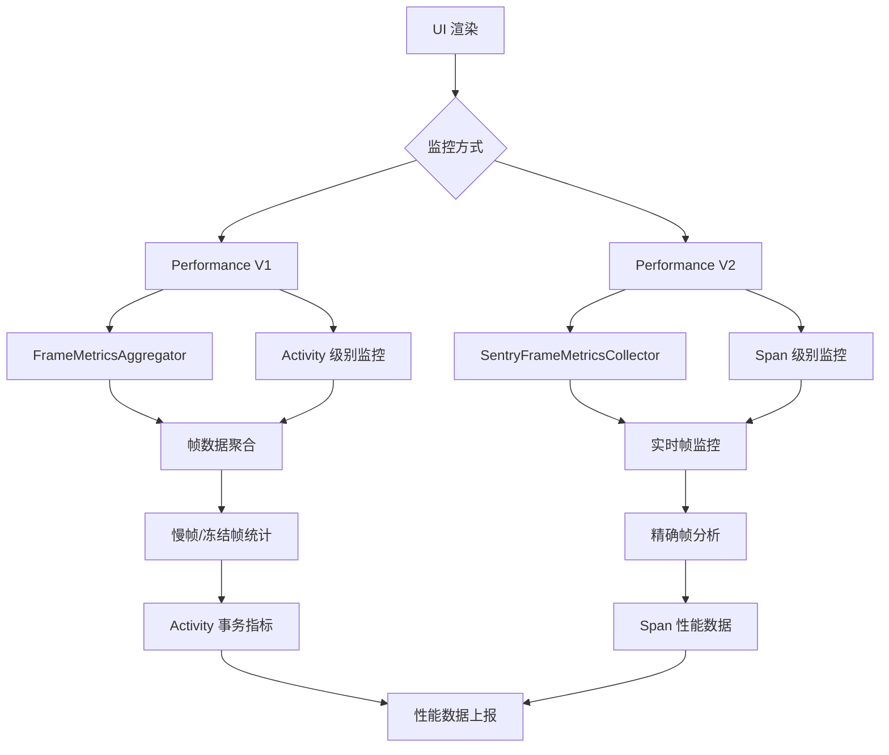

# Sentry UI 卡顿监控机制深度分析

本文档详细分析了 Sentry Android SDK 如何监控 UI 卡顿，包括帧率监控、慢帧和冻结帧检测、性能指标收集等核心机制。

## 🎯 UI 卡顿监控概览

Sentry 通过多层帧率监控机制来全面跟踪 UI 性能：



## 1. 帧率监控架构

### 1.1 双重监控策略

Sentry 提供两种帧率监控方式，根据配置自动选择：

```java
// Performance V1: Activity 级别监控
public final class ActivityFramesTracker {
    private @Nullable FrameMetricsAggregator frameMetricsAggregator = null;
    
    @VisibleForTesting
    public boolean isFrameMetricsAggregatorAvailable() {
        return frameMetricsAggregator != null
            && options.isEnableFramesTracking()
            && !options.isEnablePerformanceV2();  // V2 启用时禁用 V1
    }
}

// Performance V2: Span 级别监控
public class SpanFrameMetricsCollector implements IPerformanceContinuousCollector {
    private final boolean enabled;
    
    public SpanFrameMetricsCollector(
        final @NotNull SentryAndroidOptions options,
        final @NotNull SentryFrameMetricsCollector frameMetricsCollector) {
        
        enabled = options.isEnablePerformanceV2() && options.isEnableFramesTracking();
    }
}
```

### 1.2 帧率监控判断标准

```java
public final class SentryFrameMetricsCollector {
    private static final long frozenFrameThresholdNanos = TimeUnit.MILLISECONDS.toNanos(700);
    
    public static boolean isFrozen(long frameDuration) {
        return frameDuration > frozenFrameThresholdNanos;  // > 700ms = 冻结帧
    }
    
    public static boolean isSlow(long frameDuration, final long expectedFrameDuration) {
        return frameDuration > expectedFrameDuration;      // > 期望帧时间 = 慢帧
    }
}
```

## 2. Performance V1: Activity 级别监控

### 2.1 FrameMetricsAggregator 集成

```java
public final class ActivityFramesTracker {
    public void addActivity(final @NotNull Activity activity) {
        try (final @NotNull ISentryLifecycleToken ignored = lock.acquire()) {
            if (!isFrameMetricsAggregatorAvailable()) {
                return;
            }
            
            // 在 UI 线程上安全执行
            runSafelyOnUiThread(() -> frameMetricsAggregator.add(activity), "FrameMetricsAggregator.add");
            
            // 记录开始时的帧数快照
            snapshotFrameCountsAtStart(activity);
        }
    }
    
    private void snapshotFrameCountsAtStart(final @NotNull Activity activity) {
        FrameCounts frameCounts = calculateCurrentFrameCounts();
        if (frameCounts != null) {
            frameCountAtStartSnapshots.put(activity, frameCounts);
        }
    }
}
```

### 2.2 帧数据计算

```java
private @Nullable FrameCounts calculateCurrentFrameCounts() {
    if (!isFrameMetricsAggregatorAvailable() || frameMetricsAggregator == null) {
        return null;
    }
    
    final @Nullable SparseIntArray[] framesRates = frameMetricsAggregator.getMetrics();
    
    int totalFrames = 0;
    int slowFrames = 0;
    int frozenFrames = 0;
    
    if (framesRates != null && framesRates.length > 0) {
        final SparseIntArray totalIndexArray = framesRates[FrameMetricsAggregator.TOTAL_INDEX];
        if (totalIndexArray != null) {
            for (int i = 0; i < totalIndexArray.size(); i++) {
                int frameTime = totalIndexArray.keyAt(i);    // 帧时间 (ms)
                int numFrames = totalIndexArray.valueAt(i);  // 该时间的帧数
                
                totalFrames += numFrames;
                
                // 硬编码阈值，与官方 Android 文档和 Frame Metrics API 一致
                if (frameTime > 700) {
                    frozenFrames += numFrames;  // 冻结帧：> 700ms
                } else if (frameTime > 16) {
                    slowFrames += numFrames;    // 慢帧：> 16ms (60fps)
                }
            }
        }
    }
    
    return new FrameCounts(totalFrames, slowFrames, frozenFrames);
}
```

### 2.3 Activity 事务集成

```java
// 在 ActivityLifecycleIntegration 中集成
transactionOptions.setTransactionFinishedCallback((finishingTransaction) -> {
    @Nullable Activity unwrappedActivity = weakActivity.get();
    if (unwrappedActivity != null) {
        // Activity 结束时收集帧指标
        activityFramesTracker.setMetrics(unwrappedActivity, finishingTransaction.getEventId());
    }
});

// 在 PerformanceAndroidEventProcessor 中处理
if (eventId != null && spanContext != null && spanContext.getOperation().contentEquals(UI_LOAD_OP)) {
    final Map<String, @NotNull MeasurementValue> framesMetrics = 
        activityFramesTracker.takeMetrics(eventId);
    if (framesMetrics != null) {
        transaction.getMeasurements().putAll(framesMetrics);
    }
}
```

## 3. Performance V2: Span 级别监控

### 3.1 SentryFrameMetricsCollector 核心机制

```java
@SuppressLint("NewApi")
public SentryFrameMetricsCollector(final @NotNull Context context, ...) {
    // 获取 Choreographer 实例（必须在主线程）
    new Handler(Looper.getMainLooper()).post(() -> {
        try {
            choreographer = Choreographer.getInstance();
        } catch (Throwable e) {
            logger.log(SentryLevel.ERROR, 
                "Error retrieving Choreographer instance. Slow and frozen frames will not be reported.", e);
        }
    });
    
    // 通过反射获取 Choreographer 的私有字段
    try {
        choreographerLastFrameTimeField = Choreographer.class.getDeclaredField("mLastFrameTimeNanos");
        choreographerLastFrameTimeField.setAccessible(true);
    } catch (NoSuchFieldException e) {
        logger.log(SentryLevel.ERROR, "Unable to get the frame timestamp from the choreographer: ", e);
    }
}
```

### 3.2 实时帧监控回调

```java
frameMetricsAvailableListener = (window, frameMetrics, dropCountSinceLastInvocation) -> {
    final long now = System.nanoTime();
    
    // 获取屏幕刷新率
    final float refreshRate = buildInfoProvider.getSdkInfoVersion() >= Build.VERSION_CODES.R
        ? window.getContext().getDisplay().getRefreshRate()
        : window.getWindowManager().getDefaultDisplay().getRefreshRate();
    
    final long expectedFrameDuration = (long) (oneSecondInNanos / refreshRate);
    
    // 计算 CPU 主线程帧时间（不包括 GPU 时间）
    final long cpuDuration = getFrameCpuDuration(frameMetrics);
    
    // 计算帧延迟
    final long delayNanos = Math.max(0, cpuDuration - expectedFrameDuration);
    
    // 获取帧开始时间戳
    long startTime = getFrameStartTimestamp(frameMetrics);
    if (startTime < 0) {
        startTime = now - cpuDuration;  // 回退策略
    }
    
    // 调整帧开始时间，确保在上一帧结束之后
    startTime = Math.max(startTime, lastFrameEndNanos);
    
    // 避免重复帧
    if (startTime == lastFrameStartNanos) {
        return;
    }
    
    lastFrameStartNanos = startTime;
    lastFrameEndNanos = startTime + cpuDuration;
    
    // 判断慢帧和冻结帧
    // 减去 1fps 以避免大多数帧被误判为慢帧
    final boolean isSlow = isSlow(cpuDuration, (long) ((float) oneSecondInNanos / (refreshRate - 1.0f)));
    final boolean isFrozen = isSlow && isFrozen(cpuDuration);
    
    // 通知所有监听器
    for (FrameMetricsCollectorListener l : listenerMap.values()) {
        l.onFrameMetricCollected(startTime, lastFrameEndNanos, cpuDuration, delayNanos, isSlow, isFrozen, refreshRate);
    }
};
```

### 3.3 CPU 帧时间计算

```java
@RequiresApi(api = Build.VERSION_CODES.N)
private long getFrameCpuDuration(final @NotNull FrameMetrics frameMetrics) {
    // 受 JankStats 库启发
    // 只计算主线程 CPU 时间，不包括 GPU 渲染时间
    return frameMetrics.getMetric(FrameMetrics.UNKNOWN_DELAY_DURATION)
        + frameMetrics.getMetric(FrameMetrics.INPUT_HANDLING_DURATION)
        + frameMetrics.getMetric(FrameMetrics.ANIMATION_DURATION)
        + frameMetrics.getMetric(FrameMetrics.LAYOUT_MEASURE_DURATION)
        + frameMetrics.getMetric(FrameMetrics.DRAW_DURATION)
        + frameMetrics.getMetric(FrameMetrics.SYNC_DURATION);
}
```

## 4. Span 级别帧监控

### 4.1 SpanFrameMetricsCollector 工作流程

```java
public class SpanFrameMetricsCollector implements IPerformanceContinuousCollector {
    // 最大帧缓存数量：30秒 × 120fps = 3600帧
    private static final int MAX_FRAMES_COUNT = 3600;
    
    // 所有运行中的 Span，按开始时间排序
    private final @NotNull SortedSet<ISpan> runningSpans = new TreeSet<>(...);
    
    // 所有收集的帧，按结束时间排序（并发安全）
    private final @NotNull ConcurrentSkipListSet<Frame> frames = new ConcurrentSkipListSet<>();
    
    @Override
    public void onSpanStarted(final @NotNull ISpan span) {
        if (!enabled || span instanceof NoOpSpan || span instanceof NoOpTransaction) {
            return;
        }
        
        try (final @NotNull ISentryLifecycleToken ignored = lock.acquire()) {
            runningSpans.add(span);
            
            // 第一个 Span 开始时启动帧收集
            if (listenerId == null) {
                listenerId = frameMetricsCollector.startCollection(this);
            }
        }
    }
}
```

### 4.2 帧数据收集和处理

```java
@Override
public void onFrameMetricCollected(
    long frameStartNanos, long frameEndNanos, long durationNanos, long delayNanos,
    boolean isSlow, boolean isFrozen, float refreshRate) {
    
    // 缓存已满，跳过新帧（Span 结束时会清理缓存）
    if (frames.size() > MAX_FRAMES_COUNT) {
        return;
    }
    
    final long expectedFrameDurationNanos = (long) ((double) ONE_SECOND_NANOS / (double) refreshRate);
    lastKnownFrameDurationNanos = expectedFrameDurationNanos;
    
    // 只存储慢帧和冻结帧以节省内存
    if (isSlow || isFrozen) {
        frames.add(new Frame(
            frameStartNanos, frameEndNanos, durationNanos, delayNanos,
            isSlow, isFrozen, expectedFrameDurationNanos
        ));
    }
}
```

### 4.3 Span 结束时的指标计算

```java
private void captureFrameMetrics(final @NotNull ISpan span) {
    final @NotNull SentryNanotimeDate spanStartTime = toNanoTime(span.getStartDate());
    final @NotNull SentryNanotimeDate spanEndTime = toNanoTime(span.getFinishDate());
    
    // 查找 Span 时间范围内的所有帧
    final @NotNull SortedSet<Frame> spanFrames = frames.subSet(
        new Frame(spanStartTime), new Frame(spanEndTime)
    );
    
    final @NotNull SentryFrameMetrics frameMetrics = new SentryFrameMetrics();
    
    // 处理每一帧
    for (final @NotNull Frame frame : spanFrames) {
        // 计算帧与 Span 的重叠时间
        final long frameStartClampedNanos = Math.max(frame.getStartTimestampNanos(), spanStartNanos);
        final long frameEndClampedNanos = Math.min(frame.getEndTimestampNanos(), spanEndNanos);
        
        if (frameEndClampedNanos > frameStartClampedNanos) {
            final long overlapNanos = frameEndClampedNanos - frameStartClampedNanos;
            final long frameDurationNanos = frame.getEndTimestampNanos() - frame.getStartTimestampNanos();
            
            // 按重叠比例计算延迟
            final long frameDelayNanos = (long) ((double) frame.getDelayNanos() * overlapNanos / frameDurationNanos);
            
            frameMetrics.addFrame(overlapNanos, frameDelayNanos, frame.isSlow(), frame.isFrozen());
        }
    }
    
    // 计算总帧数（包括插值）
    final long spanDurationNanos = spanEndNanos - spanStartNanos;
    final long frameDurationNanos = lastKnownFrameDurationNanos;
    
    int totalFrameCount = frameMetrics.getSlowFrozenFrameCount();
    
    // 处理待渲染帧延迟
    final long nextScheduledFrameNanos = frameMetricsCollector.getLastKnownFrameStartTimeNanos();
    if (nextScheduledFrameNanos != -1) {
        totalFrameCount += addPendingFrameDelay(frameMetrics, frameDurationNanos, spanEndNanos, nextScheduledFrameNanos);
        totalFrameCount += interpolateFrameCount(frameMetrics, frameDurationNanos, spanDurationNanos);
    }
    
    // 设置 Span 数据
    final long frameDelayNanos = frameMetrics.getSlowFrameDelayNanos() + frameMetrics.getFrozenFrameDelayNanos();
    final double frameDelayInSeconds = frameDelayNanos / 1e9d;
    
    span.setData(SpanDataConvention.FRAMES_TOTAL, totalFrameCount);
    span.setData(SpanDataConvention.FRAMES_SLOW, frameMetrics.getSlowFrameCount());
    span.setData(SpanDataConvention.FRAMES_FROZEN, frameMetrics.getFrozenFrameCount());
    span.setData(SpanDataConvention.FRAMES_DELAY, frameDelayInSeconds);
    
    // 如果是事务，同时设置测量值
    if (span instanceof ITransaction) {
        span.setMeasurement(MeasurementValue.KEY_FRAMES_TOTAL, totalFrameCount);
        span.setMeasurement(MeasurementValue.KEY_FRAMES_SLOW, frameMetrics.getSlowFrameCount());
        span.setMeasurement(MeasurementValue.KEY_FRAMES_FROZEN, frameMetrics.getFrozenFrameCount());
        span.setMeasurement(MeasurementValue.KEY_FRAMES_DELAY, frameDelayInSeconds);
    }
}
```

## 5. 帧插值和补偿机制

### 5.1 帧数插值

```java
private static int interpolateFrameCount(
    final @NotNull SentryFrameMetrics frameMetrics,
    final long frameDurationNanos,
    final long spanDurationNanos) {
    
    // 如果 Android 上没有内容变化，系统也不会提供新的帧指标
    // 为了匹配 Span 持续时间和总帧数，我们基于 Span 持续时间简单插值总帧数
    // 这样数据更加合理，也与 Cocoa SDK 的输出匹配
    final long frameMetricsDurationNanos = frameMetrics.getTotalDurationNanos();
    final long nonRenderedDuration = spanDurationNanos - frameMetricsDurationNanos;
    
    if (nonRenderedDuration > 0) {
        return (int) Math.ceil((double) nonRenderedDuration / frameDurationNanos);
    }
    return 0;
}
```

### 5.2 待渲染帧延迟处理

```java
private int addPendingFrameDelay(
    final @NotNull SentryFrameMetrics frameMetrics,
    final long frameDurationNanos,
    final long spanEndNanos,
    final long nextScheduledFrameNanos) {
    
    // 如果 Span 结束时有待渲染的帧，计算其延迟
    if (nextScheduledFrameNanos < spanEndNanos) {
        final long pendingFrameDelayNanos = spanEndNanos - nextScheduledFrameNanos;
        
        if (pendingFrameDelayNanos > frameDurationNanos) {
            // 待渲染帧被认为是冻结帧
            frameMetrics.addFrame(frameDurationNanos, pendingFrameDelayNanos - frameDurationNanos, false, true);
            return 1;
        }
    }
    return 0;
}
```

## 6. 性能优化策略

### 6.1 内存管理

```java
public class SpanFrameMetricsCollector {
    @Override
    public void onSpanFinished(final @NotNull ISpan span) {
        // ... 处理帧指标
        
        try (final @NotNull ISentryLifecycleToken ignored = lock.acquire()) {
            if (runningSpans.isEmpty()) {
                clear();  // 所有 Span 结束时清理
            } else {
                // 只移除旧的/无关的帧
                final @NotNull ISpan oldestSpan = runningSpans.first();
                frames.headSet(new Frame(toNanoTime(oldestSpan.getStartDate()))).clear();
            }
        }
    }
    
    @Override
    public void clear() {
        try (final @NotNull ISentryLifecycleToken ignored = lock.acquire()) {
            if (listenerId != null) {
                frameMetricsCollector.stopCollection(listenerId);
                listenerId = null;
            }
            frames.clear();
            runningSpans.clear();
        }
    }
}
```

### 6.2 线程安全

```java
public final class ActivityFramesTracker {
    private void runSafelyOnUiThread(final Runnable runnable, final String tag) {
        try {
            if (AndroidThreadChecker.getInstance().isMainThread()) {
                runnable.run();
            } else {
                handler.post(() -> {
                    try {
                        runnable.run();
                    } catch (Throwable ignored) {
                        if (tag != null) {
                            options.getLogger().log(SentryLevel.WARNING, "Failed to execute " + tag);
                        }
                    }
                });
            }
        } catch (Throwable ignored) {
            if (tag != null) {
                options.getLogger().log(SentryLevel.WARNING, "Failed to execute " + tag);
            }
        }
    }
}
```

### 6.3 缓存限制

```java
@Override
public void onFrameMetricCollected(...) {
    // 缓存已满，跳过添加新帧
    // Span 结束时会修剪缓存
    if (frames.size() > MAX_FRAMES_COUNT) {
        return;
    }
    
    // 只存储慢帧和冻结帧以节省内存
    if (isSlow || isFrozen) {
        frames.add(new Frame(...));
    }
}
```

## 7. 配置和集成

### 7.1 关键配置选项

```java
// 启用帧率跟踪
options.setEnableFramesTracking(true);

// 选择性能监控版本
options.setEnablePerformanceV2(true);  // 推荐使用 V2

// 启用跟踪
options.setTracingEnabled(true);
options.setTracesSampleRate(1.0);

// Activity 生命周期跟踪（V1 需要）
options.setEnableActivityLifecycleTracingAutoFinish(true);
```

### 7.2 自动集成

```java
// ActivityLifecycleIntegration 自动注册 ActivityFramesTracker
public void register(final @NotNull IScopes scopes, final @NotNull SentryOptions options) {
    // ...
    if (performanceEnabled) {
        activityFramesTracker.addActivity(activity);
    }
}

// SentryFrameMetricsCollector 自动注册 Activity 生命周期回调
public SentryFrameMetricsCollector(final @NotNull Context context, ...) {
    if (appContext instanceof Application) {
        ((Application) appContext).registerActivityLifecycleCallbacks(this);
    }
}
```

## 8. 指标含义和阈值

### 8.1 帧分类标准

| 帧类型 | 阈值 | 说明 |
|--------|------|------|
| **正常帧** | ≤ 16ms (60fps) | 流畅的用户体验 |
| **慢帧** | > 16ms 且 ≤ 700ms | 轻微卡顿，用户可感知 |
| **冻结帧** | > 700ms | 严重卡顿，用户体验差 |

### 8.2 性能指标

```java
// 关键测量值
public static final String KEY_FRAMES_TOTAL = "frames_total";     // 总帧数
public static final String KEY_FRAMES_SLOW = "frames_slow";       // 慢帧数
public static final String KEY_FRAMES_FROZEN = "frames_frozen";   // 冻结帧数
public static final String KEY_FRAMES_DELAY = "frames_delay";     // 帧延迟（秒）

// Span 数据
public static final String FRAMES_TOTAL = "frames.total";
public static final String FRAMES_SLOW = "frames.slow";
public static final String FRAMES_FROZEN = "frames.frozen";
public static final String FRAMES_DELAY = "frames.delay";
```

### 8.3 刷新率适配

```java
// 动态获取屏幕刷新率
final float refreshRate = buildInfoProvider.getSdkInfoVersion() >= Build.VERSION_CODES.R
    ? window.getContext().getDisplay().getRefreshRate()
    : window.getWindowManager().getDefaultDisplay().getRefreshRate();

final long expectedFrameDuration = (long) (oneSecondInNanos / refreshRate);

// 适配不同刷新率的慢帧判断
// 减去 1fps 以避免大多数帧被误判为慢帧
final boolean isSlow = isSlow(cpuDuration, (long) ((float) oneSecondInNanos / (refreshRate - 1.0f)));
```

## 9. 最佳实践

### 9.1 推荐配置

```java
// 生产环境推荐配置
SentryAndroid.init(this, options -> {
    options.setDsn("YOUR_DSN");
    
    // 启用 Performance V2（推荐）
    options.setEnablePerformanceV2(true);
    options.setEnableFramesTracking(true);
    
    // 合理的采样率
    options.setTracesSampleRate(0.1);  // 10% 采样
    
    // 启用 Activity 跟踪
    options.setEnableActivityLifecycleTracingAutoFinish(true);
    options.setIdleTimeout(3000L);
});
```

### 9.2 性能优化建议

1. **减少主线程工作**：避免在主线程执行耗时操作
2. **优化布局层次**：减少 Layout 和 Draw 时间
3. **合理使用动画**：避免复杂动画导致的帧丢失
4. **监控关键页面**：重点关注用户交互频繁的页面

### 9.3 指标解读

- **慢帧率 < 5%**：用户体验良好
- **慢帧率 5-10%**：轻微卡顿，需要优化
- **慢帧率 > 10%**：明显卡顿，需要重点优化
- **冻结帧 > 0**：严重问题，需要立即修复

## 10. 故障排查

### 10.1 常见问题

**Q: 帧率数据不准确？**
A: 检查是否启用了正确的性能监控版本，确保 Android 版本 >= N (API 24)

**Q: 没有帧率数据？**
A: 确认 `isEnableFramesTracking()` 已启用，且 AndroidX 库可用

**Q: 慢帧数过多？**
A: 检查主线程是否有耗时操作，使用 Systrace 或 GPU 渲染分析工具

**Q: Performance V2 vs V1 选择？**
A: 推荐使用 V2，提供更精确的 Span 级别监控

### 10.2 调试技巧

```java
// 启用详细日志
options.setDebug(true);
options.setLogger(new SystemOutLogger());

// 检查帧率跟踪状态
ActivityFramesTracker tracker = activityFramesTracker;
System.out.println("Frame tracking available: " + tracker.isFrameMetricsAggregatorAvailable());

// 监控帧指标回调
frameMetricsCollector.startCollection((frameStartNanos, frameEndNanos, durationNanos, 
    delayNanos, isSlow, isFrozen, refreshRate) -> {
    System.out.println(String.format("Frame: duration=%dms, slow=%b, frozen=%b", 
        TimeUnit.NANOSECONDS.toMillis(durationNanos), isSlow, isFrozen));
});
```

## 总结

Sentry 的 UI 卡顿监控机制通过精密的帧率分析和智能的性能指标收集，为开发者提供了全面的 UI 性能洞察：

### 🎯 **核心优势**

1. **双重监控策略**: Performance V1 和 V2 满足不同需求
2. **精确帧分析**: 基于 Android FrameMetrics API 的准确测量
3. **实时监控**: Choreographer 集成提供实时帧数据
4. **智能分类**: 自动区分正常帧、慢帧和冻结帧
5. **内存优化**: 只存储异常帧，减少内存占用

### 🔍 **监控范围**

- **Activity 级别**: 整个 Activity 生命周期的帧性能
- **Span 级别**: 精确到具体操作的帧分析
- **多维度指标**: 总帧数、慢帧数、冻结帧数、帧延迟
- **刷新率适配**: 支持不同刷新率设备的准确监控

### 📊 **数据价值**

通过这套监控机制，开发者可以：
- 识别 UI 性能瓶颈
- 量化用户体验质量
- 监控版本间的性能变化
- 优化关键用户交互路径

这套机制确保了在各种设备和场景下，都能准确捕获和分析 UI 卡顿问题，为性能优化提供可靠的数据支撑。 