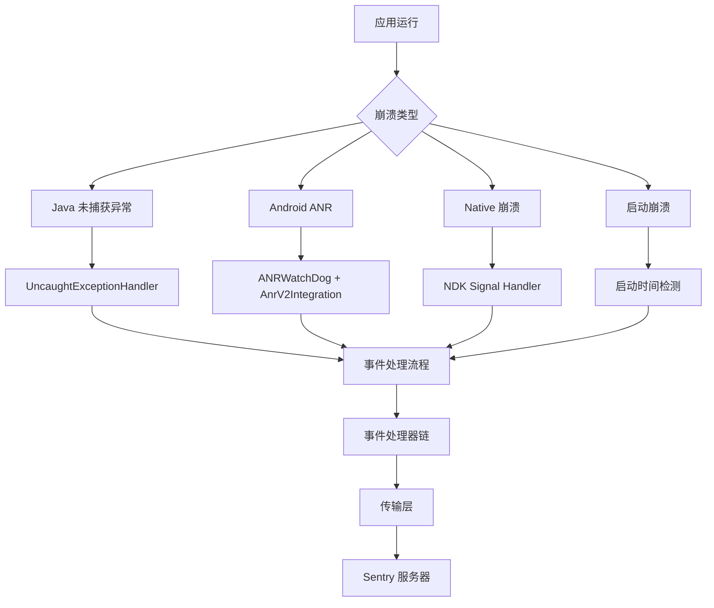
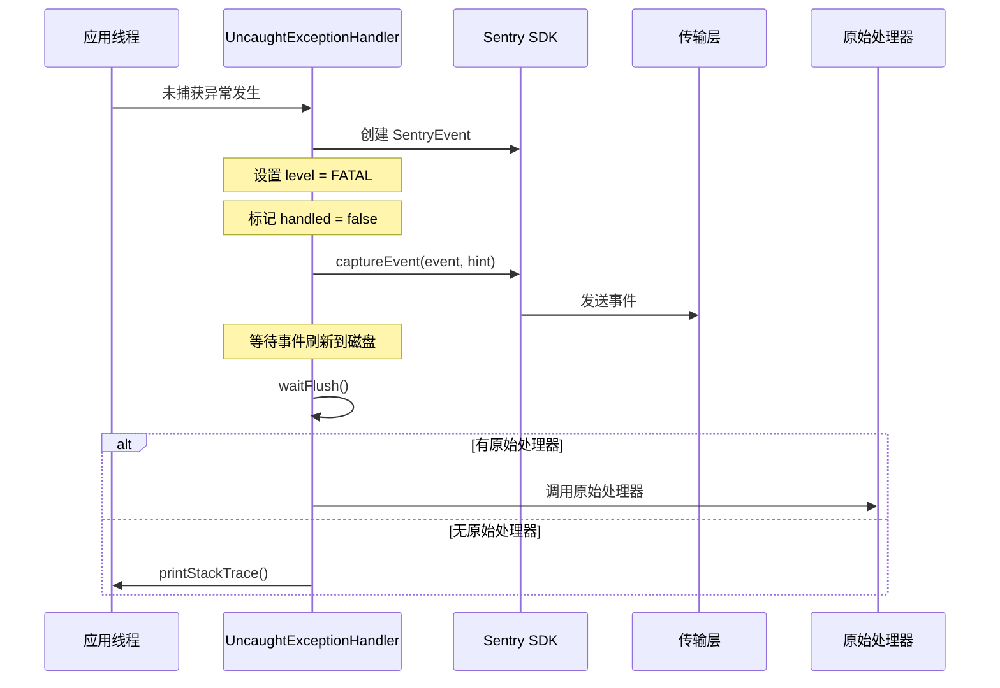
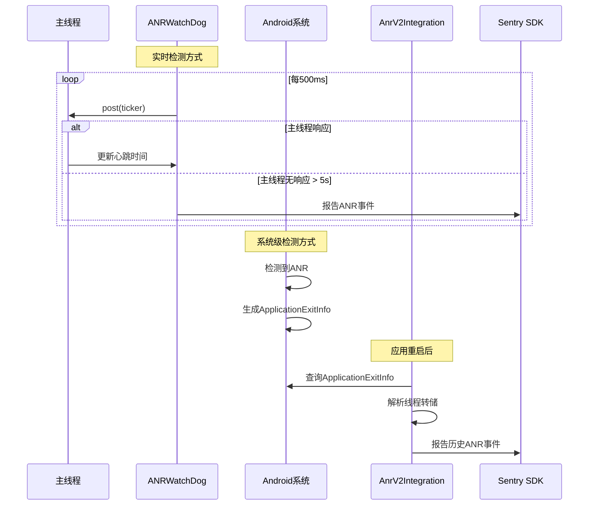
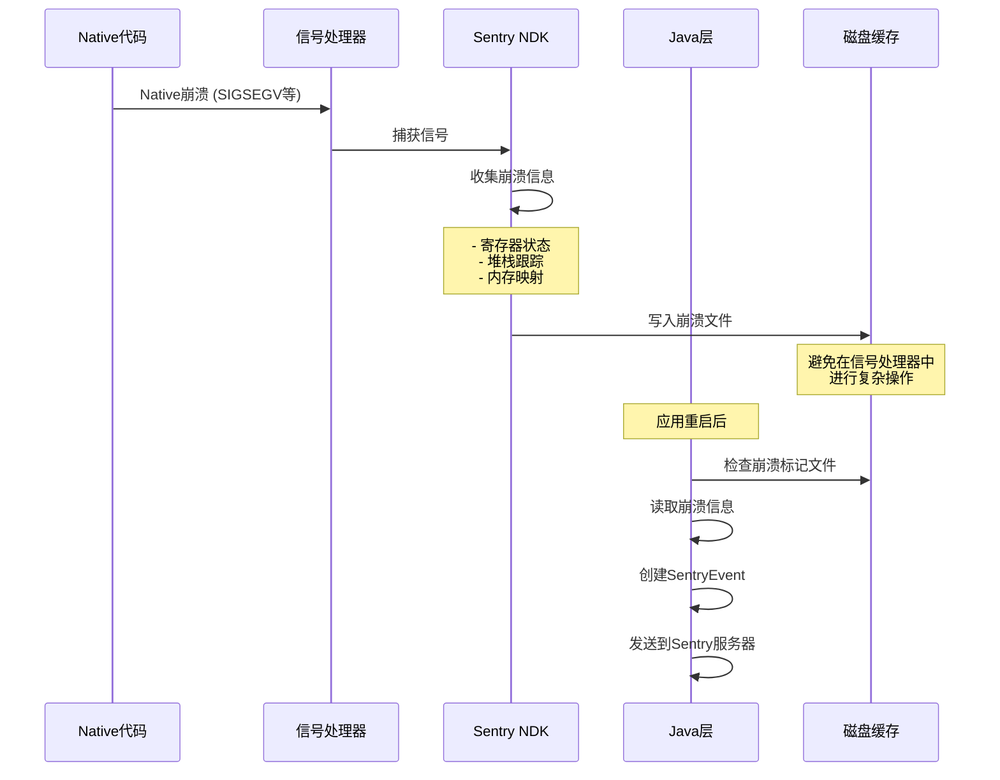
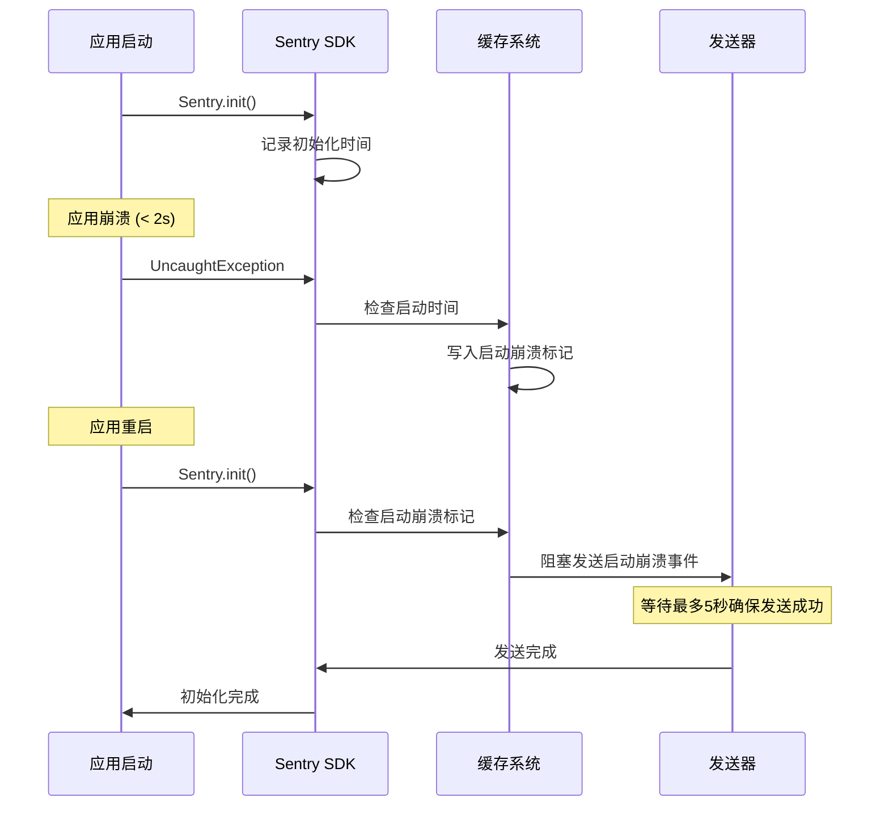
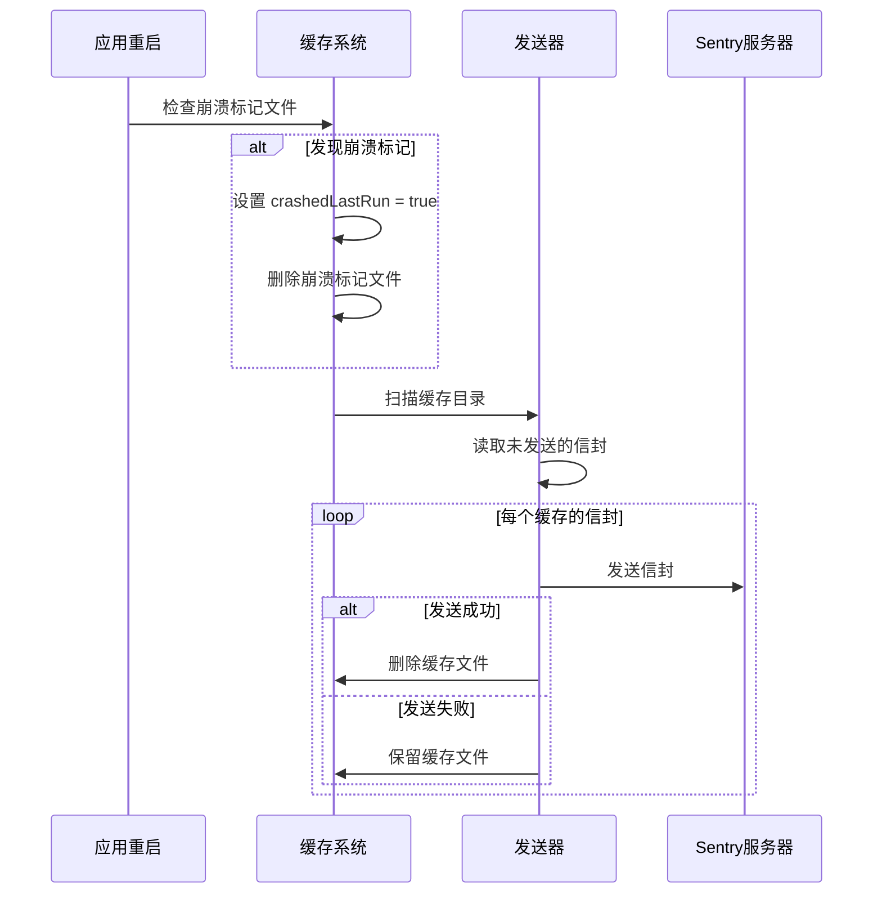

# Sentry 崩溃监控机制深度分析

本文档详细分析了 Sentry Java SDK 如何监控和处理各种类型的崩溃，包括 Java 异常、Android ANR、Native 崩溃等。

## 🎯 崩溃监控概览

Sentry 通过多层监控机制来捕获不同类型的崩溃：



## 1. Java 未捕获异常监控

### 1.1 核心机制：UncaughtExceptionHandlerIntegration

```java
public final class UncaughtExceptionHandlerIntegration 
    implements Integration, Thread.UncaughtExceptionHandler, Closeable {
    
    private @Nullable Thread.UncaughtExceptionHandler defaultExceptionHandler;
    
    @Override
    public void register(final @NotNull IScopes scopes, final @NotNull SentryOptions options) {
        // 保存原有的异常处理器
        final Thread.UncaughtExceptionHandler currentHandler = 
            threadAdapter.getDefaultUncaughtExceptionHandler();
        
        if (currentHandler != null) {
            defaultExceptionHandler = currentHandler;
        }
        
        // 设置 Sentry 的异常处理器
        threadAdapter.setDefaultUncaughtExceptionHandler(this);
    }
}
```

### 1.2 异常捕获流程



### 1.3 关键实现细节

#### 异常包装机制
```java
static Throwable getUnhandledThrowable(
    final @NotNull Thread thread, final @NotNull Throwable thrown) {
    final Mechanism mechanism = new Mechanism();
    mechanism.setHandled(false);  // 标记为未处理
    mechanism.setType("UncaughtExceptionHandler");
    
    return new ExceptionMechanismException(mechanism, thrown, thread);
}
```

#### 阻塞刷新机制
```java
public void uncaughtException(Thread thread, Throwable thrown) {
    final UncaughtExceptionHint exceptionHint = 
        new UncaughtExceptionHint(options.getFlushTimeoutMillis(), options.getLogger());
    
    final SentryEvent event = new SentryEvent(throwable);
    event.setLevel(SentryLevel.FATAL);
    
    final @NotNull SentryId sentryId = scopes.captureEvent(event, hint);
    
    // 阻塞等待事件刷新到磁盘
    if (!exceptionHint.waitFlush()) {
        options.getLogger().log(SentryLevel.WARNING, 
            "Timed out waiting to flush event to disk before crashing.");
    }
}
```

## 2. Android ANR 监控

### 2.1 双重 ANR 检测机制

Sentry Android 提供两种 ANR 检测方式：

#### 方式一：ANRWatchDog (实时检测)
```java
final class ANRWatchDog extends Thread {
    private final Runnable ticker = () -> {
        lastKnownActiveUiTimestampMs = timeProvider.getCurrentTimeMillis();
        reported.set(false);
    };
    
    @Override
    public void run() {
        while (!isInterrupted()) {
            uiHandler.post(ticker);  // 向主线程发送心跳
            Thread.sleep(pollingIntervalMs);
            
            final long unresponsiveDurationMs = 
                timeProvider.getCurrentTimeMillis() - lastKnownActiveUiTimestampMs;
            
            if (unresponsiveDurationMs > timeoutIntervalMillis) {
                if (isProcessNotResponding() && reported.compareAndSet(false, true)) {
                    final ApplicationNotResponding error = 
                        new ApplicationNotResponding(message, uiHandler.getThread());
                    anrListener.onAppNotResponding(error);
                }
            }
        }
    }
}
```

#### 方式二：AnrV2Integration (系统级检测)
```java
public final class AnrV2Integration implements Integration {
    private void reportAsSentryEvent(final @NotNull ApplicationExitInfo exitInfo) {
        // 解析系统提供的线程转储
        final ParseResult result = parseThreadDump(exitInfo, isBackground);
        
        final SentryEvent event = new SentryEvent();
        if (result.type == ParseResult.Type.DUMP) {
            event.setThreads(result.threads);  // 设置线程信息
        }
        
        event.setLevel(SentryLevel.FATAL);
        event.setTimestamp(DateUtils.getDateTime(exitInfo.getTimestamp()));
        
        scopes.captureEvent(event, hint);
    }
}
```

### 2.2 ANR 检测流程



### 2.3 线程转储解析

```java
public class ThreadDumpParser {
    public @NotNull List<SentryThread> parse(final @NotNull Lines lines) {
        final List<SentryThread> threads = new ArrayList<>();
        
        while (lines.hasNext()) {
            final String line = lines.next();
            
            if (THREAD_STATE_RE.matcher(line).matches()) {
                final SentryThread thread = parseThread(lines, line, isBackground);
                if (thread != null) {
                    threads.add(thread);
                }
            }
        }
        
        return threads;
    }
    
    private @Nullable SentryThread parseThread(Lines lines, String threadLine, boolean isBackground) {
        // 解析线程名称、状态、ID等信息
        final String threadName = extractThreadName(threadLine);
        final String threadState = extractThreadState(threadLine);
        
        final SentryThread sentryThread = new SentryThread();
        sentryThread.setName(threadName);
        sentryThread.setState(threadState);
        
        if (threadName != null && threadName.equals("main")) {
            sentryThread.setMain(true);
            sentryThread.setCrashed(true);  // ANR中主线程被标记为崩溃
        }
        
        // 解析堆栈跟踪
        final SentryStackTrace stackTrace = parseStacktrace(lines, sentryThread);
        sentryThread.setStacktrace(stackTrace);
        
        return sentryThread;
    }
}
```

## 3. Native 崩溃监控

### 3.1 NDK 集成架构

```java
public final class SentryNdk {
    public static void init(@NotNull final SentryAndroidOptions options) {
        final @NotNull NdkOptions ndkOptions = new NdkOptions(
            options.getDsn(),
            options.isDebug(),
            options.getOutboxPath(),
            options.getRelease(),
            options.getEnvironment()
        );
        
        // 初始化 Native SDK
        io.sentry.ndk.SentryNdk.init(ndkOptions);
        
        // 启用作用域同步
        if (options.isEnableScopeSync()) {
            options.addScopeObserver(new NdkScopeObserver(options));
        }
    }
}
```

### 3.2 Native 崩溃处理流程



### 3.3 作用域同步机制

```java
public class NdkScopeObserver implements IScopeObserver {
    @Override
    public void setUser(final @Nullable User user) {
        try {
            options.getExecutorService().submit(() -> {
                if (user != null) {
                    nativeScope.setUser(
                        user.getId(),
                        user.getEmail(), 
                        user.getIpAddress(),
                        user.getUsername()
                    );
                } else {
                    nativeScope.removeUser();
                }
            });
        } catch (Throwable e) {
            options.getLogger().log(SentryLevel.ERROR, e, "Scope sync setUser has an error.");
        }
    }
}
```

## 4. 启动崩溃检测

### 4.1 启动崩溃定义

启动崩溃是指在应用启动后的短时间内（默认2秒）发生的崩溃：

```java
public class AndroidEnvelopeCache extends EnvelopeCache {
    @Override
    public void store(@NotNull SentryEnvelope envelope, @NotNull Hint hint) {
        super.store(envelope, hint);
        
        final TimeSpan sdkInitTimeSpan = AppStartMetrics.getInstance().getSdkInitTimeSpan();
        
        if (HintUtils.hasType(hint, UncaughtExceptionHandlerIntegration.UncaughtExceptionHint.class)
            && sdkInitTimeSpan.hasStarted()) {
            
            long timeSinceSdkInit = 
                currentDateProvider.getCurrentTimeMillis() - sdkInitTimeSpan.getStartUptimeMs();
                
            if (timeSinceSdkInit <= options.getStartupCrashDurationThresholdMillis()) {
                options.getLogger().log(DEBUG, 
                    "Startup Crash detected %d milliseconds after SDK init.", timeSinceSdkInit);
                writeStartupCrashMarkerFile();
            }
        }
    }
}
```

### 4.2 启动崩溃处理



## 5. 事件处理流程

### 5.1 事件捕获统一入口

```java
public class SentryClient implements ISentryClient {
    @Override
    public @NotNull SentryId captureEvent(
        @NotNull SentryEvent event, 
        @Nullable IScope scope, 
        @Nullable Hint hint) {
        
        // 1. 验证和预处理
        if (shouldApplyScopeData(event, hint)) {
            event = applyScope(event, scope, hint);
        }
        
        // 2. 事件处理器链
        event = processEvent(event, hint, options.getEventProcessors());
        if (scope != null) {
            event = processEvent(event, hint, scope.getEventProcessors());
        }
        
        // 3. beforeSend 回调
        event = executeBeforeSend(event, hint);
        
        // 4. 构建信封并发送
        final SentryEnvelope envelope = buildEnvelope(event, attachments, session, traceContext);
        return sendEnvelope(envelope, hint);
    }
}
```

### 5.2 事件处理器链


#### 关键处理器说明

**MainEventProcessor**: 添加设备信息、线程信息、上下文数据
```java
public class MainEventProcessor implements EventProcessor {
    @Override
    public @NotNull SentryEvent process(@NotNull SentryEvent event, @NotNull Hint hint) {
        // 设置设备信息
        setDevice(event);
        // 设置操作系统信息  
        setOperatingSystem(event);
        // 设置运行时信息
        setRuntime(event);
        // 设置应用信息
        setApp(event);
        // 处理线程信息
        setThreads(event, hint);
        
        return event;
    }
}
```

**DeduplicateMultithreadedEventProcessor**: 多线程崩溃去重
```java
public class DeduplicateMultithreadedEventProcessor implements EventProcessor {
    @Override
    public @Nullable SentryEvent process(@NotNull SentryEvent event, @NotNull Hint hint) {
        // 只处理来自 UncaughtExceptionHandler 的崩溃
        if (!HintUtils.hasType(hint, UncaughtExceptionHandlerIntegration.UncaughtExceptionHint.class)) {
            return event;
        }
        
        final SentryException exception = event.getUnhandledException();
        if (exception == null) return event;
        
        final String type = exception.getType();
        final Long currentEventTid = exception.getThreadId();
        
        // 检查是否已经处理过相同类型的异常
        final Long tid = processedEvents.get(type);
        if (tid != null && !tid.equals(currentEventTid)) {
            // 丢弃重复的多线程崩溃
            HintUtils.setEventDropReason(hint, EventDropReason.MULTITHREADED_DEDUPLICATION);
            return null;
        }
        
        processedEvents.put(type, currentEventTid);
        return event;
    }
}
```

## 6. 传输和持久化

### 6.1 离线缓存机制

```java
public class EnvelopeCache implements IEnvelopeCache {
    @Override
    public void store(@NotNull SentryEnvelope envelope, @NotNull Hint hint) {
        // 写入崩溃标记文件
        if (HintUtils.hasType(hint, UncaughtExceptionHandlerIntegration.UncaughtExceptionHint.class)) {
            writeCrashMarkerFile();
        }
        
        // 将信封写入磁盘
        final File envelopeFile = getEnvelopeFile(envelope);
        writeEnvelopeToDisk(envelopeFile, envelope);
    }
    
    private void writeCrashMarkerFile() {
        final File crashMarkerFile = new File(options.getCacheDirPath(), CRASH_MARKER_FILE);
        try {
            crashMarkerFile.createNewFile();
        } catch (IOException e) {
            options.getLogger().log(SentryLevel.ERROR, "Failed to create crash marker file.", e);
        }
    }
}
```

### 6.2 崩溃恢复流程



## 7. 性能优化策略

### 7.1 异步处理

```java
public class UncaughtExceptionHandlerIntegration {
    @Override
    public void uncaughtException(Thread thread, Throwable thrown) {
        try {
            // 创建事件（同步，快速）
            final SentryEvent event = new SentryEvent(throwable);
            event.setLevel(SentryLevel.FATAL);
            
            // 捕获事件（可能异步）
            final @NotNull SentryId sentryId = scopes.captureEvent(event, hint);
            
            // 阻塞等待刷新（确保数据不丢失）
            if (!exceptionHint.waitFlush()) {
                options.getLogger().log(SentryLevel.WARNING, 
                    "Timed out waiting to flush event to disk before crashing.");
            }
        } catch (Throwable e) {
            // 异常处理不能影响原始崩溃流程
            options.getLogger().log(SentryLevel.ERROR, 
                "Error sending uncaught exception to Sentry.", e);
        }
        
        // 调用原始异常处理器
        if (defaultExceptionHandler != null) {
            defaultExceptionHandler.uncaughtException(thread, thrown);
        }
    }
}
```

### 7.2 内存管理

```java
public class SentryClient {
    private @NotNull SentryId sendEnvelope(@NotNull SentryEnvelope envelope, @Nullable Hint hint) {
        try {
            // 发送前清理 hint 中的大对象
            hint.clear();
            
            if (hint == null) {
                transport.send(envelope);
            } else {
                transport.send(envelope, hint);
            }
        } finally {
            // 确保资源释放
            if (hint != null) {
                hint.clear();
            }
        }
    }
}
```

## 8. 配置和最佳实践

### 8.1 关键配置选项

```java
// 基础配置
options.setDsn("YOUR_DSN");
options.setEnvironment("production");
options.setRelease("1.0.0");

// 崩溃相关配置
options.setEnableUncaughtExceptionHandler(true);  // 启用未捕获异常处理
options.setFlushTimeoutMillis(5000);              // 崩溃时刷新超时
options.setPrintUncaughtStackTrace(false);        // 生产环境关闭堆栈打印

// Android 特定配置
options.setAnrEnabled(true);                      // 启用ANR检测
options.setAnrTimeoutIntervalMillis(5000);        // ANR超时时间
options.setAnrReportInDebug(false);               // 调试时不报告ANR

// Native 崩溃配置
options.setEnableNdk(true);                       // 启用NDK崩溃捕获
options.setEnableScopeSync(true);                 // 启用作用域同步

// 启动崩溃配置
options.setStartupCrashDurationThresholdMillis(2000);  // 启动崩溃时间阈值
options.setStartupCrashFlushTimeoutMillis(5000);       // 启动崩溃刷新超时
```

### 8.2 最佳实践

#### ✅ 推荐做法
- **尽早初始化**: 在 Application.onCreate() 中初始化 Sentry
- **合理配置超时**: 根据应用特点调整刷新超时时间
- **启用所有监控**: 同时启用 Java、ANR、Native 崩溃监控
- **测试崩溃恢复**: 验证崩溃后的数据恢复机制

#### ❌ 避免做法
- **在崩溃处理器中执行复杂操作**: 可能导致二次崩溃
- **忽略启动崩溃**: 启动崩溃往往影响更严重
- **禁用缓存机制**: 可能导致崩溃数据丢失
- **过短的超时时间**: 可能导致崩溃数据未完全写入

## 9. 故障排查

### 9.1 常见问题

**Q: 崩溃事件没有上报？**
A: 检查网络连接、DSN配置、是否启用了相应的集成

**Q: ANR 检测不准确？**
A: 调整 ANR 超时时间，检查是否在调试模式下运行

**Q: Native 崩溃信息不完整？**
A: 确保符号文件已上传，检查 NDK 版本兼容性

**Q: 启动崩溃处理缓慢？**
A: 调整启动崩溃刷新超时时间，优化网络配置

### 9.2 调试技巧

```java
// 启用详细日志
options.setDebug(true);
options.setLogger(new SystemOutLogger());

// 监控崩溃处理状态
options.setBeforeEnvelopeCallback((envelope, hint) -> {
    System.out.println("Sending envelope: " + envelope.getHeader().getEventId());
});

// 检查崩溃标记文件
File crashMarker = new File(options.getCacheDirPath(), "sentry-java-crash-marker");
if (crashMarker.exists()) {
    System.out.println("Previous session crashed");
}
```

## 总结

Sentry 的崩溃监控机制通过多层防护确保了各种类型崩溃的可靠捕获：

1. **全面覆盖**: Java异常、Android ANR、Native崩溃、启动崩溃
2. **可靠传输**: 离线缓存、重试机制、阻塞刷新
3. **性能优化**: 异步处理、内存管理、去重机制
4. **易于集成**: 自动注册、合理默认值、灵活配置

这套机制确保了在各种异常情况下，崩溃信息都能被准确捕获并可靠地发送到 Sentry 服务器，为开发者提供完整的崩溃分析数据。 