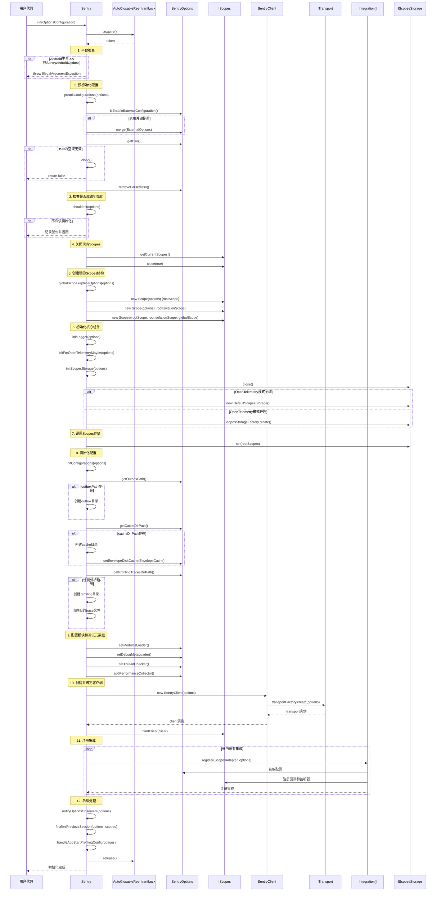
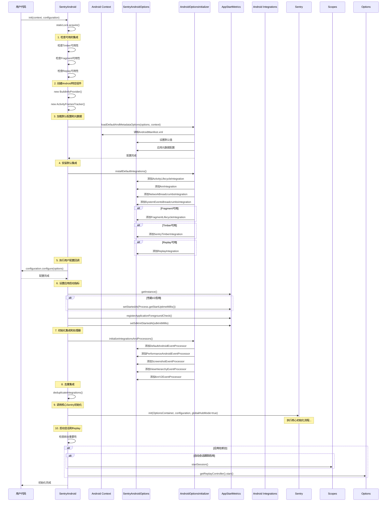
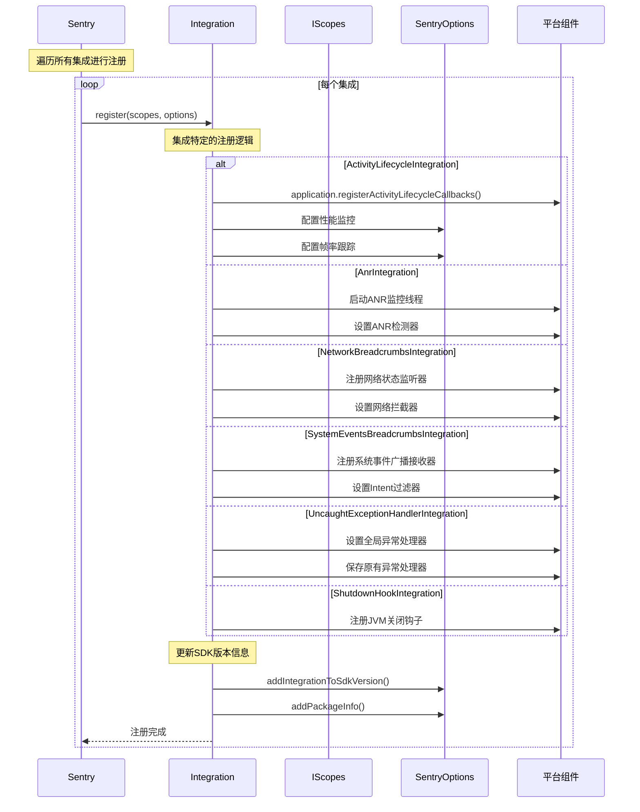
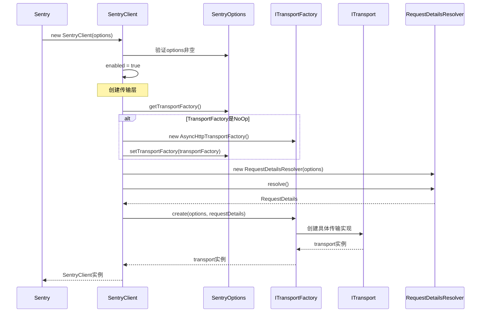

# Sentry Java SDK 初始化流程时序图

本文档通过时序图的形式详细展示了 Sentry Java SDK 的初始化流程，包括核心组件的创建、配置加载、集成注册等关键步骤。

## 核心初始化流程



## Android 特定初始化流程



## 集成注册流程



## 客户端创建流程



## 配置加载流程

```mermaid
sequenceDiagram
    participant Sentry as Sentry
    participant Options as SentryOptions
    participant External as ExternalOptions
    participant Properties as PropertiesProvider
    participant Manifest as AndroidManifest
    participant Files as 配置文件

    Note over Sentry: 预初始化配置检查
    Sentry->>Options: isEnableExternalConfiguration()
    alt 启用外部配置
        Sentry->>Properties: PropertiesProviderFactory.create()
        Properties->>Files: 读取sentry.properties
        Properties->>Files: 读取系统属性
        Properties->>Files: 读取环境变量
        Properties-->>External: 配置数据
        Sentry->>External: from(properties, logger)
        External-->>Options: 外部配置
        Sentry->>Options: merge(externalOptions)
    end

    Note over Sentry: Android特定配置加载
    alt Android平台
        Sentry->>Manifest: 读取meta-data
        Manifest->>Options: 设置DSN
        Manifest->>Options: 设置debug模式
        Manifest->>Options: 设置采样率
        Manifest->>Options: 设置环境信息
        Manifest->>Options: 设置发布版本
    end

    Note over Sentry: DSN验证
    Sentry->>Options: getDsn()
    alt DSN为空或禁用
        Sentry->>Sentry: close()
        Sentry-->>Sentry: return false
    else DSN无效
        Sentry-->>Sentry: throw IllegalArgumentException
    end

    Sentry->>Options: retrieveParsedDsn()
    Options->>Options: 解析和验证DSN格式
    Options-->>Sentry: 解析完成
```

## 关键组件说明

### 1. **Sentry 主类**
- 提供静态API入口
- 管理全局状态和锁
- 协调整个初始化流程

### 2. **SentryOptions**
- 存储所有配置选项
- 支持外部配置合并
- 提供默认值和验证

### 3. **IScopes**
- 管理作用域层次结构
- 提供线程安全的上下文管理
- 支持作用域继承和隔离

### 4. **SentryClient**
- 核心事件处理客户端
- 管理传输层连接
- 处理事件序列化和发送

### 5. **Integration**
- 提供框架和平台集成
- 自动注册监听器和钩子
- 扩展SDK功能

### 6. **Transport**
- 处理网络传输
- 实现重试和限流
- 支持离线缓存

这个初始化流程确保了Sentry SDK能够：
- 正确加载配置
- 安全地初始化组件
- 注册必要的集成
- 建立可靠的传输连接
- 提供完整的错误监控功能 