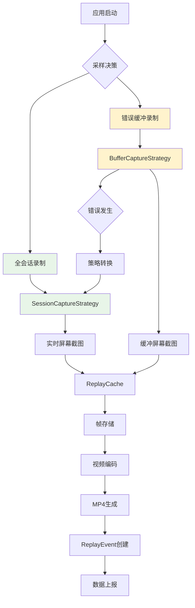

# Sentry Replay 功能深度分析

本文档详细分析了 Sentry Android SDK 的 Session Replay 功能，包括录制策略、缓存机制、视频编码、事件捕获等核心实现。

## 🎯 Replay 功能概览

Sentry Replay 通过屏幕录制和事件捕获，为开发者提供用户操作的完整回放：



## 1. 录制策略架构

### 1.1 CaptureStrategy 接口设计

```kotlin
internal interface CaptureStrategy {
    val currentReplayId: SentryId
    val currentSegment: Int
    val replayCacheDir: File?
    val replayType: ReplayType
    
    // 生命周期管理
    fun start(recorderConfig: ScreenshotRecorderConfig, segmentId: Int = 0, replayId: SentryId = SentryId(), replayType: ReplayType? = null)
    fun resume()
    fun pause()
    fun stop()
    
    // 录制控制
    fun captureReplay(isTerminating: Boolean, onSegmentSent: (Date) -> Unit)
    fun onScreenshotRecorded(bitmap: Bitmap?, store: ReplayCache.(frameTimestamp: Long) -> Unit)
    fun onConfigurationChanged(recorderConfig: ScreenshotRecorderConfig)
    fun onTouchEvent(event: MotionEvent)
    
    // 策略转换
    fun convert(): CaptureStrategy
}
```

### 1.2 ReplayType 枚举

```java
public enum ReplayType implements JsonSerializable {
    SESSION,  // 全会话录制
    BUFFER;   // 错误缓冲录制
    
    @Override
    public void serialize(final @NotNull ObjectWriter writer, final @NotNull ILogger logger) throws IOException {
        writer.value(name().toLowerCase(Locale.ROOT));
    }
}
```

## 2. SessionCaptureStrategy - 全会话录制

### 2.1 核心特性

```kotlin
internal class SessionCaptureStrategy(
    private val options: SentryOptions,
    private val scopes: IScopes?,
    private val dateProvider: ICurrentDateProvider,
    executor: ScheduledExecutorService
) : BaseCaptureStrategy(options, scopes, dateProvider, executor) {
    
    override fun start(recorderConfig: ScreenshotRecorderConfig, segmentId: Int, replayId: SentryId, replayType: ReplayType?) {
        super.start(recorderConfig, segmentId, replayId, replayType)
        
        // 全会话录制时立即设置 replayId 到 scope
        scopes?.configureScope {
            it.replayId = currentReplayId
            screenAtStart = it.screen?.substringAfterLast('.')
        }
    }
}
```

### 2.2 实时段创建

```kotlin
override fun onScreenshotRecorded(bitmap: Bitmap?, store: ReplayCache.(frameTimestamp: Long) -> Unit) {
    val frameTimestamp = dateProvider.currentTimeMillis
    val height = recorderConfig.recordingHeight
    val width = recorderConfig.recordingWidth
    
    replayExecutor.submitSafely(options, "$TAG.add_frame") {
        cache?.store(frameTimestamp)
        
        val currentSegmentTimestamp = segmentTimestamp ?: run {
            options.logger.log(DEBUG, "Segment timestamp is not set, not recording frame")
            return@submitSafely
        }
        
        if (isTerminating.get()) {
            options.logger.log(DEBUG, "Not capturing segment, because the app is terminating")
            return@submitSafely
        }
        
        val now = dateProvider.currentTimeMillis
        
        // 检查是否需要创建新段（默认10秒一段）
        if ((now - currentSegmentTimestamp.time >= options.sessionReplay.sessionSegmentDuration)) {
            val segment = createSegmentInternal(
                options.sessionReplay.sessionSegmentDuration,
                currentSegmentTimestamp,
                currentReplayId,
                currentSegment,
                height,
                width
            )
            
            if (segment is ReplaySegment.Created) {
                segment.capture(scopes)  // 立即发送段
                currentSegment++
                segmentTimestamp = segment.replay.timestamp  // 设置下一段时间戳
            }
        }
        
        // 检查会话总时长限制（默认1小时）
        if ((now - replayStartTimestamp.get() >= options.sessionReplay.sessionDuration)) {
            options.replayController.stop()
            options.logger.log(INFO, "Session replay deadline exceeded (1h), stopping recording")
        }
    }
}
```

### 2.3 配置变更处理

```kotlin
override fun onConfigurationChanged(recorderConfig: ScreenshotRecorderConfig) {
    createCurrentSegment("onConfigurationChanged") { segment ->
        if (segment is ReplaySegment.Created) {
            segment.capture(scopes)
            currentSegment++
            segmentTimestamp = segment.replay.timestamp  // 避免段间隙
        }
    }
    
    // 在提交最后一段后刷新录制配置
    super.onConfigurationChanged(recorderConfig)
}
```

## 3. BufferCaptureStrategy - 错误缓冲录制

### 3.1 缓冲机制

```kotlin
internal class BufferCaptureStrategy(
    private val options: SentryOptions,
    private val scopes: IScopes?,
    private val dateProvider: ICurrentDateProvider,
    private val random: Random,
    executor: ScheduledExecutorService
) : BaseCaptureStrategy(options, scopes, dateProvider, executor) {
    
    // 缓冲的段列表，不立即发送
    private val bufferedSegments = mutableListOf<ReplaySegment.Created>()
    
    override fun pause() {
        createCurrentSegment("pause") { segment ->
            if (segment is ReplaySegment.Created) {
                bufferedSegments += segment  // 只缓冲，不发送
                currentSegment++
            }
        }
        super.pause()
    }
}
```

### 3.2 错误触发录制

```kotlin
override fun captureReplay(isTerminating: Boolean, onSegmentSent: (Date) -> Unit) {
    // 错误采样检查
    val sampled = random.sample(options.sessionReplay.onErrorSampleRate)
    if (!sampled) {
        options.logger.log(INFO, "Replay wasn't sampled by onErrorSampleRate, not capturing for event")
        return
    }
    
    // 立即设置 replayId 到 scope，确保错误事件能关联到 replay
    scopes?.configureScope {
        it.replayId = currentReplayId
    }
    
    if (isTerminating) {
        this.isTerminating.set(true)
        options.logger.log(DEBUG, "Not capturing replay for crashed event, will be captured on next launch")
        return
    }
    
    createCurrentSegment("capture_replay") { segment ->
        // 发送所有缓冲的段
        bufferedSegments.capture()
        
        if (segment is ReplaySegment.Created) {
            segment.capture(scopes)
            onSegmentSent(segment.replay.timestamp)
        }
    }
}
```

### 3.3 缓冲轮转机制

```kotlin
override fun onScreenshotRecorded(bitmap: Bitmap?, store: ReplayCache.(frameTimestamp: Long) -> Unit) {
    val frameTimestamp = dateProvider.currentTimeMillis
    
    replayExecutor.submitSafely(options, "$TAG.add_frame") {
        cache?.store(frameTimestamp)
        
        val now = dateProvider.currentTimeMillis
        val bufferLimit = now - options.sessionReplay.errorReplayDuration  // 默认30秒缓冲
        
        // 轮转缓存，只保留最近30秒的帧
        screenAtStart = cache?.rotate(bufferLimit)
        bufferedSegments.rotate(bufferLimit)
    }
}
```

### 3.4 策略转换

```kotlin
override fun convert(): CaptureStrategy {
    if (isTerminating.get()) {
        options.logger.log(DEBUG, "Not converting to session mode, because the process is about to terminate")
        return this
    }
    
    // 转换为全会话录制策略
    val captureStrategy = SessionCaptureStrategy(options, scopes, dateProvider, replayExecutor)
    captureStrategy.start(recorderConfig, segmentId = currentSegment, replayId = currentReplayId, replayType = BUFFER)
    return captureStrategy
}
```

## 4. ReplayCache - 缓存和视频编码

### 4.1 帧存储结构

```kotlin
class ReplayCache(
    private val options: SentryOptions,
    private val replayId: SentryId
) : Closeable {
    
    // 帧列表，按时间戳排序
    internal val frames = mutableListOf<ReplayFrame>()
    
    // 缓存目录
    val replayCacheDir: File? = makeReplayCacheDir(options, replayId)
    
    // 线程安全锁
    private val lock = AutoClosableReentrantLock()
    
    data class ReplayFrame(
        val screenshot: File,      // 截图文件
        val timestamp: Long,       // 时间戳
        val screen: String? = null // 屏幕名称
    )
}
```

### 4.2 帧添加和轮转

```kotlin
fun addFrame(screenshot: File, timestamp: Long, screen: String? = null) {
    lock.acquire().use {
        frames.add(ReplayFrame(screenshot, timestamp, screen))
    }
}

fun rotate(pivotTime: Long): String? {
    lock.acquire().use {
        var screenAtStart: String? = null
        
        // 移除超出时间窗口的帧
        val iterator = frames.iterator()
        while (iterator.hasNext()) {
            val frame = iterator.next()
            if (frame.timestamp < pivotTime) {
                if (screenAtStart == null) {
                    screenAtStart = frame.screen
                }
                
                // 删除文件
                if (!frame.screenshot.delete()) {
                    options.logger.log(ERROR, "Failed to delete replay frame: ${frame.screenshot.absolutePath}")
                }
                iterator.remove()
            } else {
                break  // 帧按时间排序，后续帧都在窗口内
            }
        }
        
        return screenAtStart
    }
}
```

### 4.3 视频编码

```kotlin
fun createVideoOf(
    duration: Long,
    from: Date,
    to: Date,
    frameRate: Int,
    bitRate: Int,
    height: Int,
    width: Int
): GeneratedVideo? {
    
    lock.acquire().use {
        if (frames.isEmpty()) {
            options.logger.log(INFO, "No frames to encode for replay: $replayId")
            return null
        }
        
        // 过滤时间范围内的帧
        val segmentFrames = frames.filter { frame ->
            frame.timestamp >= from.time && frame.timestamp <= to.time
        }
        
        if (segmentFrames.isEmpty()) {
            options.logger.log(INFO, "No frames found for the specified time range")
            return null
        }
        
        val videoFile = File(replayCacheDir, "${from.time}_$duration.mp4")
        
        try {
            // 使用 MediaCodec 编码视频
            val encoder = SimpleVideoEncoder(
                options,
                MuxerConfig(
                    file = videoFile,
                    width = width,
                    height = height,
                    bitRate = bitRate,
                    frameRate = frameRate,
                    iFrameInterval = 1  // 每秒一个关键帧
                )
            )
            
            encoder.start()
            
            // 编码每一帧
            segmentFrames.forEachIndexed { index, frame ->
                val bitmap = BitmapFactory.decodeFile(frame.screenshot.absolutePath)
                if (bitmap != null) {
                    encoder.encodeFrame(bitmap, index * (1000000L / frameRate))  // 微秒时间戳
                    bitmap.recycle()
                } else {
                    options.logger.log(WARNING, "Failed to decode frame: ${frame.screenshot.absolutePath}")
                }
            }
            
            encoder.stop()
            
            return GeneratedVideo(
                video = videoFile,
                frameCount = segmentFrames.size,
                duration = duration
            )
            
        } catch (e: Exception) {
            options.logger.log(ERROR, e, "Failed to encode replay video")
            return null
        }
    }
}
```

## 5. ReplayIntegration - 主控制器

### 5.1 生命周期状态机

```kotlin
class ReplayIntegration(
    private val context: Context,
    private val dateProvider: ICurrentDateProvider = CurrentDateProvider.getInstance()
) : Integration, ReplayController {
    
    // 状态枚举
    enum class State { NONE, STARTED, PAUSED, STOPPED }
    
    private val lifecycle = StateMachine<State>(State.NONE)
    private var captureStrategy: CaptureStrategy? = null
    private var recorder: ScreenshotRecorder? = null
    
    override fun start() {
        lifecycleLock.acquire().use {
            if (!isEnabled.get() || !lifecycle.isAllowed(STARTED)) {
                return
            }
            
            // 采样决策
            val isFullSession = random.sample(options.sessionReplay.sessionSampleRate)
            if (!isFullSession && !options.sessionReplay.isSessionReplayForErrorsEnabled) {
                options.logger.log(INFO, "Session replay is not started, full session was not sampled and onErrorSampleRate is not specified")
                return
            }
            
            // 创建录制配置
            val recorderConfig = recorderConfigProvider?.invoke(false) 
                ?: ScreenshotRecorderConfig.from(context, options.sessionReplay)
            
            // 选择录制策略
            captureStrategy = if (isFullSession) {
                SessionCaptureStrategy(options, scopes, dateProvider, replayExecutor, replayCacheProvider)
            } else {
                BufferCaptureStrategy(options, scopes, dateProvider, random, replayExecutor, replayCacheProvider)
            }
            
            // 启动录制
            captureStrategy?.start(recorderConfig)
            recorder?.start(recorderConfig)
            registerRootViewListeners()
            lifecycle.currentState = STARTED
        }
    }
}
```

### 5.2 错误触发机制

```kotlin
override fun captureReplay(isTerminating: Boolean) {
    lifecycleLock.acquire().use {
        if (!isEnabled.get()) {
            return
        }
        
        when (lifecycle.currentState) {
            STARTED -> {
                // 已在录制中，触发缓冲策略的错误录制
                captureStrategy?.captureReplay(isTerminating) { segmentTimestamp ->
                    // 转换为全会话录制策略
                    captureStrategy = captureStrategy?.convert()
                }
            }
            PAUSED, STOPPED -> {
                // 尝试从上次会话恢复录制
                finalizePreviousReplay()
            }
            else -> {
                options.logger.log(DEBUG, "Replay is not enabled, not capturing for event")
            }
        }
    }
}
```

### 5.3 前一会话恢复

```kotlin
private fun finalizePreviousReplay() {
    replayExecutor.submitSafely(options, "ReplayIntegration.finalizePreviousReplay") {
        val lastSegmentData = ReplayCache.fromDisk(options, replayCacheProvider)
        
        if (lastSegmentData != null) {
            options.logger.log(DEBUG, "Finalizing previous replay segment")
            
            val segment = createSegment(
                lastSegmentData.cache,
                lastSegmentData.recorderConfig,
                lastSegmentData.duration,
                lastSegmentData.timestamp,
                lastSegmentData.cache.replayId,
                lastSegmentData.id,
                lastSegmentData.replayType,
                lastSegmentData.screenAtStart,
                emptyList(),  // 面包屑
                lastSegmentData.events
            )
            
            if (segment is ReplaySegment.Created) {
                segment.capture(scopes)
            }
            
            // 清理缓存
            FileUtils.deleteRecursively(lastSegmentData.cache.replayCacheDir)
        }
    }
}
```

## 6. 屏幕截图录制

### 6.1 ScreenshotRecorderConfig

```kotlin
data class ScreenshotRecorderConfig(
    val recordingWidth: Int,      // 录制宽度
    val recordingHeight: Int,     // 录制高度
    val scaleFactorX: Float,      // X轴缩放因子
    val scaleFactorY: Float,      // Y轴缩放因子
    val frameRate: Int,           // 帧率 (默认1fps)
    val bitRate: Int              // 比特率
) {
    companion object {
        fun from(context: Context, options: SentryReplayOptions): ScreenshotRecorderConfig {
            val displayMetrics = context.resources.displayMetrics
            val density = displayMetrics.density
            
            // 计算录制分辨率（考虑质量设置）
            val quality = options.quality
            val targetWidth = (displayMetrics.widthPixels / density * quality.sizeScale).toInt()
            val targetHeight = (displayMetrics.heightPixels / density * quality.sizeScale).toInt()
            
            return ScreenshotRecorderConfig(
                recordingWidth = targetWidth,
                recordingHeight = targetHeight,
                scaleFactorX = targetWidth.toFloat() / displayMetrics.widthPixels,
                scaleFactorY = targetHeight.toFloat() / displayMetrics.heightPixels,
                frameRate = 1,  // 固定1fps以减少存储和带宽
                bitRate = quality.bitRate
            )
        }
    }
}
```

### 6.2 质量配置

```kotlin
enum class SentryReplayOptions.Quality(
    val sizeScale: Float,    // 分辨率缩放
    val bitRate: Int         // 比特率
) {
    LOW(0.8f, 75_000),      // 低质量：80%分辨率，75kbps
    MEDIUM(1.0f, 100_000),   // 中等质量：100%分辨率，100kbps  
    HIGH(1.0f, 150_000);     // 高质量：100%分辨率，150kbps
}
```

## 7. 事件和手势捕获

### 7.1 触摸事件捕获

```kotlin
override fun onTouchEvent(event: MotionEvent) {
    if (!isRecording) return
    
    try {
        // 转换为 RRWeb 格式的事件
        val rrwebEvent = ReplayGestureConverter.convert(
            event,
            recorderConfig.scaleFactorX,
            recorderConfig.scaleFactorY
        )
        
        if (rrwebEvent != null) {
            currentEvents.add(rrwebEvent)
            
            // 在缓冲模式下轮转事件
            if (this is BufferCaptureStrategy) {
                val bufferLimit = dateProvider.currentTimeMillis - options.sessionReplay.errorReplayDuration
                rotateEvents(currentEvents, bufferLimit)
            }
        }
    } catch (e: Exception) {
        options.logger.log(ERROR, e, "Failed to capture touch event")
    }
}
```

### 7.2 面包屑集成

```kotlin
// 在段创建时收集相关面包屑
private fun collectBreadcrumbs(from: Date, to: Date): List<Breadcrumb> {
    return scopes?.configureScope { scope ->
        scope.breadcrumbs.filter { breadcrumb ->
            breadcrumb.timestamp != null &&
            breadcrumb.timestamp!! >= from &&
            breadcrumb.timestamp!! <= to
        }
    } ?: emptyList()
}
```

## 8. 配置和最佳实践

### 8.1 关键配置选项

```kotlin
// 启用 Session Replay
options.sessionReplay.isEnabled = true

// 全会话采样率（0.0-1.0）
options.sessionReplay.sessionSampleRate = 0.1  // 10%

// 错误时采样率（0.0-1.0）
options.sessionReplay.onErrorSampleRate = 1.0  // 100%

// 录制质量
options.sessionReplay.quality = SentryReplayOptions.Quality.MEDIUM

// 会话持续时间（默认1小时）
options.sessionReplay.sessionDuration = 60 * 60 * 1000L

// 段持续时间（默认10秒）
options.sessionReplay.sessionSegmentDuration = 10 * 1000L

// 错误缓冲时长（默认30秒）
options.sessionReplay.errorReplayDuration = 30 * 1000L

// 遮罩敏感信息
options.sessionReplay.maskAllText = true
options.sessionReplay.maskAllImages = false
```

### 8.2 性能优化建议

#### ✅ 推荐做法

1. **合理设置采样率**
   ```kotlin
   // 生产环境：低采样率
   options.sessionReplay.sessionSampleRate = 0.01  // 1%
   options.sessionReplay.onErrorSampleRate = 1.0   // 100%
   
   // 开发环境：高采样率
   options.sessionReplay.sessionSampleRate = 1.0   // 100%
   ```

2. **选择合适的质量**
   ```kotlin
   // 移动网络：低质量
   options.sessionReplay.quality = SentryReplayOptions.Quality.LOW
   
   // WiFi网络：中等质量
   options.sessionReplay.quality = SentryReplayOptions.Quality.MEDIUM
   ```

3. **启用敏感信息遮罩**
   ```kotlin
   options.sessionReplay.maskAllText = true
   options.sessionReplay.maskAllImages = true
   ```

#### ❌ 避免做法

- **过高的采样率**：会显著增加存储和网络使用
- **过长的缓冲时间**：会占用更多内存和存储空间
- **在低端设备上启用高质量**：可能影响应用性能

### 8.3 存储和网络影响

#### 存储使用估算

```kotlin
// 估算公式（每分钟）
fun estimateStoragePerMinute(config: ScreenshotRecorderConfig): Long {
    val frameSize = config.recordingWidth * config.recordingHeight * 3 / 4  // JPEG压缩约75%
    val framesPerMinute = config.frameRate * 60
    return frameSize * framesPerMinute
}

// 示例：中等质量，1080x1920，1fps
// 约 1080 * 1920 * 0.75 * 60 = 93MB/分钟
```

#### 网络使用优化

```kotlin
// 视频压缩后大小显著减少
fun estimateVideoSize(frameCount: Int, duration: Long, bitRate: Int): Long {
    return (bitRate * duration / 8000)  // 比特率转字节，毫秒转秒
}

// 示例：10秒段，100kbps比特率
// 约 100000 * 10 / 8000 = 125KB
```

## 9. 故障排查

### 9.1 常见问题

**Q: Replay 没有录制？**
A: 检查采样率设置，确保 `sessionSampleRate` 或 `onErrorSampleRate` > 0

**Q: 视频质量太差？**
A: 调整 `quality` 设置或增加 `bitRate`

**Q: 应用性能下降？**
A: 降低采样率，使用较低的录制质量，或减少缓冲时长

**Q: 存储空间不足？**
A: 检查缓存清理机制，确保旧的 replay 文件被正确删除

### 9.2 调试技巧

```kotlin
// 启用 Replay 调试日志
options.sessionReplay.isDebug = true
options.setDebug(true)

// 监控 Replay 状态
val replayController = options.replayController
println("Is recording: ${replayController.isRecording}")

// 检查缓存目录
val cacheDir = File(options.cacheDirPath, "replay_${replayId}")
println("Cache dir exists: ${cacheDir.exists()}")
println("Frame count: ${cacheDir.listFiles()?.count { it.name.endsWith(".jpg") }}")

// 手动触发错误录制
replayController.captureReplay(isTerminating = false)
```

## 总结

Sentry 的 Session Replay 功能通过精密的录制策略和高效的视频编码，为开发者提供了强大的用户行为回放能力：

### 🎯 **核心优势**

1. **双重录制策略**: 全会话和错误缓冲模式满足不同需求
2. **智能采样**: 灵活的采样率控制，平衡数据价值和性能影响
3. **高效编码**: 基于 MediaCodec 的硬件加速视频编码
4. **事件关联**: 触摸事件和面包屑的完整捕获
5. **隐私保护**: 内置的敏感信息遮罩机制

### 🔍 **技术特点**

- **内存优化**: 帧轮转和缓存限制机制
- **存储高效**: JPEG 压缩和 MP4 编码大幅减少存储需求
- **网络友好**: 分段上传和压缩优化
- **崩溃恢复**: 前一会话的智能恢复机制

### 📊 **应用价值**

通过这套 Replay 系统，开发者可以：
- 直观了解用户操作流程
- 快速定位和重现问题
- 分析用户体验痛点
- 验证修复效果

这套机制在保证用户隐私和应用性能的前提下，为问题诊断和用户体验优化提供了强有力的工具支撑。 