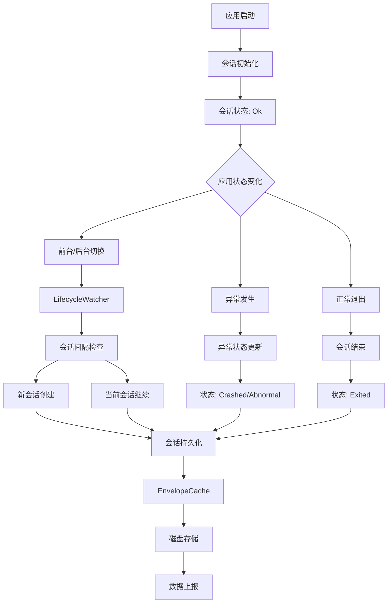

# Sentry 会话管理机制深度分析

本文档详细分析了 Sentry Java SDK 如何管理用户会话，包括会话生命周期、状态跟踪、持久化机制、异常处理等核心功能。

## 🎯 会话管理概览

Sentry 通过完整的会话管理系统来跟踪应用的使用情况和稳定性：



## 1. 会话数据结构

### 1.1 Session 核心属性

```java
public final class Session implements JsonUnknown, JsonSerializable {
    
    /** 会话状态枚举 */
    public enum State {
        Ok,        // 正常运行
        Exited,    // 正常退出
        Crashed,   // 崩溃
        Abnormal   // 异常退出（如ANR）
    }
    
    // 核心时间戳
    private final @NotNull Date started;           // 会话开始时间
    private @Nullable Date timestamp;              // 最后更新时间
    
    // 会话标识
    private final @Nullable String sessionId;      // 会话ID (sid)
    private final @Nullable String distinctId;     // 用户唯一标识 (did)
    
    // 会话状态
    private @NotNull State status;                 // 当前状态
    private final @NotNull AtomicInteger errorCount; // 错误计数
    private @Nullable Boolean init;                // 初始化标志
    
    // 会话指标
    private @Nullable Long sequence;               // 逻辑时钟
    private @Nullable Double duration;             // 会话持续时间
    
    // 环境信息
    private final @NotNull String release;        // 应用版本
    private final @Nullable String environment;   // 环境标识
    private final @Nullable String ipAddress;     // IP地址
    private @Nullable String userAgent;           // 用户代理
    
    // 异常信息
    private @Nullable String abnormalMechanism;   // 异常机制（如ANR）
    
    // 线程安全
    private final @NotNull AutoClosableReentrantLock sessionLock = new AutoClosableReentrantLock();
}
```

### 1.2 会话创建

```java
// 标准会话创建
public Session(
    @Nullable String distinctId,
    final @Nullable User user,
    final @Nullable String environment,
    final @NotNull String release) {
    
    this(
        State.Ok,                                    // 初始状态为 Ok
        DateUtils.getCurrentDateTime(),              // 当前时间作为开始时间
        DateUtils.getCurrentDateTime(),              // 当前时间作为时间戳
        0,                                          // 错误计数为 0
        distinctId,                                 // 用户唯一标识
        SentryUUID.generateSentryId(),              // 生成会话ID
        true,                                       // 标记为初始化会话
        null,                                       // 序列号稍后设置
        null,                                       // 持续时间稍后计算
        (user != null ? user.getIpAddress() : null), // 用户IP
        null,                                       // 用户代理稍后设置
        environment,                                // 环境
        release,                                    // 版本
        null                                        // 异常机制
    );
}
```

## 2. 会话生命周期管理

### 2.1 Scope 中的会话管理

```java
public final class Scope implements IScope {
    private volatile @Nullable Session session;
    private final @NotNull AutoClosableReentrantLock sessionLock = new AutoClosableReentrantLock();
    
    /**
     * 启动新会话，返回会话对
     * @return SessionPair 包含当前会话和前一个会话
     */
    @Override
    public @Nullable SessionPair startSession() {
        Session previousSession;
        SessionPair pair = null;
        
        try (final @NotNull ISentryLifecycleToken ignored = sessionLock.acquire()) {
            if (session != null) {
                // 结束当前会话（不传递scope，避免自动刷新）
                session.end();
            }
            previousSession = session;
            
            if (options.getRelease() != null) {
                // 创建新会话
                session = new Session(
                    options.getDistinctId(), 
                    user, 
                    options.getEnvironment(), 
                    options.getRelease()
                );
                
                final Session previousClone = previousSession != null ? previousSession.clone() : null;
                pair = new SessionPair(session.clone(), previousClone);
            } else {
                options.getLogger().log(SentryLevel.WARNING,
                    "Release is not set on SentryOptions. Session could not be started");
            }
        }
        return pair;
    }
    
    /**
     * 结束会话
     * @return 结束的会话
     */
    @Override
    public @Nullable Session endSession() {
        Session previousSession = null;
        try (final @NotNull ISentryLifecycleToken ignored = sessionLock.acquire()) {
            if (session != null) {
                session.end();
                previousSession = session.clone();
                session = null;  // 从scope中移除
            }
        }
        return previousSession;
    }
}
```

### 2.2 SessionPair 设计

```java
static final class SessionPair {
    /** 前一个会话（如果存在） */
    private final @Nullable Session previous;
    
    /** 当前会话 */
    private final @NotNull Session current;
    
    public SessionPair(final @NotNull Session current, final @Nullable Session previous) {
        this.current = current;
        this.previous = previous;
    }
    
    public @Nullable Session getPrevious() { return previous; }
    public @NotNull Session getCurrent() { return current; }
}
```

## 3. Android 生命周期集成

### 3.1 LifecycleWatcher 核心机制

```java
final class LifecycleWatcher implements DefaultLifecycleObserver {
    private final AtomicLong lastUpdatedSession = new AtomicLong(0L);
    private final long sessionIntervalMillis;  // 会话间隔阈值
    private final @NotNull IScopes scopes;
    private final boolean enableSessionTracking;
    
    // 应用进入前台
    @Override
    public void onStart(final @NotNull LifecycleOwner owner) {
        startSession();
        addAppBreadcrumb("foreground");
        AppState.getInstance().setInBackground(false);
    }
    
    // 应用进入后台
    @Override
    public void onStop(final @NotNull LifecycleOwner owner) {
        final long currentTimeMillis = currentDateProvider.getCurrentTimeMillis();
        this.lastUpdatedSession.set(currentTimeMillis);
        
        scopes.getOptions().getReplayController().pause();
        scheduleEndSession();  // 延迟结束会话
        
        AppState.getInstance().setInBackground(true);
        addAppBreadcrumb("background");
    }
}
```

### 3.2 会话间隔检查

```java
private void startSession() {
    cancelTask();  // 取消之前的延迟任务
    
    final long currentTimeMillis = currentDateProvider.getCurrentTimeMillis();
    
    // 获取当前会话的开始时间
    scopes.configureScope(scope -> {
        if (lastUpdatedSession.get() == 0L) {
            final @Nullable Session currentSession = scope.getSession();
            if (currentSession != null && currentSession.getStarted() != null) {
                lastUpdatedSession.set(currentSession.getStarted().getTime());
            }
        }
    });
    
    final long lastUpdatedSession = this.lastUpdatedSession.get();
    
    // 检查是否需要创建新会话
    if (lastUpdatedSession == 0L || 
        (lastUpdatedSession + sessionIntervalMillis) <= currentTimeMillis) {
        
        if (enableSessionTracking) {
            scopes.startSession();  // 创建新会话
        }
        scopes.getOptions().getReplayController().start();
    }
    
    scopes.getOptions().getReplayController().resume();
    this.lastUpdatedSession.set(currentTimeMillis);
}
```

### 3.3 延迟会话结束

```java
private void scheduleEndSession() {
    try (final @NotNull ISentryLifecycleToken ignored = timerLock.acquire()) {
        cancelTask();
        if (timer != null) {
            timerTask = new TimerTask() {
                @Override
                public void run() {
                    if (enableSessionTracking) {
                        scopes.endSession();  // 结束会话
                    }
                    scopes.getOptions().getReplayController().stop();
                }
            };
            
            // 在会话间隔时间后执行
            timer.schedule(timerTask, sessionIntervalMillis);
        }
    }
}
```

## 4. 会话状态更新

### 4.1 原子性状态更新

```java
public boolean update(
    final @Nullable State status,
    final @Nullable String userAgent,
    final boolean addErrorsCount,
    final @Nullable String abnormalMechanism) {
    
    try (final @NotNull ISentryLifecycleToken ignored = sessionLock.acquire()) {
        boolean sessionHasBeenUpdated = false;
        
        // 更新状态
        if (status != null) {
            this.status = status;
            sessionHasBeenUpdated = true;
        }
        
        // 更新用户代理
        if (userAgent != null) {
            this.userAgent = userAgent;
            sessionHasBeenUpdated = true;
        }
        
        // 增加错误计数
        if (addErrorsCount) {
            errorCount.addAndGet(1);
            sessionHasBeenUpdated = true;
        }
        
        // 更新异常机制（一旦设置就不会被覆盖）
        if (abnormalMechanism != null) {
            this.abnormalMechanism = abnormalMechanism;
            sessionHasBeenUpdated = true;
        }
        
        if (sessionHasBeenUpdated) {
            init = null;  // 清除初始化标志
            timestamp = DateUtils.getCurrentDateTime();
            if (timestamp != null) {
                sequence = getSequenceTimestamp(timestamp);  // 更新逻辑时钟
            }
        }
        
        return sessionHasBeenUpdated;
    }
}
```

### 4.2 会话结束处理

```java
public void end(final @Nullable Date timestamp) {
    try (final @NotNull ISentryLifecycleToken ignored = sessionLock.acquire()) {
        init = null;  // 清除初始化标志
        
        // 只有Ok状态才会变为Exited，Crashed状态保持不变
        if (status == State.Ok) {
            status = State.Exited;
        }
        
        // 设置结束时间戳
        if (timestamp != null) {
            this.timestamp = timestamp;
        } else {
            this.timestamp = DateUtils.getCurrentDateTime();
        }
        
        // 计算持续时间和序列号
        if (this.timestamp != null) {
            duration = calculateDurationTime(this.timestamp);
            sequence = getSequenceTimestamp(this.timestamp);
        }
    }
}

/**
 * 计算会话持续时间（秒）
 */
private double calculateDurationTime(final @NotNull Date timestamp) {
    final long diff = Math.abs(timestamp.getTime() - started.getTime());
    return (double) diff / 1000; // 转换为秒
}
```

## 5. 会话持久化机制

### 5.1 EnvelopeCache 会话文件管理

```java
public final class EnvelopeCache implements IEnvelopeCache {
    // 会话文件命名
    private static final String PREFIX_CURRENT_SESSION_FILE = "session";
    private static final String PREFIX_PREVIOUS_SESSION_FILE = "previous_session";
    private static final String SUFFIX_SESSION_FILE = ".json";
    
    public static @NotNull File getCurrentSessionFile(final @NotNull String cacheDirPath) {
        return new File(cacheDirPath, PREFIX_CURRENT_SESSION_FILE + SUFFIX_SESSION_FILE);
    }
    
    public static @NotNull File getPreviousSessionFile(final @NotNull String cacheDirPath) {
        return new File(cacheDirPath, PREFIX_PREVIOUS_SESSION_FILE + SUFFIX_SESSION_FILE);
    }
}
```

### 5.2 会话存储流程

```java
@Override
public void store(final @NotNull SentryEnvelope envelope, final @NotNull Hint hint) {
    final File currentSessionFile = getCurrentSessionFile(directory.getAbsolutePath());
    final File previousSessionFile = getPreviousSessionFile(directory.getAbsolutePath());
    
    // 处理会话结束
    if (HintUtils.hasType(hint, SessionEnd.class)) {
        if (!currentSessionFile.delete()) {
            options.getLogger().log(WARNING, "Current envelope doesn't exist.");
        }
    }
    
    // 处理异常退出
    if (HintUtils.hasType(hint, AbnormalExit.class)) {
        tryEndPreviousSession(hint);
    }
    
    // 处理会话开始
    if (HintUtils.hasType(hint, SessionStart.class)) {
        if (currentSessionFile.exists()) {
            options.getLogger().log(WARNING, "Current session is not ended, we'd need to end it.");
            
            // 将当前会话移动到previous文件
            try (final Reader reader = new BufferedReader(
                new InputStreamReader(new FileInputStream(currentSessionFile), UTF_8))) {
                
                final Session session = serializer.getValue().deserialize(reader, Session.class);
                if (session != null) {
                    writeSessionToDisk(previousSessionFile, session);
                }
            } catch (Throwable e) {
                options.getLogger().log(SentryLevel.ERROR, "Error processing session.", e);
            }
        }
        
        // 更新当前会话文件
        updateCurrentSession(currentSessionFile, envelope);
        
        // 检查崩溃标记文件
        boolean crashedLastRun = false;
        final File crashMarkerFile = new File(options.getCacheDirPath(), NATIVE_CRASH_MARKER_FILE);
        if (crashMarkerFile.exists()) {
            crashedLastRun = true;
        }
        
        // 处理前一次运行的崩溃
        if (crashedLastRun) {
            handlePreviousCrash(previousSessionFile, crashMarkerFile);
        }
    }
}
```

### 5.3 异常退出处理

```java
private void tryEndPreviousSession(final @NotNull Hint hint) {
    final Object sdkHint = HintUtils.getSentrySdkHint(hint);
    if (sdkHint instanceof AbnormalExit) {
        final File previousSessionFile = getPreviousSessionFile(directory.getAbsolutePath());
        
        if (previousSessionFile.exists()) {
            try (final Reader reader = new BufferedReader(
                new InputStreamReader(new FileInputStream(previousSessionFile), UTF_8))) {
                
                final Session session = serializer.getValue().deserialize(reader, Session.class);
                if (session != null) {
                    final AbnormalExit abnormalHint = (AbnormalExit) sdkHint;
                    final @Nullable Long abnormalExitTimestamp = abnormalHint.timestamp();
                    Date timestamp = null;
                    
                    if (abnormalExitTimestamp != null) {
                        timestamp = DateUtils.getDateTime(abnormalExitTimestamp);
                        
                        // 检查异常退出时间是否在会话期间
                        final Date sessionStart = session.getStarted();
                        if (sessionStart == null || timestamp.before(sessionStart)) {
                            options.getLogger().log(WARNING,
                                "Abnormal exit happened before previous session start, not ending the session.");
                            return;
                        }
                    }
                    
                    final String abnormalMechanism = abnormalHint.mechanism();
                    session.update(Session.State.Abnormal, null, true, abnormalMechanism);
                    session.end(timestamp);  // 使用异常退出的实际时间戳
                    writeSessionToDisk(previousSessionFile, session);
                }
            } catch (Throwable e) {
                options.getLogger().log(ERROR, "Error processing previous session.", e);
            }
        }
    }
}
```

## 6. 前一会话终结器

### 6.1 PreviousSessionFinalizer 机制

```java
final class PreviousSessionFinalizer implements Runnable {
    
    @Override
    public void run() {
        final String cacheDirPath = options.getCacheDirPath();
        if (cacheDirPath == null || !options.isEnableAutoSessionTracking()) {
            return;
        }
        
        // 等待前一会话刷新完成
        final IEnvelopeCache cache = options.getEnvelopeDiskCache();
        if (cache instanceof EnvelopeCache) {
            if (!((EnvelopeCache) cache).waitPreviousSessionFlush()) {
                options.getLogger().log(SentryLevel.WARNING,
                    "Timed out waiting to flush previous session to its own file in session finalizer.");
                return;
            }
        }
        
        final File previousSessionFile = EnvelopeCache.getPreviousSessionFile(cacheDirPath);
        
        if (previousSessionFile.exists()) {
            try (final Reader reader = new BufferedReader(
                new InputStreamReader(new FileInputStream(previousSessionFile), UTF_8))) {
                
                final Session session = serializer.deserialize(reader, Session.class);
                if (session != null) {
                    Date timestamp = null;
                    
                    // 检查崩溃标记文件
                    final File crashMarkerFile = new File(options.getCacheDirPath(), NATIVE_CRASH_MARKER_FILE);
                    if (crashMarkerFile.exists()) {
                        options.getLogger().log(INFO, "Crash marker file exists, last Session is gonna be Crashed.");
                        
                        timestamp = getTimestampFromCrashMarkerFile(crashMarkerFile);
                        
                        if (!crashMarkerFile.delete()) {
                            options.getLogger().log(ERROR, "Failed to delete the crash marker file. %s.",
                                crashMarkerFile.getAbsolutePath());
                        }
                        session.update(Session.State.Crashed, null, true);
                    }
                    
                    // 如果没有异常机制，使用计算的时间戳结束会话
                    if (session.getAbnormalMechanism() == null) {
                        session.end(timestamp);
                    }
                    
                    // 创建信封并发送
                    final SentryEnvelope fromSession = SentryEnvelope.from(serializer, session, options.getSdkVersion());
                    scopes.captureEnvelope(fromSession);
                }
            } catch (Throwable e) {
                options.getLogger().log(ERROR, "Error processing previous session file.", e);
            } finally {
                if (!previousSessionFile.delete()) {
                    options.getLogger().log(ERROR, "Failed to delete the previous session file.");
                }
            }
        }
    }
}
```

## 7. 事件与会话关联

### 7.1 SentryClient 中的会话更新

```java
@Nullable
Session updateSessionData(
    final @NotNull SentryEvent event, 
    final @NotNull Hint hint, 
    final @Nullable IScope scope) {
    
    Session clonedSession = null;
    
    if (HintUtils.shouldApplyScopeData(hint) && scope != null) {
        clonedSession = scope.withSession(session -> {
            if (session != null) {
                Session.State status = null;
                if (event.isCrashed()) {
                    status = Session.State.Crashed;
                }
                
                boolean crashedOrErrored = false;
                if (Session.State.Crashed == status || event.isErrored()) {
                    crashedOrErrored = true;
                }
                
                // 从请求头中提取用户代理
                String userAgent = null;
                if (event.getRequest() != null && event.getRequest().getHeaders() != null) {
                    userAgent = event.getRequest().getHeaders().get("user-agent");
                }
                
                // 处理异常退出提示
                final Object sentrySdkHint = HintUtils.getSentrySdkHint(hint);
                @Nullable String abnormalMechanism = null;
                if (sentrySdkHint instanceof AbnormalExit) {
                    abnormalMechanism = ((AbnormalExit) sentrySdkHint).mechanism();
                    status = Session.State.Abnormal;
                }
                
                // 更新会话
                if (session.update(status, userAgent, crashedOrErrored, abnormalMechanism)) {
                    // 如果会话已终止，结束它
                    if (session.isTerminated()) {
                        session.end();
                    }
                }
            }
        });
    }
    
    return clonedSession;
}
```

## 8. 配置和最佳实践

### 8.1 关键配置选项

```java
// 启用自动会话跟踪
options.setEnableAutoSessionTracking(true);

// 设置会话间隔（默认30秒）
options.setSessionTrackingIntervalMillis(30000L);

// 启用应用生命周期面包屑
options.setEnableAppLifecycleBreadcrumbs(true);

// 设置版本信息（会话必需）
options.setRelease("your-app@1.0.0");
options.setEnvironment("production");

// 设置用户唯一标识
options.setDistinctId("user-unique-id");
```

### 8.2 会话跟踪最佳实践

#### ✅ 推荐做法

1. **正确设置版本信息**
   ```java
   options.setRelease(BuildConfig.VERSION_NAME + "@" + BuildConfig.VERSION_CODE);
   options.setEnvironment(BuildConfig.DEBUG ? "debug" : "production");
   ```

2. **合理设置会话间隔**
   ```java
   // 生产环境：30秒（默认）
   options.setSessionTrackingIntervalMillis(30000L);
   
   // 开发环境：可以设置更短的间隔用于测试
   options.setSessionTrackingIntervalMillis(5000L);
   ```

3. **设置用户标识**
   ```java
   // 使用稳定的用户标识
   options.setDistinctId(getUserUniqueId());
   
   // 或在运行时设置
   Sentry.configureScope(scope -> {
       scope.setUser(new User().setId("user-123"));
   });
   ```

#### ❌ 避免做法

- **频繁的会话间隔**：过短的间隔会导致过多的会话创建
- **缺少版本信息**：没有release信息会导致会话无法创建
- **手动会话管理**：除非特殊需求，避免手动调用startSession/endSession

### 8.3 会话数据解读

#### 会话指标含义

- **会话数量**: 应用启动和使用的次数
- **崩溃率**: Crashed状态会话占总会话的比例
- **异常率**: Abnormal状态会话占总会话的比例
- **会话持续时间**: 用户使用应用的时长分布

#### 健康度评估

```java
// 会话健康度计算示例
public class SessionHealth {
    public static double calculateCrashFreeRate(int totalSessions, int crashedSessions) {
        if (totalSessions == 0) return 1.0;
        return 1.0 - ((double) crashedSessions / totalSessions);
    }
    
    public static boolean isHealthy(double crashFreeRate) {
        return crashFreeRate >= 0.99; // 99%以上为健康
    }
}
```

## 9. 故障排查

### 9.1 常见问题

**Q: 会话没有被创建？**
A: 检查是否设置了release信息，这是会话创建的必要条件

**Q: 会话持续时间异常？**
A: 检查设备时间是否正确，会话持续时间基于系统时间计算

**Q: 崩溃会话没有被标记？**
A: 确保崩溃处理器正确集成，检查崩溃标记文件是否正常创建

**Q: 会话间隔不生效？**
A: 检查应用生命周期监听是否正确注册，确保LifecycleWatcher正常工作

### 9.2 调试技巧

```java
// 启用详细日志
options.setDebug(true);
options.setLogger(new SystemOutLogger());

// 监控会话状态
Sentry.configureScope(scope -> {
    Session session = scope.getSession();
    if (session != null) {
        System.out.println("Session ID: " + session.getSessionId());
        System.out.println("Session Status: " + session.getStatus());
        System.out.println("Error Count: " + session.errorCount());
        System.out.println("Duration: " + session.getDuration());
    }
});

// 检查会话文件
File currentSessionFile = EnvelopeCache.getCurrentSessionFile(options.getCacheDirPath());
File previousSessionFile = EnvelopeCache.getPreviousSessionFile(options.getCacheDirPath());
System.out.println("Current session file exists: " + currentSessionFile.exists());
System.out.println("Previous session file exists: " + previousSessionFile.exists());
```

## 总结

Sentry 的会话管理机制通过完善的生命周期跟踪和状态管理，为开发者提供了全面的应用使用情况洞察：

### 🎯 **核心优势**

1. **自动化管理**: 与Android生命周期深度集成，自动跟踪会话
2. **状态完整性**: 支持Ok、Exited、Crashed、Abnormal四种状态
3. **持久化保障**: 完善的磁盘存储和恢复机制
4. **异常处理**: 智能处理各种异常退出场景
5. **线程安全**: 全面的锁机制确保并发安全

### 🔍 **监控范围**

- **会话生命周期**: 从创建到结束的完整跟踪
- **应用稳定性**: 崩溃率和异常率统计
- **用户行为**: 会话持续时间和使用模式
- **版本对比**: 不同版本间的稳定性对比

### 📊 **数据价值**

通过这套会话管理机制，开发者可以：
- 监控应用稳定性趋势
- 识别影响用户体验的问题
- 评估版本发布的影响
- 优化应用的可靠性

这套机制确保了在各种使用场景下，都能准确跟踪和分析用户会话，为应用质量改进提供可靠的数据支撑。 